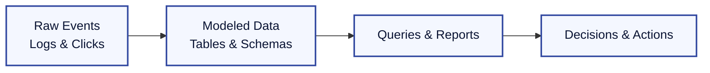

## Why Start with a Foundations Chapter?

If you are completely new to databases, it helps to build the right mental model before touching SQL. This chapter gives you the metaphors, vocabulary, and mindset that make the rest of the curriculum feel intuitive rather than overwhelming.

## Databases by Analogy

| Real World                                                 | Database World                                  | Why It Matters                                                                |
| :--------------------------------------------------------- | :---------------------------------------------- | :---------------------------------------------------------------------------- |
| A public library with shelves, index cards, and librarians | A DBMS with tables, indexes, and query planners | Shows how structure plus a retrieval strategy make huge collections usable    |
| Airport traffic control                                    | Concurrency control & transactions              | Highlights why coordination is vital when many actors change shared resources |
| City zoning laws                                           | Data constraints & schemas                      | Rules prevent chaotic construction; schemas keep data predictable             |
| Fire drills and insurance policies                         | Backups and disaster recovery                   | Preparedness is the only guarantee when things go wrong                       |

> **Mental shortcut:** When you can explain a database concept by pointing to something in the physical world, you understand it well enough to teach it.

## The Three Pillars of Database Work

1. **Modeling reality** – Capture the nouns (entities) and verbs (relationships) of a business domain.
2. **Manipulating data** – Use languages like SQL to read and change that data safely.
3. **Maintaining the system** – Keep the engine tuned: performance, security, and recoverability.

We will circle back to these pillars in every chapter.

## Prerequisite Skills Checklist

You do *not* need to be a professional developer before learning databases, but a few basics make the journey smoother:

- Comfortable with file/folder navigation in a terminal.
- Able to read basic JSON or CSV files.
- Familiar with at least one programming language enough to write conditional logic (if/else).
- Understands the difference between RAM and disk, and why disk is slower.

If any of these feel shaky, spend an afternoon reviewing them—they will pay off immediately.

## How Data Becomes Knowledge

Keep this flow in mind: each chapter pushes you from left to right. If you feel lost, ask yourself which arrow you are currently learning about.

## Suggested Learning Path

1. **Skim Chapter 1** to recognize core vocabulary (data, information, DBMS).
2. **Dig into Chapter 2** to meet the relational model—the backbone of SQL databases.
3. **Jump to Chapter 4** and run the SQL examples while reading.
4. **Loop back to Chapter 3** when you are ready to design your own schema.
5. **Treat Chapters 5–8** as your advanced playbook once fundamentals click.

## Common Misconceptions to Avoid

- **“SQL is programming.”** It is a *declarative* language—closer to asking the system questions than writing algorithms.
- **“NoSQL replaces relational.”** It complements it; most companies run multiple flavors side by side.
- **“Backups are optional once you are in production.”** They are the seatbelt of every data system.

## Quick Reference Glossary

| Term               | Plain-English Definition                                |
| :----------------- | :------------------------------------------------------ |
| Schema             | The structural blueprint for how data is organized      |
| Record (Row/Tuple) | A single real-world instance captured in the database   |
| Primary Key        | The official unique identifier for a record             |
| Transaction        | A bundle of operations that succeed or fail together    |
| Index              | A fast lookup aid, like the index at the back of a book |

## Ready to Continue

Once these concepts feel familiar, you are primed to dive into Chapter 1 with confidence. Feel free to revisit this primer whenever you need to reset your bearings.