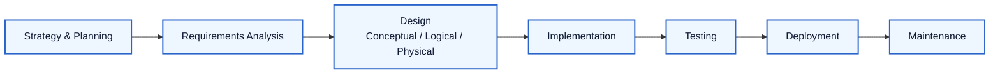
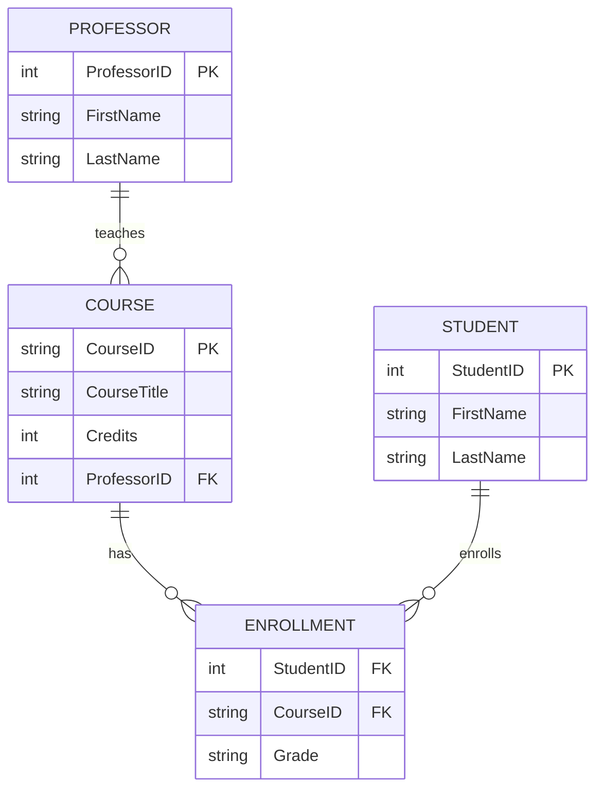

### **3.1. The Database Development Life Cycle (DDLC)**

Building a database is an engineering process, not just an ad-hoc task. The DDLC provides a structured framework for designing, building, and maintaining a database system, ensuring it meets user requirements and is robust over its lifetime.

**Phases of the DDLC**

1.  **Strategy and Planning:** This initial phase is about understanding the high-level goals. Activities include defining the overall mission, conducting a feasibility study (Is this project technically, economically, and operationally viable?), and creating a high-level project plan and timeline.
2.  **Requirements Analysis:** This is arguably the most critical phase. It involves deep engagement with stakeholders to understand their needs. Activities include conducting interviews, analyzing existing documents and systems, defining business rules (e.g., "A customer can have multiple orders, but an order belongs to only one customer"), and producing a detailed requirements specification document.
3.  **Design (Conceptual, Logical, Physical):** The blueprinting phase. We translate the 'what' from the requirements into the 'how' of the database structure. We will cover this in detail in the next sections. The output is the complete schema design.
4.  **Implementation:** The design is brought to life. This involves writing the Data Definition Language (DDL) code (e.g., `CREATE TABLE`, `CREATE INDEX` statements) to build the database objects in a specific DBMS, and configuring the DBMS environment.
5.  **Testing:** Rigorous verification is performed to ensure the database works as intended. This includes data loading tests (Can we load sample data correctly?), unit tests for queries and procedures, performance tests (Do queries run fast enough under load?), and security tests.
6.  **Deployment:** The tested database is released for operational use. This can be a complex process involving data migration from an old system to the new one, and requires careful planning to minimize downtime.
7.  **Maintenance:** The longest phase of the lifecycle. This involves ongoing tasks like monitoring performance, regular backups, applying security patches, optimizing queries, and making schema modifications as business requirements evolve.



### **3.2. Data Modeling: From Idea to Blueprint**

Data modeling is the process of creating a visual representation (a data model) of the data objects in a system and the relationships between them. This process is broken down into three stages of increasing detail, moving from the abstract to the concrete.

#### Running Example: A Simple University System

Let's follow a requirement: "We need a system to track which students are enrolled in which courses, and which professors teach those courses."

**1. Conceptual Data Model**

The highest-level view, focusing on business concepts. It's a communication tool for non-technical stakeholders.

* **Entities:** We identify the main nouns: `Student`, `Course`, `Professor`.
* **Relationships:** We identify the verbs: A `Professor` *teaches* a `Course`. A `Student` *enrolls in* a `Course`.

The model is essentially a drawing with boxes for entities and lines for relationships, with no technical details.

**2. Logical Data Model**

A detailed, technology-agnostic blueprint. This is where the core design work happens. It defines all entities, attributes, keys, and relationships precisely.

* **Professor Entity:**
    * Attributes: ProfessorID (Primary Key), FirstName, LastName, Email
* **Student Entity:**
    * Attributes: StudentID (Primary Key), FirstName, LastName, Major
* **Course Entity:**
    * Attributes: CourseID (Primary Key), CourseTitle, Credits, ProfessorID (Foreign Key to Professor)
* **Resolving M:N Relationship:** Students and Courses have a many-to-many relationship. We create a new "linking" table.
    * **Enrollment Entity:** A new table with a composite primary key of (StudentID, CourseID). It might also have an attribute like `Grade`.



**3. Physical Data Model**

The implementation-specific model. It translates the logical model into the actual DDL for a specific DBMS, defining data types, indexes, and storage properties.

```sql
CREATE TABLE Students (
    StudentID INT PRIMARY KEY,
    FirstName VARCHAR(50) NOT NULL,
    LastName VARCHAR(50) NOT NULL,
    Major VARCHAR(100)
);

CREATE TABLE Courses (
    CourseID VARCHAR(10) PRIMARY KEY,
    CourseTitle VARCHAR(100) NOT NULL,
    Credits INT CHECK (Credits > 0)
);

-- And so on for all other tables...
```

### **3.3. Entity-Relationship (ER) Modeling**

ER modeling is the primary technique used to create the conceptual and logical data models. An ER Diagram (ERD) is a flowchart that illustrates how "entities" relate to each other within a system.

**Components of an ERD**

  * **Entity:** A real-world object or concept about which we want to store data (e.g., `Student`, `Course`, `Professor`). Represented by a rectangle.
  * **Attribute:** A property or characteristic of an entity (e.g., `StudentName`, `CourseTitle`). Represented by ovals (in Chen notation) or listed inside the entity box (in Crow's Foot).
  * **Relationship:** An association between two or more entities (e.g., a `Student` *enrolls in* a `Course`). Represented by a diamond (Chen) or a line connecting entities (Crow's Foot).

**Cardinality and Ordinality**

This describes the precise rules of a relationship, which are drawn on the lines of an ERD.

  * **Cardinality:** Describes the maximum number of times an instance in one entity can be related to instances in another entity.
      * `1:1` (One-to-One): A `Country` has one `Capital City`.
      * `1:N` (One-to-Many): A `Mother` can have many `Children`, but each `Child` has only one biological mother. This is the most common relationship type.
      * `M:N` (Many-to-Many): A `Student` can enroll in many `Courses`, and a `Course` can have many `Students`.
  * **Ordinality (or Participation):** Describes the minimum number of times an instance in one entity must be related to another. It specifies whether the relationship is **mandatory (1)** or **optional (0)**. For example, a `Customer` *can* have an `Order` (optional), but an `Order` *must* have a `Customer` (mandatory).

> #### Resolving Many-to-Many (M:N) Relationships
>
> Relational databases cannot directly implement M:N relationships. They must be resolved by creating a third table, known as a **linking table** or **associative entity**.
> To resolve the M:N relationship between `Students` and `Courses`, we create an `Enrollment` table. The primary key of `Enrollment` is a composite key made of the foreign keys from the other two tables: `(StudentID, CourseID)`. This new structure creates two 1:N relationships:
>
>   * A `Student` can have many `Enrollment` records (1:N).
>   * A `Course` can have many `Enrollment` records (1:N).

**ERD Notations**

There are several ways to draw ERDs. The two most common are Chen notation and Crow's Foot notation. Crow's Foot is more popular in modern CASE tools for its simplicity and information density.

### **3.4. Normalization: The Art of Organization**

Normalization is a systematic process for organizing columns and tables in a relational database to minimize data redundancy and prevent data anomalies (insertion, update, and deletion anomalies). The goal is to ensure that every piece of non-key data is dependent on the key, the whole key, and nothing but the key.

#### Example: Normalizing a Project Tracking Sheet

Imagine we start with a single spreadsheet used to track employee hours on projects. It's a mess of repeated data.

**Unnormalized Form (UNF)**

The raw data. Note the repeating employee information for each project task.

| ProjectID | ProjectName      | EmployeeInfo (Name, Email)             |
| :-------- | :--------------- | :------------------------------------- |
| P101      | Orion Launch     | Alice (a@dev.com), Bob (b@dev.com)     |
| P102      | Website Redesign | Alice (a@dev.com), Charlie (c@dev.com) |

**First Normal Form (1NF)**

**Rule:** Ensure all columns contain atomic (indivisible) values and each row is unique. We must eliminate repeating groups.
**Fix:** We create a separate row for each employee on a project.

| ProjectID | ProjectName      | EmployeeID | EmployeeName | EmployeeEmail |
| :-------- | :--------------- | :--------- | :----------- | :------------ |
| P101      | Orion Launch     | E1         | Alice        | a@dev.com     |
| P101      | Orion Launch     | E2         | Bob          | b@dev.com     |
| P102      | Website Redesign | E1         | Alice        | a@dev.com     |
| P102      | Website Redesign | E3         | Charlie      | c@dev.com     |

**Problem:** We still have major redundancy. `ProjectName` and employee details are repeated. This table suffers from update, insertion, and deletion anomalies.

**Second Normal Form (2NF)**

**Rule:** Must be in 1NF, and all non-key attributes must be fully functionally dependent on the entire primary key. (This rule is only relevant for composite primary keys).
**Analysis:** Let's assume the primary key is `(ProjectID, EmployeeID)`.

  * `ProjectName` depends only on `ProjectID` (a partial dependency).
  * `EmployeeName` and `EmployeeEmail` depend only on `EmployeeID` (another partial dependency).
    **Fix:** We split the table to remove these partial dependencies.

**Projects Table**

| ProjectID (PK) | ProjectName      |
| :------------- | :--------------- |
| P101           | Orion Launch     |
| P102           | Website Redesign |

**Employees Table**

| EmployeeID (PK) | EmployeeName | EmployeeEmail |
| :-------------- | :----------- | :------------ |
| E1              | Alice        | a@dev.com     |
| E2              | Bob          | b@dev.com     |
| E3              | Charlie      | c@dev.com     |

**Project_Assignments Table**

| ProjectID (FK) | EmployeeID (FK) |
| :------------- | :-------------- |
| P101           | E1              |
| P101           | E2              |
| P102           | E1              |
| P102           | E3              |

**Problem:** We're much better, but what if we add a manager to the project? Let's say we add `ManagerName` to the `Projects` table.

**Third Normal Form (3NF)**

**Rule:** Must be in 2NF, and there should be no transitive dependencies (where a non-key attribute depends on another non-key attribute).
**Analysis:** Let's modify our `Projects` table from the 2NF step.

**Projects Table (Violates 3NF)**

| ProjectID (PK) | ProjectName      | ManagerID | ManagerName |
| :------------- | :--------------- | :-------- | :---------- |
| P101           | Orion Launch     | M5        | David Lee   |
| P102           | Website Redesign | M5        | David Lee   |

Here, `ManagerName` depends on `ManagerID`, which is a non-key attribute. This is a transitive dependency. If David Lee changes his name, we have to update it in multiple places.
**Fix:** We split out the managers into their own table.

**Projects Table (3NF)**

| ProjectID (PK) | ProjectName      | ManagerID (FK) |
| :------------- | :--------------- | :------------- |
| P101           | Orion Launch     | M5             |
| P102           | Website Redesign | M5             |

**Managers Table (3NF)**

| ManagerID (PK) | ManagerName |
| :------------- | :---------- |
| M5             | David Lee   |

Now our data is in 3NF. Redundancy is minimized, and anomalies are eliminated. Each attribute depends only on its table's primary key.

### Denormalization

Sometimes, for performance reasons (especially in read-heavy data warehouses), designers will intentionally violate normalization rules. This process, called denormalization, reduces the number of joins needed for a query but re-introduces redundancy. It's a deliberate trade-off that should be made carefully and only after profiling performance.

#### When Denormalization Helps
- **Analytics and reporting:** Dashboards that aggregate the same metrics thousands of times per hour benefit from pre-computed totals or flattened dimension tables.
- **Operational read hot-spots:** If a critical API endpoint must serve data with sub-millisecond latency, duplicating a few values can remove expensive joins.
- **Distributed systems:** Wide-column or document stores often favor denormalized records to minimize cross-partition lookups.

#### Common Denormalization Patterns
- **Duplicated attributes:** Copying descriptive columns (e.g., `CustomerName`) onto a fact table to avoid a join during reads.
- **Pre-computed aggregates:** Storing running totals, counts, or averages in a summary table or materialized view that is refreshed on a schedule.
- **Flattened hierarchies:** Embedding parent/child identifiers in the same row (such as storing `DepartmentPath = "Corporate > Engineering > Platform"`).
- **Derived lookups:** Materializing frequently used calculations (like `FullAddress`) so client code does not reassemble them on every request.

#### Guardrails and Mitigations
- **Document the duplication:** Note every column that is denormalized and the authoritative source it mirrors. This avoids divergent updates months later.
- **Automate synchronization:** Use triggers, stored procedures, ETL jobs, or change data capture to keep duplicates consistent.
- **Monitor drift:** Regularly compare denormalized tables against their normalized sources to catch inconsistencies.
- **Favor read replicas or caches first:** Sometimes adding an index, using a read replica, or caching results is sufficient without altering the schema.

> **Rule of Thumb:** Normalize first for correctness, measure performance, and only denormalize surgically with a rollback plan.
