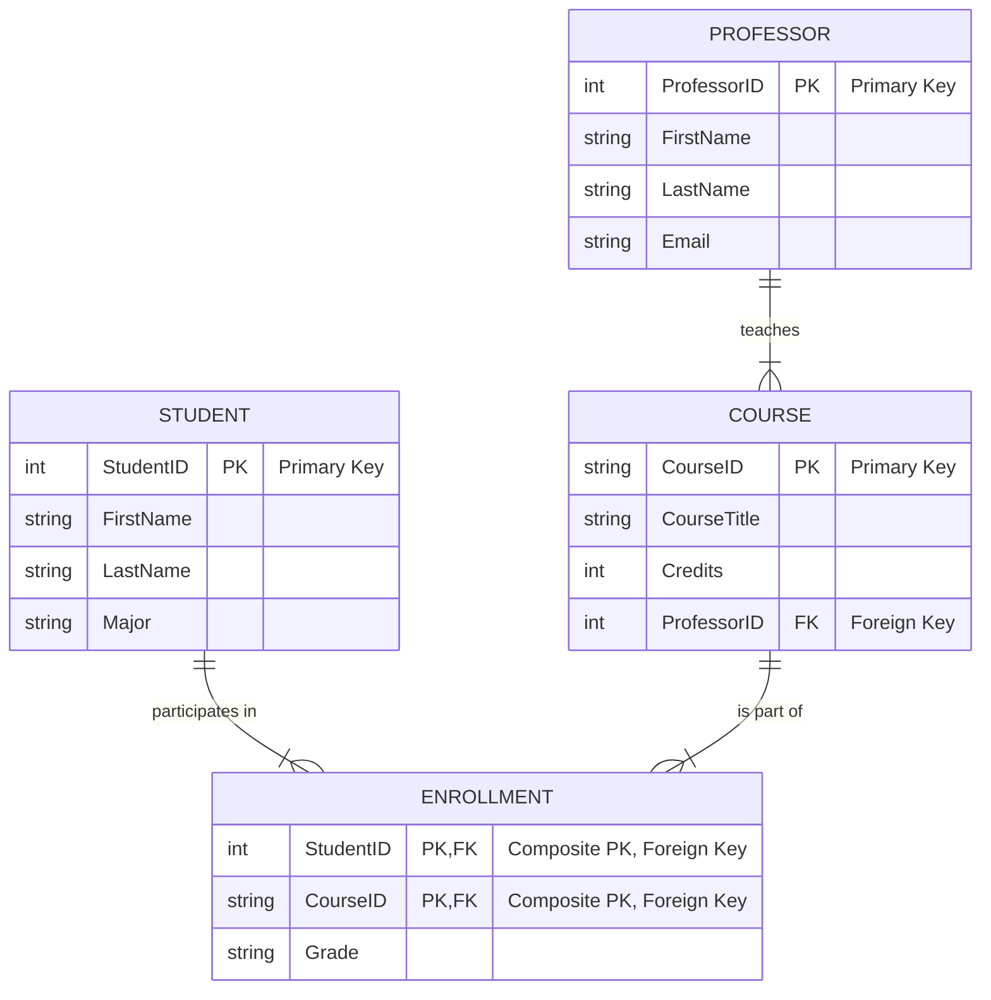

Welcome to the architect's room! 🏛️ This chapter is all about the blueprinting process behind any robust database. We'll move from a vague idea to a concrete, efficient, and reliable database schema. Mastering these concepts is crucial, as "design a database for X" is one of the most common scenarios in technical interviews.

:::tip[Chapter Goals]

* Understand the structured process of the **Database Development Life Cycle (DDLC)**.
* Learn to translate business requirements into **Conceptual, Logical, and Physical data models**.
* Master **Entity-Relationship (ER) Modeling**, including cardinality and resolving many-to-many relationships.
* Grasp the principles of **Normalization** (1NF, 2NF, 3NF) to eliminate data redundancy.
* Know when and why to use **Denormalization** for performance gains.
:::

---

### **3.1 The Database Development Life Cycle (DDLC)**

Building a database isn't just about writing `CREATE TABLE` statements; it's a structured engineering process. The DDLC provides a systematic framework for designing, building, and maintaining a database, ensuring it meets user requirements and remains robust throughout its life.

#### **Phases of the DDLC**

1.  **Strategy and Planning:** This initial phase is about understanding the high-level goals. What problem are we solving? Is it feasible? Activities include defining the overall mission, conducting feasibility studies (technical, economic, operational), and creating a high-level project plan.
2.  **Requirements Analysis:** This is arguably the most critical phase. Deep engagement with stakeholders is key to understanding their needs. Activities include conducting interviews, analyzing existing systems, defining **business rules** (e.g., "A customer can have multiple orders, but an order belongs to only one customer"), and producing a detailed requirements specification document.
3.  **Design (Conceptual, Logical, Physical):** The blueprinting phase. We translate the 'what' from the requirements into the 'how' of the database structure. We'll cover these three levels of design in detail in the next sections.
4.  **Implementation:** The design is brought to life. This involves writing the Data Definition Language (DDL) code (e.g., `CREATE TABLE`, `CREATE INDEX`) to build the database objects in a specific DBMS and configuring the environment.
5.  **Testing:** Rigorous verification ensures the database works as intended. This includes data loading tests, unit tests for queries, performance stress tests, and security vulnerability checks.
6.  **Deployment:** The tested database is released for operational use. This often involves a complex data migration from an old system to the new one and requires careful planning to minimize downtime.
7.  **Maintenance:** The longest phase. This involves ongoing tasks like monitoring performance, regular backups, applying security patches, query optimization, and evolving the schema as business needs change.

```mermaid
graph TD
    subgraph DDLC
        direction TB
        Strategy["1. Strategy & Planning"] --> Requirements["2. Requirements Analysis"];
        Requirements --> Design["3. Design<br/>(Conceptual, Logical, Physical)"];
        Design --> Implementation["4. Implementation"];
        Implementation --> Testing["5. Testing"];
        Testing --> Deployment["6. Deployment"];
        Deployment --> Maintenance["7. Maintenance"];
        Maintenance --> Requirements;
    end
    classDef phase fill:#eef6ff,stroke:#2a63c9,stroke-width:2px,color:#0f1a33;
    class Strategy,Requirements,Design,Implementation,Testing,Deployment,Maintenance phase;
````

| Phase          | Key Artifact                       | Guiding Question                             |
| :------------- | :--------------------------------- | :------------------------------------------- |
| Strategy       | Vision statement, budget estimate  | Why are we building this and is it feasible? |
| Requirements   | User stories, business rules       | What information must the system capture?    |
| Design         | ER diagrams, schema docs           | How should the data be structured?           |
| Implementation | DDL scripts, migrations            | How do we build and version the schema?      |
| Testing        | Test plans, sample datasets        | Does the schema behave as expected?          |
| Deployment     | Release checklist, migration plan  | How do we go live safely?                    |
| Maintenance    | Monitoring dashboards, bug reports | How do we keep it healthy and relevant?      |

:::info[💡 Interview Prep]

#### **Common Interview Questions**

  * **Q: What is the DDLC and why is it important?**

      * **A:** The DDLC is a structured framework for building and maintaining a database. It's important because it turns a potentially chaotic process into a predictable engineering discipline, ensuring the final product is well-designed, meets user needs, and is maintainable over time.

  * **Q: Which phase of the DDLC do you consider the most critical, and why?**

      * **A:** The **Requirements Analysis** phase. A mistake here has a cascading effect. If you misunderstand or fail to capture a key business requirement, the design will be flawed, the implementation will be wrong, and you'll end up building a system that doesn't solve the user's problem, wasting time and resources. "Garbage in, garbage out."

  * **Q: How does an Agile methodology affect the traditional DDLC?**

      * **A:** In an Agile context, the DDLC becomes iterative. Instead of a single pass through all phases, you cycle through mini-DDLCs in sprints. You might analyze, design, implement, and test a small set of features in one sprint, then repeat for the next set. This allows for flexibility and continuous feedback. The maintenance phase is continuous.
        :::

-----

### **3.2 Data Modeling: From Idea to Blueprint**

Data modeling is the process of creating a visual representation (a data model) of the data objects in a system and the relationships between them. This process is broken down into three stages of increasing detail, moving from the abstract to the concrete.

#### **Running Example: A Simple University System**

Let's follow a requirement: "We need a system to track which students are enrolled in which courses, and which professors teach those courses."

**1. Conceptual Data Model**
The highest-level, bird's-eye view. It focuses on business concepts and is used to communicate with non-technical stakeholders. It answers: **What** are the core things our business cares about?

  * **Entities:** We identify the main nouns: `Student`, `Course`, `Professor`.
  * **Relationships:** We identify the verbs connecting them: A `Professor` *teaches* a `Course`. A `Student` *enrolls in* a `Course`.

**2. Logical Data Model**
A detailed, technology-agnostic blueprint. This is where the core design work happens. It defines all entities, attributes, primary keys, foreign keys, and relationships precisely. It answers: **How** should these concepts be structured?

  * **Professor Entity:** `ProfessorID` (PK), `FirstName`, `LastName`, `Email`
  * **Student Entity:** `StudentID` (PK), `FirstName`, `LastName`, `Major`
  * **Course Entity:** `CourseID` (PK), `CourseTitle`, `Credits`, `ProfessorID` (FK)
  * **Resolving M:N Relationship:** A student can take many courses, and a course has many students. This many-to-many relationship requires a linking table.
      * **Enrollment Entity:** `(StudentID, CourseID)` (Composite PK), `Grade`

:::tip[Analogy: Building a House 🏠]

  * **Conceptual Model:** An architect's initial sketch shown to the client. It shows rooms and how they connect (living room connects to kitchen) but has no dimensions or material specs.
  * **Logical Model:** The detailed architectural blueprint. It defines every room's dimensions, window placements, and door types, but doesn't specify "ACME brand bricks" or "Schlage brand door knobs."
  * **Physical Model:** The contractor's construction plan. It specifies the exact materials (e.g., `VARCHAR(50)` for a name, `INT` for an ID), indexing strategies, and storage configurations for a specific database system like PostgreSQL or MySQL.
    :::

**3. Physical Data Model**
The implementation-specific model. It translates the logical model into the actual DDL for a specific DBMS, defining exact data types, constraints, indexes, and storage properties. It answers: **With what specific technology** will we build this structure?

```sql
CREATE TABLE Students (
    StudentID INT PRIMARY KEY,
    FirstName VARCHAR(50) NOT NULL,
    LastName VARCHAR(50) NOT NULL,
    Major VARCHAR(100)
);

CREATE TABLE Professors (
    ProfessorID INT PRIMARY KEY,
    FirstName VARCHAR(50) NOT NULL,
    LastName VARCHAR(50) NOT NULL,
    Email VARCHAR(100) UNIQUE NOT NULL
);

CREATE TABLE Courses (
    CourseID VARCHAR(10) PRIMARY KEY,
    CourseTitle VARCHAR(100) NOT NULL,
    Credits INT CHECK (Credits > 0),
    ProfessorID INT,
    FOREIGN KEY (ProfessorID) REFERENCES Professors(ProfessorID)
);

-- And so on for the Enrollment table...
```

:::info[💡 Interview Prep]

#### **Common Interview Questions**

  * **Q: Explain the difference between a conceptual, logical, and physical data model.**

      * **A:** The **conceptual** model is a high-level, abstract view of business entities and their relationships, used for communicating with stakeholders. The **logical** model is a detailed, technology-agnostic blueprint defining attributes, keys, and relationships. The **physical** model is the implementation-specific version of the logical model, defining actual data types, indexes, and storage for a specific DBMS.

  * **Q: Why is it important to have a logical model that is DBMS-agnostic?**

      * **A:** It separates the fundamental business logic from the specific technology. This makes the design more portable (you could switch from MySQL to SQL Server with less effort), easier to understand without getting bogged down in implementation details, and promotes a better-structured design process.
        :::

-----

### **3.3 Entity-Relationship (ER) Modeling**

ER modeling is the primary technique used to create conceptual and logical data models. An ER Diagram (ERD) is a flowchart that illustrates how "entities" relate to each other within a system.

#### **Components of an ERD**

  * **Entity:** A real-world object or concept about which we store data (e.g., `Student`, `Course`). Represented by a rectangle.
  * **Attribute:** A property of an entity (e.g., `StudentName`, `CourseTitle`). Listed inside the entity rectangle.
  * **Relationship:** An association between entities (e.g., a `Student` *enrolls in* a `Course`). Represented by a line connecting the entities.

#### **Cardinality and Ordinality**

This is the grammar of an ERD, defining the precise rules of a relationship.

  * **Cardinality:** Describes the **maximum** number of connections.
      * `1:1` (One-to-One): A `Country` has one `Capital City`. A `User` has one `Profile`.
      * `1:N` (One-to-Many): One `Author` can write many `Books`, but each `Book` has only one `Author`. This is the most common relationship.
      * `M:N` (Many-to-Many): One `Student` can enroll in many `Courses`, and one `Course` can have many `Students`.
  * **Ordinality (or Participation):** Describes the **minimum** number of connections (is it required?).
      * **Mandatory (1):** The line is a solid dash `|`. An `Order` *must* belong to a `Customer`.
      * **Optional (0):** The line has a circle `o`. A `Customer` *may* not have any `Orders` yet.

<!-- end list -->



:::danger[Crucial Concept: Resolving Many-to-Many (M:N) Relationships]

Relational databases cannot directly implement M:N relationships. You **must** resolve them by creating a third table, known as a **linking table**, **junction table**, or **associative entity**.

To resolve the M:N relationship between `Students` and `Courses`, we create the `Enrollment` table. The primary key of `Enrollment` is a composite key made of the foreign keys from the other two tables: `(StudentID, CourseID)`. This new structure creates two clean 1:N relationships:

  * A `Student` can have many `Enrollment` records (1:N).
  * A `Course` can have many `Enrollment` records (1:N).
    :::

:::info[💡 Interview Prep]

#### **Common Interview Questions**

  * **Q: How do you resolve a many-to-many relationship in a relational database? Why is this necessary?**

      * **A:** You resolve it by creating a linking/junction table. This table's primary key is typically a composite of the foreign keys from the two original tables. It's necessary because a foreign key column in a table can only point to a single row in another table, which fundamentally prevents a direct M:N link. The linking table breaks the M:N relationship into two 1:N relationships, which relational databases can handle perfectly.

  * **Q: What's the difference between cardinality and ordinality?**

      * **A:** **Cardinality** defines the *maximum* number of related instances (one or many). **Ordinality** defines the *minimum* number of related instances (zero or one), indicating whether the relationship is optional or mandatory.
        :::

-----

### **3.4 Normalization: The Art of Organization**

Normalization is a systematic process for organizing tables and columns to **minimize data redundancy** and prevent data anomalies (insertion, update, and deletion issues). The goal, famously stated by William Kent, is to ensure that every non-key attribute is dependent on "the key, the whole key, and nothing but the key."

#### **Data Anomalies Explained**

Why do we need to normalize? Because unorganized data leads to problems:

  * **Insertion Anomaly:** You can't add a new piece of information unless another, unrelated piece is also present. (e.g., Can't add a new professor until they are assigned to a course).
  * **Update Anomaly:** The same piece of information is stored in multiple rows. To update it, you must find and change every instance, risking inconsistency. (e.g., A professor changes their name, and you miss updating one of their course records).
  * **Deletion Anomaly:** Deleting one piece of information unintentionally deletes another. (e.g., A student un-enrolls from their only course, and their entire student record is deleted from the table).

#### **The Normal Forms (Step-by-Step)**

Let's normalize a messy project tracking table.

**Unnormalized Form (UNF)**

| ProjectID | ProjectName      | EmployeeID | EmployeeName   | EmployeeEmail |
| :-------- | :--------------- | :--------- | :------------- | :------------ |
| P101      | Orion Launch     | E1, E2     | Alice, Bob     | a@dev, b@dev  |
| P102      | Website Redesign | E1, E3     | Alice, Charlie | a@dev, c@dev  |

**First Normal Form (1NF)**

  * **Rule:** Ensure all columns contain atomic (indivisible) values and each row is unique. Eliminate repeating groups.
  * **Fix:** Create a separate row for each employee on a project.

| ProjectID | ProjectName      | EmployeeID | EmployeeName | EmployeeEmail |
| :-------- | :--------------- | :--------- | :----------- | :------------ |
| P101      | Orion Launch     | E1         | Alice        | a@dev.com     |
| P101      | Orion Launch     | E2         | Bob          | b@dev.com     |
| P102      | Website Redesign | E1         | Alice        | a@dev.com     |
| P102      | Website Redesign | E3         | Charlie      | c@dev.com     |

  * ✅ **Achieved:** Atomicity.
  * ❌ **Problem:** Massive redundancy. `ProjectName` and employee details are repeated, leading to all three anomalies.

**Second Normal Form (2NF)**

  * **Rule:** Must be in 1NF, and all non-key attributes must depend on the **entire** primary key. (This rule is only relevant for composite primary keys).
  * **Analysis:** The primary key is `(ProjectID, EmployeeID)`.
      * `ProjectName` depends only on `ProjectID` (a **partial dependency**).
      * `EmployeeName` and `EmployeeEmail` depend only on `EmployeeID` (another **partial dependency**).
  * **Fix:** Split the table to remove these partial dependencies.

**`Projects` Table**

| ProjectID (PK) | ProjectName      |
| :------------- | :--------------- |
| P101           | Orion Launch     |
| P102           | Website Redesign |

**`Employees` Table**

| EmployeeID (PK) | EmployeeName | EmployeeEmail |
| :-------------- | :----------- | :------------ |
| E1              | Alice        | a@dev.com     |
| E2              | Bob          | b@dev.com     |
| E3              | Charlie      | c@dev.com     |

**`Project_Assignments` Table** (Linking Table)

| ProjectID (FK) | EmployeeID (FK) |
| :------------- | :-------------- |
| P101           | E1              |
| P101           | E2              |
| P102           | E1              |
| P102           | E3              |

  * ✅ **Achieved:** No partial dependencies.
  * ❌ **Problem:** What if a non-key attribute depends on another non-key attribute?

**Third Normal Form (3NF)**

  * **Rule:** Must be in 2NF, and there should be no **transitive dependencies** (where a non-key attribute depends on another non-key attribute).
  * **Analysis:** Let's add a `ManagerName` and `ManagerID` to the `Projects` table.

**`Projects` Table (Violates 3NF)**

| ProjectID (PK) | ProjectName      | ManagerID | ManagerName |
| :------------- | :--------------- | :-------- | :---------- |
| P101           | Orion Launch     | M5        | David Lee   |
| P102           | Website Redesign | M5        | David Lee   |

  * Here, `ProjectName` depends on `ProjectID` (the key). `ManagerID` also depends on `ProjectID`. But `ManagerName` depends on `ManagerID`, which is *not* the primary key. This is a transitive dependency.
  * **Fix:** Split out the managers into their own table.

**`Projects` Table (3NF)**

| ProjectID (PK) | ProjectName      | ManagerID (FK) |
| :------------- | :--------------- | :------------- |
| P101           | Orion Launch     | M5             |
| P102           | Website Redesign | M5             |

**`Managers` Table**

| ManagerID (PK) | ManagerName |
| :------------- | :---------- |
| M5             | David Lee   |

Now, every non-key attribute in every table depends only on that table's primary key. Our design is clean and robust.

:::note[Beyond 3NF]
For most practical applications, 3NF is sufficient. However, you might hear about **Boyce-Codd Normal Form (BCNF)**, which is a stricter version of 3NF that handles certain rare anomalies. A table is in BCNF if for every functional dependency `X -> Y`, `X` is a superkey.
:::

:::info[💡 Interview Prep]

#### **Common Interview Questions**

  * **Q: What is normalization and why is it important?**

      * **A:** Normalization is the process of organizing a database to reduce redundancy and improve data integrity. It's important because it prevents data anomalies (insertion, update, deletion), saves storage space, and makes the database easier to maintain and evolve.

  * **Q: Explain 1NF, 2NF, and 3NF in simple terms.**

      * **A:** **1NF** means all columns are atomic (no lists) and rows are unique. **2NF** means it's in 1NF and all non-key columns depend on the *whole* primary key (no partial dependencies). **3NF** means it's in 2NF and all columns depend *only* on the primary key (no transitive dependencies).

  * **Q: Give an example of an update anomaly.**

      * **A:** Imagine a table where a manager's name, "David Lee", is stored in every project row he manages. If he gets married and changes his name, you'd have to find and update every single row. If you miss one, the data becomes inconsistent. This is an update anomaly. Normalization solves this by storing his name in one place in a `Managers` table.

  * **Q: What is a transitive dependency?**

      * **A:** It's an indirect dependency where `A -> B` and `B -> C`, which implies `A -> C`. In database terms, it's when a non-key attribute depends on another non-key attribute, violating 3NF.
        :::

-----

### **3.5 Denormalization: The Performance Escape Hatch**

After working so hard to normalize our data, why would we ever undo it? **Performance.**

**Denormalization** is the intentional process of violating normalization rules to improve query performance by reducing the number of complex joins. It's a deliberate trade-off: you increase data redundancy to decrease query execution time.

#### **When to Consider Denormalization**

  * **Read-Heavy Systems:** In analytics, data warehousing, or reporting systems where query speed is paramount and data is written infrequently.
  * **High-Performance Requirements:** When a critical application feature must return data with extremely low latency.
  * **Calculated Values:** Storing pre-computed values (like a running total or an order's total price) that are expensive to calculate on the fly.

#### **Common Denormalization Patterns**

  - **Duplicated Columns:** Copying a frequently needed attribute (like `ProductName`) into the `OrderItems` table to avoid joining with the `Products` table for every query.
  - **Pre-computed Aggregates:** Creating summary tables that store daily sales totals, user activity counts, etc. These are updated by a nightly job.
  - **Materialized Views:** Database objects that store the result of a query. A great way to formalize denormalization.

:::warning[Handle with Care]
Denormalization is not a fix for a bad design. It introduces complexity and risks data inconsistency if not managed carefully. Always have a mechanism (like triggers or batch jobs) to keep the redundant data in sync.
:::

:::tip[Rule of Thumb]
Normalize first, then measure performance. If and only if you identify a clear, performance-critical bottleneck that can be solved by fewer joins, should you consider denormalizing. Always document the trade-off.
:::

:::info[💡 Interview Prep]

#### **Common Interview Questions**

  * **Q: What is denormalization, and when would you use it?**

      * **A:** Denormalization is the process of intentionally adding redundancy to a database to improve read performance. I would use it in a read-heavy system, like a data warehouse, where complex join queries for reports are running too slowly. It's a trade-off: you sacrifice storage efficiency and some data integrity guarantees for faster query results.

  * **Q: What are the risks of denormalization, and how do you mitigate them?**

      * **A:** The main risk is data inconsistency (update anomalies). If a piece of data is stored in two places, it might be updated in one place but not the other. You mitigate this by using database triggers, scheduled batch jobs, or application logic to ensure the redundant copies are always kept in sync with the primary source of truth.
        :::

-----

### **Chapter Summary & Key Takeaways**

  * Database design is a formal process guided by the **DDLC**.
  * Data modeling moves from high-level **conceptual** models to detailed **logical** blueprints, and finally to implementation-specific **physical** schemas.
  * **ER diagrams** are the primary tool for logical modeling, and resolving **M:N relationships** with linking tables is a fundamental skill.
  * **Normalization** (especially up to 3NF) is the default best practice for creating clean, robust, and maintainable relational database schemas.
  * **Denormalization** is a powerful but risky performance optimization technique that should be used judiciously and only after profiling.
