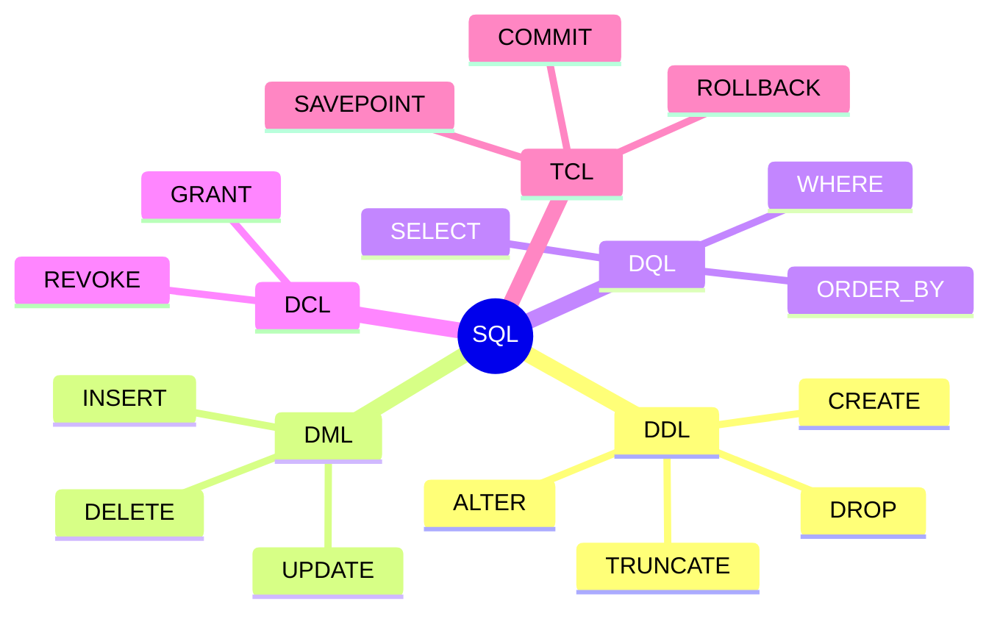
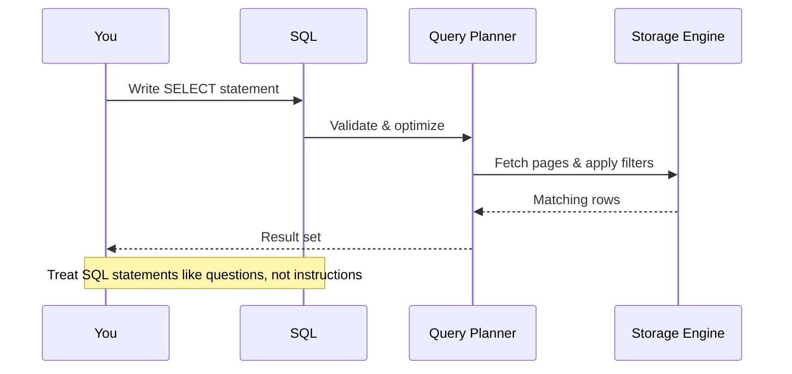

### **4.1. Introduction to SQL**

**What is SQL?**
SQL, often pronounced "sequel" or "S-Q-L," stands for Structured Query Language. It's a declarative programming language designed specifically for managing data held in a relational database management system (RDBMS). "Declarative" means you tell the database *what* you want, and the database figures out *how* to get it for you.

**Why is SQL so important?**
* **Standardization:** It's an ANSI/ISO standard, meaning the core commands work across different database systems (like PostgreSQL, MySQL, SQL Server) with only minor variations in syntax for advanced features.
* **Powerful:** It can handle vast amounts of data and complex queries with concise commands.
* **Accessible:** The syntax is relatively easy to read and understand, resembling natural English.



**Think of SQL as a conversation.** You state intent (“Show me all active customers who signed up this month”), the DBMS negotiates the best plan, and a result set comes back. The clearer your request, the faster the database responds.



---

### **4.1.1. Practice Tables We'll Use**

To make the examples predictable we will rely on the same miniature library dataset. Unless stated otherwise, assume the tables are reset to the baseline state below before each variation.

**`Authors` (people who wrote books)**

| AuthorID | FirstName | LastName | Nationality      |
| :------- | :-------- | :------- | :--------------- |
| 1        | George    | Orwell   | British          |
| 2        | J.R.R.    | Tolkien  | British          |
| 3        | Isaac     | Asimov   | Russian-American |

**`Books` (titles in our catalogue)**

| BookID | Title                 | PublicationYear | AuthorID | Genre            | Price |
| :----- | :-------------------- | :-------------- | :------- | :--------------- | :---- |
| 101    | 1984                  | 1949            | 1        | Dystopian        | 12.99 |
| 102    | Animal Farm           | 1945            | 1        | Political Satire | 8.99  |
| 201    | The Hobbit            | 1937            | 2        | Fantasy          | 10.50 |
| 202    | The Lord of the Rings | 1954            | 2        | Fantasy          | 25.00 |
| 301    | Foundation            | 1951            | 3        | Science Fiction  | 14.25 |

**`BookLoans` (circulation history)**

| LoanID | BookID | Borrower       | BorrowedAt | ReturnedAt |
| :----- | :----- | :------------- | :--------- | :--------- |
| 1      | 101    | Alicia Taylor  | 2024-01-03 | 2024-01-10 |
| 2      | 201    | Malik Phillips | 2024-01-04 | 2024-01-16 |
| 3      | 202    | Priya Singh    | 2024-01-04 | NULL       |
| 4      | 101    | Wei Chen       | 2024-01-12 | 2024-01-20 |

> **Note:** `ReturnedAt = NULL` indicates that the book is still out.

---

### **4.2. Data Definition Language (DDL)**

DDL statements are used to **define and manage the database structure or schema**. These commands build and modify the "container" that holds your data. Think of them as the architectural blueprints.

#### **`CREATE`**
Used to create new database objects like tables, indexes, or views. The most common use is `CREATE TABLE`.

| Scenario | Goal                                     | Key Difference                                            |
| :------- | :--------------------------------------- | :-------------------------------------------------------- |
| A        | Minimal lookup table                     | Fixed list of genres with a surrogate key                 |
| B        | Table with defaults and check constraint | Automatically populate timestamps and enforce valid price |
| C        | Table created from query                 | Materialize a snapshot using `CREATE TABLE … AS SELECT`   |

**Scenario A – create a lookup table**

_State before:_ `Genres` table does not exist.

```sql
CREATE TABLE Genres (
    GenreID INT PRIMARY KEY,
    GenreName VARCHAR(50) UNIQUE NOT NULL
);
```

**Inside `Genres` right after creation**

| Column    | Data Type   | Constraint       |
| :-------- | :---------- | :--------------- |
| GenreID   | INT         | PRIMARY KEY      |
| GenreName | VARCHAR(50) | UNIQUE, NOT NULL |

**Scenario B – table with column defaults and validation**

_State before:_ `BookOrders` table does not exist.

```sql
CREATE TABLE BookOrders (
    OrderID SERIAL PRIMARY KEY,
    BookID INT NOT NULL,
    OrderedAt TIMESTAMP DEFAULT CURRENT_TIMESTAMP,
    Copies INT CHECK (Copies BETWEEN 1 AND 25),
    UnitPrice DECIMAL(6,2) CHECK (UnitPrice >= 0),
    FOREIGN KEY (BookID) REFERENCES Books(BookID)
);
```

**Inside `BookOrders` after creation**

| Column    | Type         | Default / Constraint     |
| :-------- | :----------- | :----------------------- |
| OrderID   | SERIAL       | Auto-incrementing PK     |
| BookID    | INT          | FK to `Books.BookID`     |
| OrderedAt | TIMESTAMP    | Defaults to current time |
| Copies    | INT          | 1 ≤ Copies ≤ 25          |
| UnitPrice | DECIMAL(6,2) | Must be non-negative     |

**Scenario C – create a materialized snapshot**

```sql
CREATE TABLE FantasyBooks AS
SELECT b.BookID, b.Title, b.Price
FROM Books AS b
WHERE b.Genre LIKE '%Fantasy%';
```

**Inside `FantasyBooks` immediately after creation**

| BookID | Title                 | Price |
| :----- | :-------------------- | :---- |
| 201    | The Hobbit            | 10.50 |
| 202    | The Lord of the Rings | 25.00 |

-----

#### **`ALTER`**

Used to modify an existing database object. You can add, delete, or modify columns in an existing table.

| Scenario | Goal                        | Inside-the-table effect                       |
| :------- | :-------------------------- | :-------------------------------------------- |
| A        | Add a column with a default | Existing rows receive the default value       |
| B        | Rename a column             | Column metadata changes, data stays put       |
| C        | Add a foreign key later     | Validates existing data before enforcing link |

**Scenario A – add a loyalty flag to `Borrowers`**

_Before altering:_

| BorrowerID | Name           | City      |
| :--------- | :------------- | :-------- |
| 1          | Alicia Taylor  | Seattle   |
| 2          | Malik Phillips | Portland  |
| 3          | Priya Singh    | Vancouver |

```sql
ALTER TABLE Borrowers
ADD COLUMN IsPremium BOOLEAN DEFAULT FALSE;
```

_After alter:_

| BorrowerID | Name           | City      | IsPremium |
| :--------- | :------------- | :-------- | :-------- |
| 1          | Alicia Taylor  | Seattle   | FALSE     |
| 2          | Malik Phillips | Portland  | FALSE     |
| 3          | Priya Singh    | Vancouver | FALSE     |

**Scenario B – rename a column for clarity**

```sql
ALTER TABLE Books
RENAME COLUMN PublicationYear TO FirstPublicationYear;
```

_Result:_ Inside the table, the column name changes; existing values (1949, 1945, …) remain untouched. Queries must now reference `FirstPublicationYear`.

**Scenario C – enforce a relationship after the fact**

_Pre-check:_ ensure every `BookLoans.BookID` already exists in `Books`.

```sql
ALTER TABLE BookLoans
ADD CONSTRAINT FK_BookLoans_Books
FOREIGN KEY (BookID) REFERENCES Books(BookID);
```

_Outcome:_ If a row pointed to a non-existent book, the statement would fail. Successful execution guarantees referential integrity going forward.

-----

#### **`DROP`**

Used to permanently delete an entire database object. **Use with extreme caution!**

**Scenario A – dropping a leaf table**

```sql
DROP TABLE FantasyBooks;
```

_Inside the database:_ the rows and structure disappear instantly. Dependent objects (views, FKs) must be removed first or the command fails.

**Scenario B – cascading drop**

```sql
DROP TABLE Authors CASCADE;
```

Some databases support `CASCADE`, which also removes dependent tables such as `Books`. Always check dependencies first:

| Object Type | Name            | Depends On |
| :---------- | :-------------- | :--------- |
| Table       | Books           | Authors    |
| View        | vw_AuthorCounts | Books      |

Dropping `Authors` without a plan leaves you with missing data and broken queries.

-----

#### **`TRUNCATE`**

Used to quickly delete all rows from a table, but the table structure itself remains. It's much faster than `DELETE` for wiping a table clean.

| Step    | Command                 | Inside the table                                                   |
| :------ | :---------------------- | :----------------------------------------------------------------- |
| Before  | —                       | `Books` has 5 rows                                                 |
| Execute | `TRUNCATE TABLE Books;` | Storage is deallocated; rows removed without logging each deletion |
| After   | —                       | `Books` has 0 rows, but columns and constraints remain             |

> **Contrast:** `TRUNCATE` cannot be used on a table referenced by a foreign key (unless you disable or drop the FK temporarily). Use `DELETE` when you need fine-grained control or logging.

-----

### **4.3. Data Manipulation Language (DML)**

DML statements are used to **manage the data within the schema objects**. If DDL builds the house, DML puts the furniture in and moves it around.

#### **`INSERT`**

Used to add new rows of data into a table. Here are three common variations with the `Books` table reset to baseline before each run.

**Variation A – insert a single row with explicit values**

_Before:_ `Books` has 5 rows.

```sql
INSERT INTO Books (BookID, Title, PublicationYear, AuthorID, Genre, Price)
VALUES (401, 'I, Robot', 1950, 3, 'Science Fiction', 11.75);
```

_After:_

| BookID | Title    | PublicationYear | AuthorID | Genre           | Price |
| :----- | :------- | :-------------- | :------- | :-------------- | :---- |
| …      | …        | …               | …        | …               | …     |
| 401    | I, Robot | 1950            | 3        | Science Fiction | 11.75 |

**Variation B – insert multiple rows at once**

```sql
INSERT INTO Books (BookID, Title, PublicationYear, AuthorID, Genre, Price)
VALUES
  (402, 'The Silmarillion', 1977, 2, 'Fantasy', 19.99),
  (403, 'Down and Out in Paris and London', 1933, 1, 'Memoir', 13.45);
```

_Impact inside `Books`:_ row count increases by 2; each row is logged separately for transactional consistency.

**Variation C – insert derived data from another table**

```sql
INSERT INTO FantasyBooks (BookID, Title, Price)
SELECT BookID, Title, Price
FROM Books
WHERE Genre LIKE '%Fantasy%';
```

_Outcome:_ New fantasy titles flow into `FantasyBooks`. If `FantasyBooks` already contained those IDs and a unique constraint exists, the insert fails—highlighting why data validation matters.

-----

#### **`UPDATE`**

Used to modify existing rows in a table. Each variation demonstrates how the `WHERE` clause shapes the outcome.

**Variation A – targeted update by primary key**

_Before:_ `Books` shows `Price = 25.00` for `BookID = 202`.

```sql
UPDATE Books
SET Price = 22.50
WHERE BookID = 202;
```

_After:_ only the “The Lord of the Rings” row changes. Every other row remains untouched.

**Variation B – conditional update on multiple rows**

```sql
UPDATE Books
SET Price = Price * 0.90
WHERE Genre LIKE '%Fantasy%';
```

_Inside the table:_ both fantasy titles get a 10% discount. Watch the decimals: some engines round, others keep precision.

**Variation C – updating via join (copy data from another table)**

Suppose we have a `NewPrices` staging table.

| BookID | NewPrice |
| :----- | :------- |
| 101    | 11.50    |
| 201    | 9.75     |

```sql
UPDATE Books AS b
SET Price = np.NewPrice
FROM NewPrices AS np
WHERE b.BookID = np.BookID;
```

_Outcome:_ rows 101 and 201 reflect the staged prices; other rows do not change. This pattern is ubiquitous in warehouse refresh jobs.

-----

#### **`DELETE`**

Used to remove existing rows from a table. Compare outcomes by tweaking the predicate.

**Variation A – delete a single row**

```sql
DELETE FROM Books
WHERE Title = 'Animal Farm';
```

_Effect:_ one row disappears; all loans referencing that `BookID` would violate referential integrity unless cascades are configured.

**Variation B – delete a set via `IN`**

```sql
DELETE FROM Books
WHERE Genre IN ('Memoir', 'Political Satire');
```

_Table state:_ rows with genres in the list vanish. After execution, re-run a `SELECT` to confirm which genres remain.

**Variation C – delete using a subquery**

```sql
DELETE FROM Books
WHERE BookID IN (
    SELECT BookID
    FROM BookLoans
    WHERE ReturnedAt IS NULL
);
```

_Outcome:_ removes any book that is currently on loan (probably a bad idea, but illustrates how powerful subqueries are). Always double-check preview queries before destructive actions.

-----

### **4.4. Data Query Language (DQL)**

DQL is used to **retrieve data** from the database. It is the most frequently used part of SQL. The `SELECT` statement is its cornerstone.

#### **`SELECT`**

Used to query the database and retrieve data that matches criteria that you specify. Instead of a single query, walk through core building blocks and see how the result set changes.

**Baseline view of `Books`**

| BookID | Title                 | Genre            | Price | FirstPublicationYear |
| :----- | :-------------------- | :--------------- | :---- | :------------------- |
| 101    | 1984                  | Dystopian        | 12.99 | 1949                 |
| 102    | Animal Farm           | Political Satire | 8.99  | 1945                 |
| 201    | The Hobbit            | Fantasy          | 10.50 | 1937                 |
| 202    | The Lord of the Rings | Fantasy          | 25.00 | 1954                 |
| 301    | Foundation            | Science Fiction  | 14.25 | 1951                 |

**Variation A – project everything**

```sql
SELECT *
FROM Books;
```

_Result:_ includes every column and every row exactly as stored. Useful for quick inspection but noisy in production queries.

**Variation B – project calculated columns**

```sql
SELECT Title,
       Price,
       Price * 0.85 AS SalePrice
FROM Books;
```

_Result inside the result set:_ `SalePrice` shows a computed value; the underlying `Books.Price` column is unchanged because `SELECT` is read-only.

**Variation C – filter with `WHERE`**

```sql
SELECT Title, Genre, Price
FROM Books
WHERE Price > 12 AND Genre <> 'Fantasy';
```

_Output:_ Only “1984” and “Foundation” appear. Changing `>` to `>=` or adjusting the genre condition would alter which rows qualify.

**Variation D – pattern matching with `LIKE`**

```sql
SELECT Title
FROM Books
WHERE Title LIKE 'The%';
```

_Result:_ “The Hobbit” and “The Lord of the Rings”. Replace `'The%'` with `'%on'` to get titles ending in “on”.

**Variation E – sorting with `ORDER BY`**

```sql
SELECT Title, Price
FROM Books
ORDER BY Price DESC, Title ASC;
```

_Result ordering:_ Highest price first; ties broken alphabetically. Removing `ORDER BY` leaves the database free to return rows in any order.

**Variation F – limiting rows**

```sql
SELECT Title, Price
FROM Books
ORDER BY Price DESC
FETCH FIRST 2 ROWS ONLY; -- or LIMIT 2
```

_Result:_ Top two priciest books. Adjusting `OFFSET` (e.g., `OFFSET 2`) skips initial rows for pagination.

**Variation G – aggregate with `GROUP BY`**

```sql
SELECT Genre,
       COUNT(*)       AS TitleCount,
       AVG(Price)     AS AvgPrice
FROM Books
GROUP BY Genre
ORDER BY TitleCount DESC;
```

_Inside the result set:_ one row per genre summarizing counts and average price. Changing the grouping column (e.g., by `AuthorID`) reshapes the aggregation.

**Variation H – filter aggregated rows with `HAVING`**

```sql
SELECT Genre,
       COUNT(*) AS TitleCount
FROM Books
GROUP BY Genre
HAVING COUNT(*) >= 2;
```

_Effect:_ Only genres with at least two titles appear. Dropping the `HAVING` clause would show every genre regardless of count.

**Variation I – join across tables**

```sql
SELECT a.LastName,
       b.Title,
       bl.Borrower,
       bl.BorrowedAt,
       bl.ReturnedAt
FROM BookLoans AS bl
JOIN Books AS b   ON bl.BookID = b.BookID
JOIN Authors AS a ON b.AuthorID = a.AuthorID
ORDER BY bl.BorrowedAt;
```

_Result:_ Each loan row is enriched with book and author data. Switching `JOIN` to `LEFT JOIN` would keep loans even when the book record is missing (returning NULLs for book fields).

**Variation J – subqueries as virtual tables**

```sql
SELECT Title,
       Price,
       Price - AVG(Price) OVER () AS PriceDelta
FROM Books;
```

_Inside the result set:_ `PriceDelta` shows how each price compares to the overall average. Changing the window (e.g., `OVER (PARTITION BY Genre)`) compares against the genre-specific average instead.

-----

### **4.4.1. From Question to Query: A Guided Example**

Let’s pretend a product manager asks, “Which fantasy books were published before 1950 and who wrote them?” Translate it into SQL step by step:

| Thought Process     | SQL Translation                                     |
| :------------------ | :-------------------------------------------------- |
| Identify tables     | We need `Books` plus `Authors` for names            |
| Filter genre        | `WHERE Genre = 'Fantasy' OR Genre = 'High Fantasy'` |
| Filter year         | `AND PublicationYear < 1950`                        |
| Display columns     | `SELECT Title, PublicationYear, Authors.LastName`   |
| Tie tables together | `JOIN Authors ON Books.AuthorID = Authors.AuthorID` |

```sql
SELECT b.Title,
       b.PublicationYear,
       a.FirstName || ' ' || a.LastName AS Author
FROM Books AS b
JOIN Authors AS a ON b.AuthorID = a.AuthorID
WHERE (b.Genre = 'Fantasy' OR b.Genre = 'High Fantasy')
  AND b.PublicationYear < 1950
ORDER BY b.PublicationYear;
```

Result? A concise list that answers the original question directly. Practicing this translation loop makes SQL feel conversational.

### **4.5. Data Control Language (DCL)**

DCL statements are used to **manage permissions and access control** within the database. They determine who can do what.

  * **`GRANT`**: Gives a specific user permissions to perform certain tasks.
  * **`REVOKE`**: Takes away permissions from a user.

**Variation A – grant read-only access**

```sql
GRANT SELECT ON Books TO analyst;
```

_Effect inside the catalog:_ `analyst` can read rows but not modify them. Attempting `INSERT` now fails with a permission error.

**Variation B – grant with column-level precision (supported in some engines)**

```sql
GRANT UPDATE (Price) ON Books TO pricing_bot;
```

_Result:_ `pricing_bot` may update `Books.Price` but no other columns. The database enforces this at execution time.

**Variation C – revoke rights**

```sql
REVOKE SELECT ON Books FROM analyst;
```

_Outcome:_ entries for the privilege are removed from the permission tables; future selects fail until access is restored.

-----

### **4.6. Transaction Control Language (TCL)**

TCL statements are used to manage transactions, which are sequences of operations performed as a single logical unit of work. Transactions ensure data integrity using the ACID properties.

  * **`COMMIT`**: Saves all the work done in the current transaction.
  * **`ROLLBACK`**: Undoes all the work done in the current transaction, restoring the database to the state it was in before the transaction began.
  * **`SAVEPOINT`**: Sets a point within a transaction to which you can later roll back.

**Variation A – commit happy path**

```sql
BEGIN TRANSACTION;
UPDATE Books SET Price = Price * 1.05;
COMMIT;
```

_Inside the table:_ every price increases by 5%. Because we committed, the changes persist even if the session ends.

**Variation B – rollback on error**

```sql
BEGIN TRANSACTION;
DELETE FROM Books WHERE Genre = 'Fantasy';
-- Realize this was too aggressive
ROLLBACK;
```

_Outcome:_ the delete is undone; row counts return to baseline.

**Variation C – rollback to savepoint**

```sql
BEGIN TRANSACTION;
UPDATE Books SET Price = Price * 0.80;
SAVEPOINT before_memoir_discount;
UPDATE Books SET Price = Price * 0.50 WHERE Genre = 'Memoir';
ROLLBACK TO SAVEPOINT before_memoir_discount;
COMMIT;
```

_Effect:_ global 20% discount sticks, but the aggressive memoir discount is undone. The savepoint lets you surgically undo part of the transaction.
