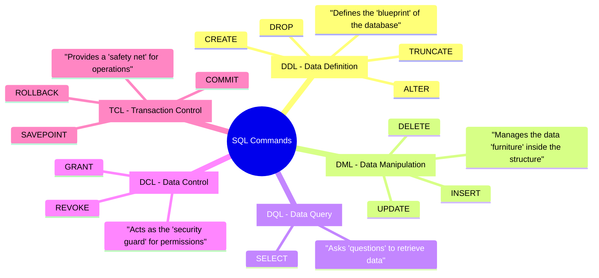
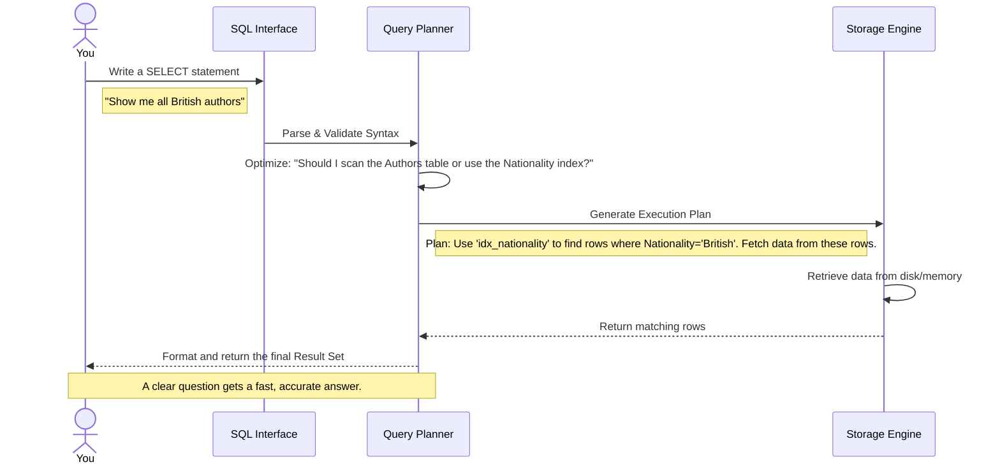

### **4.1. Introduction to SQL**

**What is SQL?**
SQL, which stands for **Structured Query Language**, is the universal language for communicating with relational databases. Often pronounced "sequel" or "S-Q-L," it's a **declarative** language. This means you describe **what** data you want, and the database management system (DBMS) figures out the most efficient way **how** to get it for you.

Think of it like ordering a pizza 🍕. You don't tell the chef to "preheat the oven, roll the dough, spread the sauce..." (an *imperative* approach). Instead, you just say, "I want a large pepperoni pizza" (a *declarative* request). You state the desired outcome, and the expert handles the complex steps.

**Why is SQL so important?**

  * **The Standard:** It's an ANSI/ISO standard. Core commands like `SELECT`, `INSERT`, `UPDATE`, and `DELETE` work across different database systems (like PostgreSQL, MySQL, SQL Server) with only minor variations in syntax for advanced features.
  * **Powerful & Performant:** It can handle vast amounts of data and complex queries with concise commands. Often, a well-written SQL query will outperform code written using an Object-Relational Mapper (ORM) because it's closer to the data.
  * **Accessible:** The syntax is relatively easy to read and understand, resembling natural English, making it a valuable skill for developers, data analysts, and product managers alike.

The commands in SQL are categorized based on their function. This diagram shows the main categories you'll work with:



**Think of SQL as a conversation.** You state your intent (“Show me all active customers who signed up this month”), the DBMS negotiates the best execution plan, and a result set comes back. The clearer your request, the faster and more accurate the database's response.



-----

### **4.1.1. Practice Tables We'll Use**

To make the examples predictable and easy to follow, we will rely on the same miniature library dataset. This setup is a classic relational model, with tables linked by keys.

:::info Key Concepts: Primary vs. Foreign Keys

  * A **Primary Key (PK)** is a column (or set of columns) that uniquely identifies each row in a table. `AuthorID` in the `Authors` table is a PK. It cannot be `NULL` and must be unique.
  * A **Foreign Key (FK)** is a column that creates a link between two tables. `AuthorID` in the `Books` table is an FK that references the `AuthorID` in the `Authors` table. This enforces **referential integrity**, ensuring a book cannot be added for an author who doesn't exist.
    :::

**`Authors` (people who wrote books)**

| AuthorID (PK) | FirstName | LastName | Nationality      |
| :------------ | :-------- | :------- | :--------------- |
| 1             | George    | Orwell   | British          |
| 2             | J.R.R.    | Tolkien  | British          |
| 3             | Isaac     | Asimov   | Russian-American |

**`Books` (titles in our catalogue)**

| BookID (PK) | Title                 | PublicationYear | AuthorID (FK) | Genre            | Price |
| :---------- | :-------------------- | :-------------- | :------------ | :--------------- | :---- |
| 101         | 1984                  | 1949            | 1             | Dystopian        | 12.99 |
| 102         | Animal Farm           | 1945            | 1             | Political Satire | 8.99  |
| 201         | The Hobbit            | 1937            | 2             | Fantasy          | 10.50 |
| 202         | The Lord of the Rings | 1954            | 2             | Fantasy          | 25.00 |
| 301         | Foundation            | 1951            | 3             | Science Fiction  | 14.25 |

**`BookLoans` (circulation history)**

| LoanID (PK) | BookID (FK) | Borrower       | BorrowedAt | ReturnedAt |
| :---------- | :---------- | :------------- | :--------- | :--------- |
| 1           | 101         | Alicia Taylor  | 2024-01-03 | 2024-01-10 |
| 2           | 201         | Malik Phillips | 2024-01-04 | 2024-01-16 |
| 3           | 202         | Priya Singh    | 2024-01-04 | NULL       |
| 4           | 101         | Wei Chen       | 2024-01-12 | 2024-01-20 |

> **Note on `NULL`:** The value `NULL` represents missing or unknown data. It is not the same as zero or an empty string (`''`). In the `BookLoans` table, `ReturnedAt IS NULL` indicates that the book is still checked out.

-----

### **4.2. Data Definition Language (DDL)**

DDL statements **define and manage the database structure or schema**. These commands build and modify the "container" that holds your data. Think of them as the architectural blueprints. 🏛️

#### **`CREATE`**

Used to create new database objects like tables, indexes, or views.

:::tip Choosing the Right Data Type
Selecting an appropriate data type is crucial for performance and data integrity.

  * **Numbers:** Use `INT` or `BIGINT` for whole numbers. Use `DECIMAL(precision, scale)` for financial data to avoid floating-point rounding errors.
  * **Text:** Use `VARCHAR(n)` for strings with a known maximum length. Use `TEXT` for longer, variable-length strings.
  * **Time:** Use `DATE` for dates only, `TIME` for times only, and `TIMESTAMP` or `DATETIME` for date and time combinations.
    :::

| Scenario | Goal                                      | Key Feature Demonstrated                             |
| :------- | :---------------------------------------- | :--------------------------------------------------- |
| A        | Minimal lookup table                      | Basic structure with `PRIMARY KEY` and `UNIQUE`      |
| B        | Table with defaults and check constraints | Auto-populating columns and enforcing business rules |
| C        | Table created from a query                | Materializing a snapshot using `CREATE TABLE ... AS` |

**Scenario A – Create a minimal lookup table**
A lookup table stores a fixed set of values, like genres, to ensure consistency.

```sql
CREATE TABLE Genres (
    GenreID INT PRIMARY KEY,
    GenreName VARCHAR(50) UNIQUE NOT NULL
);
```

  * `PRIMARY KEY`: Uniquely identifies each genre.
  * `UNIQUE`: Ensures no two genres have the same name.
  * `NOT NULL`: Requires that every genre has a name.

**Scenario B – Create a table with defaults and validation**
This table for book orders will auto-fill the order time and validate inputs.

```sql
CREATE TABLE BookOrders (
    OrderID SERIAL PRIMARY KEY, -- Auto-incrementing primary key
    BookID INT NOT NULL,
    OrderedAt TIMESTAMP DEFAULT CURRENT_TIMESTAMP, -- Defaults to the time of insert
    Copies INT CHECK (Copies > 0 AND Copies <= 25), -- Enforces a business rule
    UnitPrice DECIMAL(6,2) CHECK (UnitPrice >= 0), -- Ensures price isn't negative
    FOREIGN KEY (BookID) REFERENCES Books(BookID) -- Guarantees referential integrity
);
```

:::info Dialect-Specific Syntax

  * **Auto-incrementing Keys:** `SERIAL` is a PostgreSQL shorthand. The standard SQL way is `INT GENERATED ALWAYS AS IDENTITY`. MySQL uses `INT AUTO_INCREMENT`. SQL Server uses `INT IDENTITY(1,1)`.
    :::

**Scenario C – Create a table from a query result (CTAS)**
`CREATE TABLE AS SELECT` (CTAS) is great for creating backups, summary tables, or snapshots.

```sql
CREATE TABLE FantasyBooks AS
SELECT b.BookID, b.Title, b.Price
FROM Books AS b
WHERE b.Genre = 'Fantasy';
```

The new `FantasyBooks` table is created with the structure and data returned by the `SELECT` statement. It's a static copy; it will not update automatically if the `Books` table changes.

-----

#### **`ALTER`**

Used to modify an existing database object. You can add, delete, or modify columns and constraints.

:::danger Caution with ALTER TABLE
On large production tables, `ALTER TABLE` can be a slow and locking operation, potentially causing downtime. For major changes, strategies like creating a new table and migrating data are often used.
:::

| Scenario | Goal                            | Impact on Data & Structure                        |
| :------- | :------------------------------ | :------------------------------------------------ |
| A        | Add a new column with a default | Existing rows get the default value instantly     |
| B        | Rename an existing column       | Metadata changes; data is unaffected              |
| C        | Add a foreign key constraint    | Validates existing data before enforcing the link |

**Scenario A – Add a column with a default**
Let's add a flag to the `Authors` table to mark them as a "Featured Author".

```sql
ALTER TABLE Authors
ADD COLUMN IsFeatured BOOLEAN DEFAULT FALSE;
```

All existing authors (Orwell, Tolkien, Asimov) will automatically have `IsFeatured` set to `FALSE`.

**Scenario B – Rename a column for clarity**

```sql
-- Standard SQL
ALTER TABLE Books
RENAME COLUMN PublicationYear TO FirstPublishedYear;
```

Queries must now reference `FirstPublishedYear`. This is a metadata-only change and is usually very fast.

**Scenario C – Enforce a relationship after data entry**
If the `BookLoans` table was created without a foreign key, we can add it later.

```sql
ALTER TABLE BookLoans
ADD CONSTRAINT fk_bookloans_bookid
FOREIGN KEY (BookID) REFERENCES Books(BookID);
```

The database will first check if every `BookID` in `BookLoans` exists in `Books`. If the check passes, the constraint is created. If not, the command fails, protecting your data's integrity.

-----

#### **`DROP`**

Permanently deletes an entire database object. **This is irreversible and should be used with extreme caution\!** 💣

**Scenario A – Dropping a standalone table**

```sql
-- Permanently deletes the table and all its data
DROP TABLE FantasyBooks;
```

If `FantasyBooks` had no dependencies, it's removed instantly.

**Scenario B – Dropping a table with dependencies**
If you try `DROP TABLE Authors;`, it will fail because the `Books` table has a foreign key that references it.

```sql
-- This will FAIL by default to protect you
DROP TABLE Authors;

-- This will succeed, but will also drop the Books table and anything
-- that depends on it. EXTREMELY DANGEROUS.
DROP TABLE Authors CASCADE; -- Syntax varies (e.g., SQL Server handles this differently)
```

-----

#### **`TRUNCATE`**

Quickly deletes **all rows** from a table but leaves the table structure (columns, constraints, etc.) intact.

| Step    | Command                 | Inside the table                                                   |
| :------ | :---------------------- | :----------------------------------------------------------------- |
| Before  | —                       | `Books` has 5 rows                                                 |
| Execute | `TRUNCATE TABLE Books;` | Storage is deallocated; rows removed without logging each deletion |
| After   | —                       | `Books` has 0 rows, and the auto-increment counter is reset        |

It's much faster than `DELETE` for wiping a table, but it's less flexible as it cannot be used with a `WHERE` clause.

-----

### **🧠 DDL Interview Questions**

> **Question 1: What is the difference between `DELETE`, `TRUNCATE`, and `DROP`?**

This is one of the most common SQL interview questions.

| Feature            | `DELETE`                                   | `TRUNCATE`                                          | `DROP`                                             |
| :----------------- | :----------------------------------------- | :-------------------------------------------------- | :------------------------------------------------- |
| **What it does**   | Removes rows from a table                  | Removes all rows from a table                       | Removes the entire table object (structure & data) |
| **`WHERE` clause** | **Yes**, can remove specific rows          | **No**, removes all rows                            | **No**, affects the whole object                   |
| **Speed**          | Slower (logs each row deletion)            | Faster (deallocates data pages)                     | Fastest (removes object definition)                |
| **Rollback**       | Can be rolled back (part of a transaction) | Cannot be rolled back in some systems (e.g., MySQL) | Cannot be rolled back                              |
| **Triggers**       | `DELETE` triggers will fire for each row   | `TRUNCATE` triggers do not fire                     | No triggers                                        |
| **Identity Reset** | Does not reset `SERIAL`/`AUTO_INCREMENT`   | **Resets** `SERIAL`/`AUTO_INCREMENT` counters       | N/A (the counter is gone)                          |
| **Analogy**        | Shredding specific files from a cabinet    | Emptying the entire file cabinet                    | Burning the entire file cabinet                    |

> **Question 2: What is a constraint and why is it useful? Give examples.**

A **constraint** is a rule enforced on the data in a table to ensure accuracy and reliability. They are the database's primary defense against bad data.

  * **`NOT NULL`**: Ensures a column cannot have a `NULL` value.
  * **`UNIQUE`**: Ensures all values in a column are different from each other.
  * **`PRIMARY KEY`**: A combination of `NOT NULL` and `UNIQUE` that uniquely identifies each row.
  * **`FOREIGN KEY`**: Ensures referential integrity by linking to a primary key in another table.
  * **`CHECK`**: Ensures that all values in a column satisfy a specific condition (e.g., `Price >= 0`).

-----

### **4.3. Data Manipulation Language (DML)**

DML statements **manage the data within schema objects**. If DDL builds the house, DML puts the furniture in, rearranges it, and takes it out. 🛋️

#### **`INSERT`**

Adds new rows of data into a table.

**Variation A – Insert a single row with explicit values**

```sql
INSERT INTO Books (BookID, Title, PublicationYear, AuthorID, Genre, Price)
VALUES (302, 'Dune', 1965, 4, 'Science Fiction', 15.99);
```

:::tip Best Practice: Explicit Column Names
Always list the columns explicitly (`INSERT INTO Table (Col1, Col2)`). This makes your code more readable and prevents it from breaking if columns are added or reordered in the future.
:::

**Variation B – Insert multiple rows at once**
This is more efficient than running multiple single `INSERT` statements.

```sql
INSERT INTO Authors (AuthorID, FirstName, LastName, Nationality)
VALUES
  (4, 'Frank', 'Herbert', 'American'),
  (5, 'Ursula', 'Le Guin', 'American');
```

**Variation C – Insert data from another table**
This is useful for populating summary tables or migrating data.

```sql
-- Assume FantasyBooks table was created earlier
INSERT INTO FantasyBooks (BookID, Title, Price)
SELECT BookID, Title, Price
FROM Books
WHERE Genre = 'Science Fiction' AND BookID = 301;
```

-----

#### **`UPDATE`**

Modifies existing rows in a table.

:::danger The Ultimate SQL Mistake
**Always, always, always use a `WHERE` clause with `UPDATE` and `DELETE`\!** Forgetting it will cause the operation to apply to *every single row* in the table. Before running a destructive query, it's a great habit to write it as a `SELECT` first to preview which rows will be affected.

`-- SELECT *, Price * 0.90 FROM Books WHERE Genre = 'Fantasy';`
:::

**Variation A – Targeted update by primary key**
This is the safest way to update, as it targets exactly one row.

```sql
-- The Lord of the Rings has a new edition, price changed.
UPDATE Books
SET Price = 22.50
WHERE BookID = 202;
```

**Variation B – Conditional update on multiple rows**
Give a 10% discount to all books by George Orwell.

```sql
UPDATE Books
SET Price = Price * 0.90
WHERE AuthorID = 1;
```

**Variation C – Updating a table using values from another table**
Suppose we have a `NewPrices` staging table with price updates.
**`NewPrices`**
| BookID | NewPrice |
| :----- | :------- |
| 101    | 11.50    |
| 201    | 9.75     |

```sql
-- PostgreSQL and SQL Server syntax
UPDATE Books AS b
SET Price = np.NewPrice
FROM NewPrices AS np
WHERE b.BookID = np.BookID;

-- MySQL syntax
UPDATE Books b
JOIN NewPrices np ON b.BookID = np.BookID
SET b.Price = np.NewPrice;
```

-----

#### **`DELETE`**

Removes existing rows from a table.

**Variation A – Delete a single, specific row**

```sql
DELETE FROM Books
WHERE BookID = 102; -- Removes 'Animal Farm'
```

If `BookID` 102 were referenced in `BookLoans`, this would fail due to the foreign key constraint, protecting your data.

**Variation B – Delete a set of rows using `IN`**

```sql
DELETE FROM Authors
WHERE Nationality IN ('American', 'Russian-American');
```

This would attempt to delete Isaac Asimov and any other American authors we added. Again, it would fail if their books still exist in the `Books` table.

**Variation C – Delete using a subquery**
This powerful pattern lets you delete based on a condition in another table.

```sql
-- Delete loan records for all Fantasy books.
DELETE FROM BookLoans
WHERE BookID IN (
    SELECT BookID
    FROM Books
    WHERE Genre = 'Fantasy'
);
```

-----

### **4.4. Data Query Language (DQL)**

DQL is used to **retrieve data** from the database. It's how you ask questions. The `SELECT` statement is its cornerstone and the command you will use most often. 🧐

#### **`SELECT`**

Walk through the core building blocks to see how a query is constructed.

**Variation A – Project everything from a table**
`*` is a wildcard for "all columns".

```sql
SELECT * FROM Books;
```

:::tip Avoid `SELECT *` in Production Code
While handy for exploration, it's bad practice in application code.

1.  **Performance:** You might fetch more data than needed, increasing network traffic.
2.  **Stability:** If a column is added/removed, your application might break. Explicitly naming columns is safer.
    :::

**Variation B – Project specific and calculated columns with aliases**
Create a "virtual" column showing a sale price. `AS` gives it a clean name.

```sql
SELECT
  Title,
  Price,
  Price * 0.85 AS SalePrice -- The AS keyword is optional but good for clarity
FROM Books;
```

The underlying `Books.Price` column is unchanged.

**Variation C – Filter rows with `WHERE`**
The `WHERE` clause acts on individual rows *before* any grouping.

```sql
SELECT Title, Genre, Price
FROM Books
WHERE Price > 12 AND Genre <> 'Fantasy'; -- <> means 'not equal to'
```

**Variation D – Pattern matching with `LIKE`**
`%` is a wildcard for any number of characters. `_` is a wildcard for a single character.

```sql
-- Find all books with 'The' in their title
SELECT Title
FROM Books
WHERE Title LIKE '%The%';
```

**Variation E – Sorting the result with `ORDER BY`**

```sql
-- Order by genre alphabetically, then by price from highest to lowest
SELECT Title, Genre, Price
FROM Books
ORDER BY Genre ASC, Price DESC; -- ASC is the default
```

**Variation F – Limiting the number of rows (`LIMIT`/`TOP`/`FETCH`)**
Essential for pagination and finding "Top N" records.

```sql
-- Get the 2 most expensive books
SELECT Title, Price
FROM Books
ORDER BY Price DESC
LIMIT 2; -- PostgreSQL/MySQL/SQLite

-- SQL Server equivalent:
-- SELECT TOP 2 Title, Price FROM Books ORDER BY Price DESC;

-- Standard SQL equivalent:
-- SELECT Title, Price FROM Books ORDER BY Price DESC FETCH FIRST 2 ROWS ONLY;
```

**Variation G – Aggregating data with `GROUP BY`**
`GROUP BY` collapses multiple rows into a single summary row. It's used with aggregate functions like `COUNT()`, `SUM()`, `AVG()`, `MAX()`, `MIN()`.

```sql
SELECT
  Genre,
  COUNT(*) AS NumberOfBooks,
  AVG(Price) AS AveragePrice
FROM Books
GROUP BY Genre
ORDER BY NumberOfBooks DESC;
```

:::info The `GROUP BY` Golden Rule
Any non-aggregated column in the `SELECT` list **must** also be in the `GROUP BY` clause.
:::

**Variation H – Filtering aggregated results with `HAVING`**
`HAVING` is like `WHERE`, but for groups. It runs *after* `GROUP BY`.

```sql
-- Find genres that have more than one book
SELECT
  Genre,
  COUNT(*) AS TitleCount
FROM Books
GROUP BY Genre
HAVING COUNT(*) > 1; -- Filter the groups, not the original rows
```

This would only return the "Fantasy" genre.

**Variation I – Combining data from multiple tables with `JOIN`**
`JOIN` is the core of relational databases. It combines rows from tables based on a related column.

```sql
SELECT
  b.Title,
  a.FirstName,
  a.LastName
FROM Books AS b
JOIN Authors AS a ON b.AuthorID = a.AuthorID;
```

This links each book to its author's name.

**Variation J – Using window functions with `OVER()`**
Window functions perform a calculation across a set of table rows related to the current row. Unlike `GROUP BY`, they do not collapse rows.

```sql
-- Show each book's price and how it compares to the average price in its genre
SELECT
  Title,
  Genre,
  Price,
  AVG(Price) OVER (PARTITION BY Genre) AS AvgPriceForGenre
FROM Books;
```

**Result:**
| Title                 | Genre   | Price | AvgPriceForGenre |
| :-------------------- | :------ | :---- | :--------------- |
| The Hobbit            | Fantasy | 10.50 | 17.75            |
| The Lord of the Rings | Fantasy | 25.00 | 17.75            |
| ...                   | ...     | ...   | ...              |

-----

### **4.4.1. From Question to Query: A Guided Example**

Let’s translate a business question into SQL: **“Which fantasy books were published before 1950, and who wrote them? Show the author's full name.”**

| Thought Process                | SQL Translation                                              |
| :----------------------------- | :----------------------------------------------------------- |
| **1. Identify needed data:**   | Book Title, Year, Author Name                                |
| **2. Identify source tables:** | `Books` (for title/year) and `Authors` (for name)            |
| **3. How to link tables?:**    | `Books.AuthorID = Authors.AuthorID`                          |
| **4. What columns to show?:**  | `SELECT b.Title, b.PublicationYear, a.FirstName, a.LastName` |
| **5. How to filter books?:**   | `WHERE b.Genre = 'Fantasy' AND b.PublicationYear < 1950`     |
| **6. How to combine names?:**  | Use concatenation: `a.FirstName                              |  | ' ' |  | a.LastName` |
| **7. Final Assembly:**         | Combine all clauses into a final query.                      |

```sql
-- Final query
SELECT
  b.Title,
  b.PublicationYear,
  a.FirstName || ' ' || a.LastName AS AuthorFullName -- PostgreSQL/SQLite concatenation
  -- For SQL Server use: a.FirstName + ' ' + a.LastName
  -- For MySQL use: CONCAT(a.FirstName, ' ', a.LastName)
FROM
  Books AS b
JOIN
  Authors AS a ON b.AuthorID = a.AuthorID
WHERE
  b.Genre = 'Fantasy' AND b.PublicationYear < 1950
ORDER BY
  b.PublicationYear;
```

**Result:** A concise list answering the question directly. Practicing this translation loop makes SQL feel conversational.

-----

### **🧠 DQL Interview Questions**

> **Question 1: Explain the logical order of operations in a `SELECT` statement.**

This is a key concept. Even though we write `SELECT` first, the database executes the clauses in a different, logical order:

1.  `FROM` / `JOIN`: Gathers all the data from the specified tables.
2.  `WHERE`: Filters individual rows based on conditions.
3.  `GROUP BY`: Aggregates the filtered rows into groups.
4.  `HAVING`: Filters the aggregated groups.
5.  `SELECT`: Selects the final columns and performs calculations.
6.  `DISTINCT`: Removes duplicate rows.
7.  `ORDER BY`: Sorts the final result set.
8.  `LIMIT` / `OFFSET`: Selects a subset of the sorted rows.

> **Question 2: What is the difference between `UNION` and `UNION ALL`?**

Both operators combine the result sets of two or more `SELECT` statements.

  * **`UNION`**: Removes duplicate rows from the combined result set. It's like doing a `UNION ALL` followed by a `DISTINCT`.
  * **`UNION ALL`**: Includes all rows, including duplicates. It is faster because it doesn't need to check for duplicates.

> **Question 3: What is the difference between a subquery and a Common Table Expression (CTE)?**

Both can be used to break down complex queries.

  * A **Subquery** is a `SELECT` statement nested inside another statement. They can sometimes be hard to read if nested deeply.
  * A **Common Table Expression (CTE)** is a temporary, named result set, defined using a `WITH` clause. CTEs are often much more readable for complex, multi-step queries and can be recursive.

<!-- end list -->

```sql
-- Using a CTE to find British authors
WITH BritishAuthors AS (
  SELECT AuthorID, FirstName, LastName
  FROM Authors
  WHERE Nationality = 'British'
)
SELECT b.Title, ba.LastName
FROM Books b
JOIN BritishAuthors ba ON b.AuthorID = ba.AuthorID;
```

-----

### **4.5. Data Control Language (DCL)**

DCL statements manage **permissions and access control**. They determine who can do what to which database objects. Think of them as the database's security guard. 🛡️

  * **`GRANT`**: Gives a specific user permissions to perform tasks.
  * **`REVOKE`**: Takes away permissions from a user.

**Variation A – Grant read-only access**

```sql
GRANT SELECT ON Books TO analyst;
```

*Effect*: The `analyst` user can now run `SELECT` queries on the `Books` table but will receive a permission error if they attempt an `INSERT`, `UPDATE`, or `DELETE`.

**Variation B – Grant column-specific update rights**
Some database engines allow fine-grained permissions at the column level.

```sql
GRANT UPDATE (Price) ON Books TO pricing_bot;
```

*Effect*: The `pricing_bot` role may update the `Price` column in `Books`, but not the `Title` or `Genre`.

**Variation C – Revoke rights**

```sql
REVOKE SELECT ON Books FROM analyst;
```

*Effect*: The permission is removed. Future `SELECT` attempts by the `analyst` will fail.

:::tip Best Practice: Use Roles
Instead of granting permissions to individual users, it's better to grant them to a **role** (a group of permissions) and then assign users to that role. This makes managing permissions much easier as your team grows.

`CREATE ROLE read_only;`
`GRANT SELECT ON ALL TABLES IN SCHEMA public TO read_only;`
`GRANT read_only TO analyst_user, reporting_service;`
:::

-----

### **4.6. Transaction Control Language (TCL)**

TCL statements manage **transactions**, which are sequences of operations performed as a single, logical unit of work. Transactions ensure data integrity through the ACID properties.

:::info What is ACID?
ACID is a set of properties that guarantee database transactions are processed reliably. This is a critical concept in DBMS theory.

  * **A**tomicity: The whole transaction succeeds, or none of it does. There's no partial success. (All or nothing).

  * **C**onsistency: A transaction brings the database from one valid state to another. Data integrity is never compromised.

  * **I**solation: Concurrent transactions do not interfere with each other. It's as if they are running one after the other.

  * **D**urability: Once a transaction is committed, it will remain so, even in the event of a power loss or system crash.
    :::

  * **`COMMIT`**: Saves all the work done in the current transaction, making the changes permanent.

  * **`ROLLBACK`**: Undoes all the work done in the current transaction, restoring the database to the state it was in before the transaction began.

  * **`SAVEPOINT`**: Sets a point within a transaction to which you can later roll back.

**Variation A – A successful, committed transaction**

```sql
BEGIN TRANSACTION;
UPDATE Books SET Price = Price * 1.05 WHERE Genre = 'Fantasy';
UPDATE Books SET Price = Price * 1.10 WHERE Genre = 'Science Fiction';
COMMIT;
```

*Effect*: Both updates are applied and made permanent. The changes are now visible to all other users.

**Variation B – A transaction rolled back due to an error**

```sql
BEGIN TRANSACTION;
DELETE FROM Books WHERE Genre = 'Fantasy';
-- Whoops, that was a mistake! Let's undo it.
ROLLBACK;
```

*Effect*: The `DELETE` operation is completely undone. The fantasy books are restored to the table as if the command never ran.

**Variation C – Rolling back to a partial savepoint**
This allows you to undo only part of a transaction.

```sql
BEGIN TRANSACTION;
UPDATE Authors SET IsFeatured = TRUE WHERE AuthorID = 1; -- Orwell
SAVEPOINT author_1_featured;

UPDATE Authors SET IsFeatured = TRUE WHERE AuthorID = 2; -- Tolkien
-- Let's say we only wanted to feature Orwell.
ROLLBACK TO SAVEPOINT author_1_featured;

COMMIT;
```

*Effect*: The final state is that only George Orwell is featured. The change to Tolkien's record was rolled back, but the initial change to Orwell's was committed.