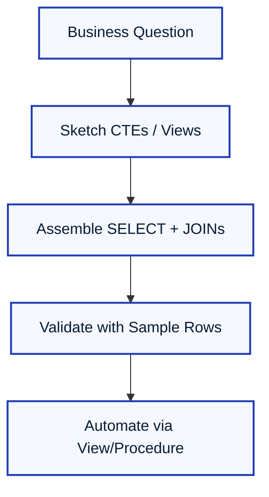

With fundamentals in place, this chapter shows how the same SQL keywords behave differently depending on predicates, data shape, and execution context. For each concept we reuse a single dataset, run multiple variations of each keyword, and peek at the table state or result set so you can see exactly what changed.

---

### **5.0. Practice Dataset for All Examples**

Unless a variation explicitly modifies data, assume the tables reset to the baseline below before each example.

**`Departments`**

| DepartmentID | DepartmentName   | Budget | ParentDepartmentID |
| :----------- | :--------------- | :----- | :----------------- |
| 10           | Engineering      | 750000 | NULL               |
| 20           | Marketing        | 250000 | NULL               |
| 30           | Customer Success | 180000 | NULL               |
| 40           | Research         | 300000 | 10                 |

**`Employees`**

| EmployeeID | FirstName | LastName | DepartmentID | ManagerID | HireDate   | Salary |
| :--------- | :-------- | :------- | :----------- | :-------- | :--------- | :----- |
| 101        | Amina     | Lee      | 10           | NULL      | 2015-02-14 | 98000  |
| 102        | Bruno     | Silva    | 10           | 101       | 2018-07-09 | 82000  |
| 103        | Carmen    | Ortiz    | 20           | 107       | 2019-11-21 | 69000  |
| 104        | Deepak    | Rao      | 40           | 101       | 2020-05-04 | 76000  |
| 105        | Erin      | Chen     | 30           | 108       | 2017-03-18 | 72000  |
| 106        | Faisal    | Khan     | 10           | 102       | 2021-01-11 | 68000  |
| 107        | Grace     | Mbaye    | 20           | NULL      | 2012-09-02 | 103000 |
| 108        | Hugo      | Martins  | 30           | NULL      | 2014-06-30 | 95000  |
| 109        | Irina     | Petrov   | NULL         | 101       | 2022-04-12 | 54000  |

> `ManagerID = NULL` indicates a top-level manager. `DepartmentID = NULL` indicates a central contractor not assigned to a department.

**`Projects`**

| ProjectID | ProjectName      | StartDate  | EndDate    | OwningDepartmentID |
| :-------- | :--------------- | :--------- | :--------- | :----------------- |
| 501       | Phoenix Rewrite  | 2023-02-01 | NULL       | 10                 |
| 502       | Atlas Launch     | 2022-09-15 | 2024-01-31 | 20                 |
| 503       | Lighthouse AI    | 2023-05-20 | NULL       | 40                 |
| 504       | Harmony Outreach | 2023-01-10 | 2023-12-10 | 30                 |

**`Employee_Projects`**

| EmployeeID | ProjectID | Role         | AllocationPercent |
| :--------- | :-------- | :----------- | :---------------- |
| 101        | 501       | Sponsor      | 25                |
| 102        | 501       | Lead Eng     | 60                |
| 102        | 503       | Reviewer     | 15                |
| 104        | 503       | Scientist    | 70                |
| 105        | 504       | PM           | 50                |
| 106        | 501       | Dev          | 45                |
| 107        | 502       | Advisor      | 20                |
| 108        | 504       | Exec Sponsor | 15                |
| 109        | 502       | Contractor   | 40                |

---

### **5.1. Filtering and Operators**

`WHERE` predicates turn huge tables into focused result sets. Changing an operator or boundary can quietly reshape the answer.

#### **`BETWEEN` (inclusive bounds)**

**Variation A – calendar decade window**

```sql
SELECT EmployeeID, FirstName, HireDate
FROM Employees
WHERE HireDate BETWEEN '2015-01-01' AND '2019-12-31';
```

_Result:_ Returns employees hired from 2015 through 2019 inclusive (Amina, Bruno, Carmen, Erin). If you change the upper bound to `'2019-11-20'`, Carmen disappears.

**Variation B – salary band check**

```sql
SELECT EmployeeID, Salary
FROM Employees
WHERE Salary BETWEEN 70000 AND 90000;
```

_Result set:_ Employees 102, 104, 105, 106. Lowering the minimum to `65000` pulls in Faisal; raising the maximum to `100000` adds Amina.

#### **`IN` (explicit and dynamic lists)**

**Variation A – explicit list**

```sql
SELECT FirstName, DepartmentID
FROM Employees
WHERE DepartmentID IN (10, 40);
```

_Result:_ Employees working in Engineering or Research (101, 102, 104, 106).

**Variation B – subquery-powered list**

```sql
SELECT FirstName, DepartmentID
FROM Employees
WHERE DepartmentID IN (
    SELECT DepartmentID
    FROM Departments
    WHERE Budget > 300000
);
```

_When underlying budgets change, the same query adapts. Currently Engineering (750000) and Research (300000) qualify, returning employees in departments 10 and 40. If Research budget drops below 300000, Deepak disappears from the result._

#### **`LIKE` (pattern matching)**

**Variation A – prefix match**

```sql
SELECT LastName
FROM Employees
WHERE LastName LIKE 'M%';
```

_Result:_ Mbaye and Martins. Switching to `'Ma%'` narrows to Martins.

**Variation B – contains and single-character wildcard**

```sql
SELECT FirstName
FROM Employees
WHERE FirstName LIKE '_r%';
```

_Result:_ Bruno and Grace (second letter `r`). Replacing `_r%` with `%na%` catches Amina and Irina.

#### **`IS NULL` / `IS NOT NULL`**

**Variation A – find unassigned departments**

```sql
SELECT EmployeeID, FirstName
FROM Employees
WHERE DepartmentID IS NULL;
```

_Result:_ Irina is the only central contractor right now. After assigning her to department 20, she disappears from this query and starts showing up in department reports.

**Variation B – ensure complete management chain**

```sql
SELECT EmployeeID, FirstName
FROM Employees
WHERE ManagerID IS NOT NULL;
```

_Result:_ Everyone except Amina, Grace, and Hugo. If you set `ManagerID` for Amina to 107, she would now appear here and would no longer be a top-level manager.

---

### **5.2. SQL Functions**

Functions can summarize many rows or transform single values. Try different arguments to see how results shift.

#### **Aggregate functions**

**Variation A – classic stats**

```sql
SELECT
    COUNT(*)        AS Headcount,
    AVG(Salary)     AS AvgSalary,
    SUM(Salary)     AS Payroll,
    MIN(Salary)     AS Lowest,
    MAX(Salary)     AS Highest
FROM Employees;
```

_Result:_ One row summarizing salary distribution. If you exclude contractors (`WHERE DepartmentID IS NOT NULL`) the average rises because Irina drops out.

**Variation B – conditional aggregate**

```sql
SELECT
    COUNT(CASE WHEN Salary >= 90000 THEN 1 END) AS HighEarners,
    COUNT(CASE WHEN Salary < 70000 THEN 1 END) AS EntryLevel
FROM Employees;
```

_Table impact:_ Underlying data remains unchanged; the counts shift instantly if you update any salary.

**Variation C – distinct counting**

```sql
SELECT COUNT(DISTINCT DepartmentID) AS ActiveDepartments
FROM Employees
WHERE DepartmentID IS NOT NULL;
```

_Result:_ 3 departments currently have staff assigned. If Irina joins Marketing, the distinct count stays 3; if Research hires someone new, it remains 3 because department 40 already exists in the set.

#### **Scalar functions**

**String transformation**

```sql
SELECT EmployeeID,
       UPPER(FirstName || ' ' || LastName) AS FullNameUpper,
       LENGTH(LastName) AS LastNameLength
FROM Employees;
```

_Result:_ Same row count as `Employees`. Change `UPPER` to `LOWER` to see lowercase outputs. Changing concatenation to `CONCAT_WS(' ', FirstName, LastName)` works in engines that prefer function syntax.

**Numeric rounding and absolute difference**

```sql
SELECT ProjectID,
       AllocationPercent,
       ROUND(AllocationPercent / 100.0, 2) AS FractionalAlloc,
       ABS(AllocationPercent - 50)         AS DistanceFromEvenSplit
FROM Employee_Projects;
```

_Result:_ Helps spot over-allocated contributors. Editing allocation numbers immediately changes the calculations because scalar functions run per row.

**Date extraction**

```sql
SELECT EmployeeID,
       HireDate,
       EXTRACT(YEAR FROM HireDate) AS HireYear,
       EXTRACT(QUARTER FROM HireDate) AS HireQuarter
FROM Employees;
```

_Result:_ Lets you bucket hires by calendar year/quarter. Swap `EXTRACT` for `DATEPART` if you are on SQL Server.

---

### **5.3. Grouping and Aggregation**

#### **`GROUP BY` variations**

**Variation A – department headcount**

```sql
SELECT DepartmentID,
       COUNT(*) AS EmployeeCount
FROM Employees
WHERE DepartmentID IS NOT NULL
GROUP BY DepartmentID
ORDER BY DepartmentID;
```

_Result:_ Departments 10, 20, 30, 40 map to counts 3, 2, 2, 1. If Deepak transfers from 40 to 10, department 40 drops to zero (and disappears unless you outer join to `Departments`).

**Variation B – group by multiple columns**

```sql
SELECT DepartmentID,
       EXTRACT(YEAR FROM HireDate) AS HireYear,
       COUNT(*) AS Hires
FROM Employees
WHERE DepartmentID IS NOT NULL
GROUP BY DepartmentID, EXTRACT(YEAR FROM HireDate)
ORDER BY DepartmentID, HireYear;
```

_Result:_ Breaks counts by department and hire year. Adding 2023 hires immediately produces a new row combination.

**Variation C – grouping sets and rollup**

```sql
SELECT
    DepartmentID,
    ManagerID,
    COUNT(*) AS DirectReports
FROM Employees
GROUP BY ROLLUP (DepartmentID, ManagerID)
ORDER BY DepartmentID, ManagerID;
```

_Result:_ You get detailed counts per manager, totals per department, and a grand total (`NULL, NULL`). If your engine lacks `ROLLUP`, simulate it with `GROUPING SETS` or `UNION ALL` queries.

#### **`HAVING` variations**

**Variation A – enforce minimum headcount**

```sql
SELECT DepartmentID,
       COUNT(*) AS EmployeeCount
FROM Employees
WHERE DepartmentID IS NOT NULL
GROUP BY DepartmentID
HAVING COUNT(*) >= 2;
```

_Result:_ Filters out department 40 because it has only one employee. Lowering the threshold to 1 brings it back.

**Variation B – aggregate predicate referencing other aggregates**

```sql
SELECT DepartmentID,
       AVG(Salary) AS AvgSalary,
       SUM(Salary) AS TotalSalary
FROM Employees
WHERE DepartmentID IS NOT NULL
GROUP BY DepartmentID
HAVING SUM(Salary) > 150000 AND AVG(Salary) < 95000;
```

_Result:_ Returns departments whose payroll exceeds 150k but average salary is below 95k, highlighting larger teams with moderate salaries. Changing either threshold changes membership instantly.

---

### **5.4. Joins**

The same pair of tables can yield radically different shapes depending on join type.

**Baseline slices before joining**

| DeptID | DeptName         |
| :----- | :--------------- |
| 10     | Engineering      |
| 20     | Marketing        |
| 30     | Customer Success |
| 40     | Research         |

| EmpID | DeptID |
| :---- | :----- |
| 101   | 10     |
| 102   | 10     |
| 103   | 20     |
| 104   | 40     |
| 105   | 30     |
| 106   | 10     |
| 107   | 20     |
| 108   | 30     |
| 109   | NULL   |

#### **`INNER JOIN` vs `LEFT JOIN`**

```sql
SELECT e.EmployeeID, e.FirstName, d.DepartmentName
FROM Employees AS e
JOIN Departments AS d ON e.DepartmentID = d.DepartmentID
ORDER BY e.EmployeeID;
```

_Result:_ Contractors with `NULL` departments (Irina) vanish. Switching to `LEFT JOIN` preserves Irina with `DepartmentName = NULL`.

#### **`RIGHT JOIN` and `FULL OUTER JOIN`**

```sql
SELECT d.DepartmentName,
       e.EmployeeID
FROM Employees AS e
RIGHT JOIN Departments AS d ON e.DepartmentID = d.DepartmentID
ORDER BY d.DepartmentName, e.EmployeeID;
```

_Result:_ Every department listed even if empty. If Research lost Deepak, you would still see "Research" with `EmployeeID = NULL`. Using `FULL OUTER JOIN` additionally keeps contractors without departments.

#### **Self join for hierarchy**

```sql
SELECT child.EmployeeID,
       child.FirstName AS Employee,
       parent.FirstName AS Manager
FROM Employees AS child
LEFT JOIN Employees AS parent ON child.ManagerID = parent.EmployeeID
ORDER BY child.EmployeeID;
```

_Result:_ Each row shows employee/manager pairing. When `ManagerID` is `NULL`, manager fields are `NULL`, signaling top-level roles. Changing Bruno's manager to 108 updates his row instantly.

#### **Join with bridging table**

```sql
SELECT e.FirstName,
       p.ProjectName,
       ep.Role,
       ep.AllocationPercent
FROM Employee_Projects AS ep
JOIN Employees AS e ON ep.EmployeeID = e.EmployeeID
JOIN Projects  AS p ON ep.ProjectID = p.ProjectID
ORDER BY p.ProjectName, e.FirstName;
```

_Result:_ Expands many-to-many relationships into readable rows. Removing a row from `Employee_Projects` will prune lines for that employee/project combination only.

---

### **5.5. Subqueries (Nested Queries)**

#### **Subquery in `WHERE`**

**Variation A – single-value comparison**

```sql
SELECT FirstName, DepartmentID
FROM Employees
WHERE DepartmentID = (
    SELECT DepartmentID
    FROM Departments
    WHERE DepartmentName = 'Engineering'
);
```

_Result:_ Employees 101, 102, 106 (department 10). If two departments shared the same name, this subquery would fail; add `LIMIT 1` or a unique constraint to safeguard.

**Variation B – `IN` subquery with condition**

```sql
SELECT FirstName, DepartmentID
FROM Employees
WHERE DepartmentID IN (
    SELECT DepartmentID
    FROM Departments
    WHERE ParentDepartmentID = 10
);
```

_Result:_ Finds employees in departments overseen by Engineering (currently department 40, so Deepak). Assigning more sub-departments to parent 10 grows the result automatically.

#### **`FROM` clause subquery**

```sql
SELECT avg_stats.DepartmentID,
       avg_stats.AvgSalary,
       avg_stats.Headcount
FROM (
    SELECT DepartmentID,
           AVG(Salary) AS AvgSalary,
           COUNT(*)    AS Headcount
    FROM Employees
    WHERE DepartmentID IS NOT NULL
    GROUP BY DepartmentID
) AS avg_stats
WHERE avg_stats.Headcount >= 2;
```

_Result:_ Derived table holds per-department summaries, outer query filters the aggregated rows. Removing the outer filter surfaces departments with a single employee.

#### **Correlated subquery**

```sql
SELECT e.EmployeeID,
       e.FirstName,
       e.Salary
FROM Employees AS e
WHERE e.Salary > (
    SELECT AVG(e_inner.Salary)
    FROM Employees AS e_inner
    WHERE e_inner.DepartmentID = e.DepartmentID
);
```

_Result:_ Returns employees earning above their department average. If the department has only one member, the average equals their salary, so they do not appear unless you use `>=`.

#### **`EXISTS` vs `IN`**

```sql
SELECT e.EmployeeID, e.FirstName
FROM Employees AS e
WHERE EXISTS (
    SELECT 1
    FROM Employee_Projects AS ep
    WHERE ep.EmployeeID = e.EmployeeID
      AND ep.AllocationPercent >= 50
);
```

_Result:_ Employees with at least one heavy project assignment (102, 104, 105). Replacing `EXISTS` with `IN` against the same subquery would deliver the same list today, but `EXISTS` ignores duplicates and can short-circuit faster.

---

### **5.6. Common Table Expressions (CTEs)**

#### **Single CTE for clarity**

```sql
WITH DeptStats AS (
    SELECT DepartmentID,
           COUNT(*) AS Headcount,
           AVG(Salary) AS AvgSalary
    FROM Employees
    WHERE DepartmentID IS NOT NULL
    GROUP BY DepartmentID
)
SELECT d.DepartmentName,
       s.Headcount,
       s.AvgSalary
FROM DeptStats AS s
JOIN Departments AS d ON d.DepartmentID = s.DepartmentID
WHERE s.Headcount >= 2;
```

_Result:_ Same logic as earlier subquery, but sectioned into named steps. Removing the `WHERE` clause yields all departments, showing how CTEs act like reusable views for a single statement.

#### **Stacked CTEs for stepwise reasoning**

```sql
WITH ProjectHours AS (
    SELECT ProjectID,
           SUM(AllocationPercent) AS TotalPercent
    FROM Employee_Projects
    GROUP BY ProjectID
),
    OverAllocated AS (
    SELECT ProjectID
    FROM ProjectHours
    WHERE TotalPercent > 100
)
SELECT p.ProjectName,
       h.TotalPercent
FROM ProjectHours AS h
JOIN Projects AS p ON p.ProjectID = h.ProjectID
LEFT JOIN OverAllocated AS o ON o.ProjectID = h.ProjectID
ORDER BY h.TotalPercent DESC;
```

_Result:_ Shows per-project allocation and flags those exceeding 100%. If no project crosses the threshold, `OverAllocated` is empty but the main list still renders because of the `LEFT JOIN`.

#### **Recursive CTE (hierarchy)**

```sql
WITH RECURSIVE OrgChart AS (
    SELECT EmployeeID,
           FirstName,
           ManagerID,
           0 AS Depth
    FROM Employees
    WHERE ManagerID IS NULL
    UNION ALL
    SELECT e.EmployeeID,
           e.FirstName,
           e.ManagerID,
           oc.Depth + 1
    FROM Employees AS e
    JOIN OrgChart AS oc ON e.ManagerID = oc.EmployeeID
)
SELECT *
FROM OrgChart
ORDER BY Depth, EmployeeID;
```

_Result:_ Traverses management hierarchy from roots downward. Adding a new reporting layer automatically extends the tree in the result.

---

### **5.7. Window Functions**

#### **Ranking family**

```sql
SELECT EmployeeID,
       DepartmentID,
       Salary,
       ROW_NUMBER() OVER (PARTITION BY DepartmentID ORDER BY Salary DESC) AS RowNum,
       RANK()       OVER (PARTITION BY DepartmentID ORDER BY Salary DESC) AS RankWithGaps,
       DENSE_RANK() OVER (PARTITION BY DepartmentID ORDER BY Salary DESC) AS DenseRank
FROM Employees
WHERE DepartmentID IS NOT NULL
ORDER BY DepartmentID, Salary DESC;
```

_Result:_ Compare how ties affect each rank column. If two employees share the same salary, `RANK` skips numbers while `DENSE_RANK` does not.

#### **Running totals and moving averages**

```sql
SELECT ep.EmployeeID,
       e.FirstName,
       ep.ProjectID,
       ep.AllocationPercent,
       SUM(ep.AllocationPercent) OVER (PARTITION BY ep.EmployeeID ORDER BY ep.ProjectID) AS RunningAlloc,
       AVG(ep.AllocationPercent) OVER (PARTITION BY ep.EmployeeID ROWS BETWEEN CURRENT ROW AND 1 FOLLOWING) AS TwoProjectAvg
FROM Employee_Projects AS ep
JOIN Employees AS e ON e.EmployeeID = ep.EmployeeID
ORDER BY ep.EmployeeID, ep.ProjectID;
```

_Result:_ For each employee, see how allocations accumulate across projects and the forward-looking average. Sorting `ORDER BY ep.ProjectID DESC` changes the running total sequence.

#### **Window over entire set**

```sql
SELECT ProjectID,
       AllocationPercent,
       AllocationPercent - AVG(AllocationPercent) OVER () AS DeltaFromOverallAvg
FROM Employee_Projects;
```

_Result:_ Shows each row's deviation from the global average (approx 37.8%). Partitioning by `ProjectID` would instead compare within each project.

---

### **5.8. Set Operations**

#### **`UNION` vs `UNION ALL`**

```sql
SELECT DepartmentID FROM Employees WHERE DepartmentID IS NOT NULL
UNION
SELECT ParentDepartmentID FROM Departments WHERE ParentDepartmentID IS NOT NULL;
```

_Result:_ Unique list of department IDs that appear either as home departments or parent departments (10, 20, 30, 40). Switching to `UNION ALL` preserves duplicates, useful for counts but requiring an outer aggregation to dedupe.

#### **`INTERSECT`**

```sql
SELECT DepartmentID FROM Employees WHERE DepartmentID IS NOT NULL
INTERSECT
SELECT DepartmentID FROM Projects;
```

_Result:_ Departments that both employ people and own projects (10, 20, 30, 40). If Research closes all projects, department 40 disappears.

#### **`EXCEPT` (anti join shorthand)**

```sql
SELECT DepartmentID FROM Departments
EXCEPT
SELECT DepartmentID FROM Employees WHERE DepartmentID IS NOT NULL;
```

_Result:_ Departments lacking headcount. Currently none. If you inserted department 50 without employees, it would surface here immediately.

---

### **5.9. Advanced Objects**

#### **Views**

**Variation A – simple view for reuse**

```sql
CREATE VIEW vw_employee_directory AS
SELECT e.EmployeeID,
       e.FirstName,
       e.LastName,
       d.DepartmentName
FROM Employees AS e
LEFT JOIN Departments AS d ON e.DepartmentID = d.DepartmentID;
```

_Result:_ No data copied; the view reads live tables. Running `SELECT * FROM vw_employee_directory WHERE DepartmentName = 'Engineering';` returns the engineering roster. Dropping or renaming columns in base tables can break the view, so manage carefully.

**Variation B – secure view masking salaries**

```sql
CREATE VIEW vw_public_directory AS
SELECT e.EmployeeID,
       e.FirstName,
       e.LastName,
       COALESCE(d.DepartmentName, 'Contractor') AS DepartmentLabel
FROM Employees AS e
LEFT JOIN Departments AS d ON e.DepartmentID = d.DepartmentID;

GRANT SELECT ON vw_public_directory TO analytics_reader;
```

_Table impact:_ Users with `analytics_reader` role now see department labels but not salaries. Revoking the grant removes access immediately.

#### **Stored procedures**

**Variation A – parameterized fetch**

```sql
CREATE PROCEDURE GetEmployeesByDept(IN p_department INT)
LANGUAGE sql
AS $$
    SELECT EmployeeID, FirstName, LastName
    FROM Employees
    WHERE DepartmentID = p_department;
$$;

CALL GetEmployeesByDept(10);
```

_Result:_ Returns Engineering staff. Passing `NULL` retrieves no rows because the equality comparison fails; update the procedure with `IS NOT DISTINCT FROM` for nullable inputs.

**Variation B – procedure with data change and transaction control**

```sql
CREATE PROCEDURE GiveRaise(IN p_employee INT, IN p_percent NUMERIC)
LANGUAGE plpgsql
AS $$
BEGIN
    UPDATE Employees
    SET Salary = Salary * (1 + p_percent)
    WHERE EmployeeID = p_employee;
END;
$$;

CALL GiveRaise(106, 0.05);
```

_After call:_ Faisal's salary increases from 68000 to 71400. Wrapping `UPDATE` in explicit transactions allows multi-step adjustments with rollback on error.

#### **Triggers**

```sql
CREATE TABLE SalaryAudit (
    AuditID SERIAL PRIMARY KEY,
    EmployeeID INT,
    OldSalary NUMERIC(10,2),
    NewSalary NUMERIC(10,2),
    ChangedAt TIMESTAMP DEFAULT CURRENT_TIMESTAMP
);

CREATE FUNCTION log_salary_change() RETURNS TRIGGER AS $$
BEGIN
    INSERT INTO SalaryAudit(EmployeeID, OldSalary, NewSalary)
    VALUES (OLD.EmployeeID, OLD.Salary, NEW.Salary);
    RETURN NEW;
END;
$$ LANGUAGE plpgsql;

CREATE TRIGGER trg_salary_update
AFTER UPDATE OF Salary ON Employees
FOR EACH ROW
WHEN (OLD.Salary IS DISTINCT FROM NEW.Salary)
EXECUTE FUNCTION log_salary_change();
```

_Result:_ Any salary update inserts a row into `SalaryAudit`. For example, if `CALL GiveRaise(106, 0.05);` runs, a matching audit entry appears. Removing the trigger stops automatic logging without touching the main table.

#### **User-defined functions (UDFs)**

```sql
CREATE FUNCTION format_employee_label(p_employee INT)
RETURNS TEXT
LANGUAGE sql
AS $$
    SELECT e.FirstName || ' ' || e.LastName || ' (' || COALESCE(d.DepartmentName, 'Contractor') || ')'
    FROM Employees AS e
    LEFT JOIN Departments AS d ON e.DepartmentID = d.DepartmentID
    WHERE e.EmployeeID = p_employee;
$$;

SELECT format_employee_label(105);
```

_Result:_ Returns `Erin Chen (Customer Success)`. Updating departmental assignments changes the function output automatically because it queries live tables.

---

### **5.10. Advanced Query Playbook (Updated)**

| Scenario                          | Keyword Stack                        | What to Observe                                                                          |
| :-------------------------------- | :----------------------------------- | :--------------------------------------------------------------------------------------- |
| Compare rows within a segment     | `PARTITION BY` with window functions | Result columns stay at row grain while providing peer context                            |
| Locate gaps or overlaps           | `LEFT JOIN` + `IS NULL`, or `EXCEPT` | Missing matches surface as `NULL` rows or result sets                                    |
| Build explainable complex queries | Break logic into CTEs                | Each CTE becomes a named checkpoint you can inspect individually                         |
| Reuse business logic safely       | Views, procedures, triggers          | Views share read logic; procedures encapsulate writes; triggers enforce background rules |



> **Remember:** Each SQL keyword is a lever. Practice swapping predicates, adjusting bounds, and capturing before/after states so that every transformation is intentional and explainable.
