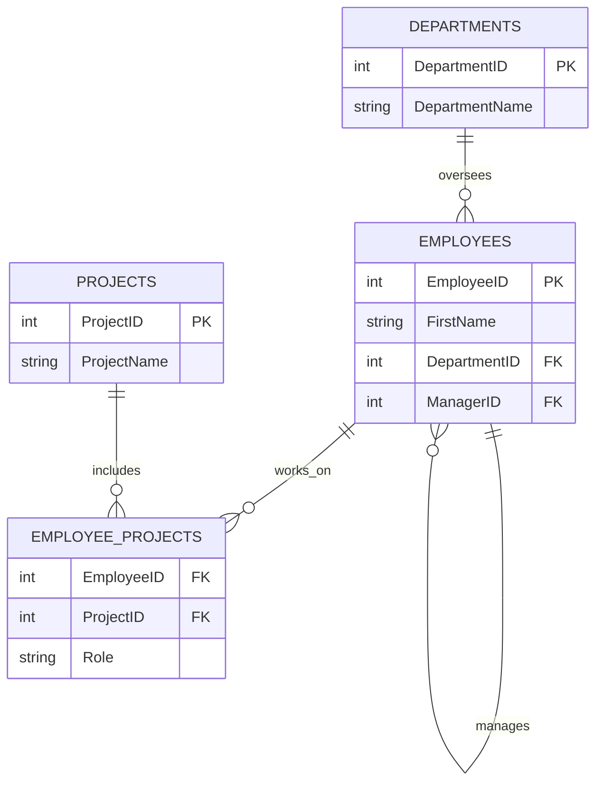

With the fundamentals of DDL and DML in hand, we can now unlock the true power of SQL. This chapter dives into the techniques required to ask sophisticated questions of your data. We will move beyond simple `SELECT` statements to explore complex filtering, data aggregation, joining multiple tables, and advanced query structures like subqueries and window functions. Mastering these concepts is the key to transforming raw data into meaningful business insights.

For the examples in this chapter, we will use a slightly more complex database schema for a company:

* **`Departments`**: Stores department information.
* **`Employees`**: Stores employee details, including their manager and department.
* **`Projects`**: Stores project information.
* **`Employee_Projects`**: A linking table to assign employees to projects.



---

### **5.1. Filtering and Operators**

The `WHERE` clause is made more powerful by a range of operators that allow for precise filtering.

#### **`BETWEEN`**
Selects values within a given range. The range is inclusive.

**Example:** Find all employees hired in the 1990s.
```sql
SELECT EmployeeID, FirstName, LastName, HireDate
FROM Employees
WHERE HireDate BETWEEN '1990-01-01' AND '1999-12-31';
```

#### **`IN`**

Specifies a list of multiple possible values for a column. It's a shorthand for multiple `OR` conditions.

**Example:** Find all employees in the 'Engineering' or 'Marketing' departments.

```sql
SELECT FirstName, LastName, DepartmentID
FROM Employees
WHERE DepartmentID IN (101, 103); -- Assuming 101 is Engineering, 103 is Marketing
```

#### **`LIKE`**

Used for pattern matching in string data. It uses wildcards:

  * `%`: Represents zero, one, or multiple characters.
  * `_`: Represents a single character.

**Example 1:** Find all employees whose last name starts with 'S'.

```sql
SELECT FirstName, LastName
FROM Employees
WHERE LastName LIKE 'S%';
```

**Example 2:** Find all employees whose first name has 'an' in it.

```sql
SELECT FirstName, LastName
FROM Employees
WHERE FirstName LIKE '%an%';
```

#### **`IS NULL` / `IS NOT NULL`**

Checks if a column's value is empty (NULL) or not. You cannot use `= NULL`.

**Example:** Find all employees who do not have a manager assigned.

```sql
SELECT EmployeeID, FirstName, LastName
FROM Employees
WHERE ManagerID IS NULL;
```

-----

### **5.2. SQL Functions**

SQL functions perform operations on data and return a result. They are categorized into aggregate and scalar functions.

#### **Aggregate Functions**

These operate on a set of rows and return a single summary value.

  * `COUNT()`: Counts the number of rows.
  * `SUM()`: Sums up the values in a column.
  * `AVG()`: Calculates the average value of a column.
  * `MIN()`: Finds the minimum value in a column.
  * `MAX()`: Finds the maximum value in a column.

**Example:** Get key statistics for employee salaries.

```sql
SELECT
    COUNT(EmployeeID) AS TotalEmployees,
    AVG(Salary) AS AverageSalary,
    SUM(Salary) AS TotalSalaryCost,
    MIN(Salary) AS MinimumSalary,
    MAX(Salary) AS MaximumSalary
FROM Employees;
```

#### **Scalar Functions**

These operate on a single value and return a single value.

**String Functions:**

  * `UPPER()`: Converts a string to uppercase.
  * `LOWER()`: Converts a string to lowercase.
  * `LENGTH()`: Returns the length of a string.
  * `SUBSTRING()`: Extracts a substring.

**Example:** Display employee full names in uppercase.

```sql
SELECT UPPER(FirstName || ' ' || LastName) AS FullName -- Syntax for concatenation varies (e.g., CONCAT(FirstName, ' ', LastName) in MySQL)
FROM Employees;
```

**Numeric Functions:**

  * `ROUND()`: Rounds a numeric value to a specified number of decimals.
  * `ABS()`: Returns the absolute value.

**Example:** Show salaries rounded to the nearest thousand.

```sql
SELECT Salary, ROUND(Salary, -3) AS RoundedSalary
FROM Employees;
```

**Date Functions:**

  * `NOW()` or `GETDATE()`: Returns the current date and time.
  * `EXTRACT()` or `DATEPART()`: Extracts a part of a date (year, month, day).

**Example:** Find the year each employee was hired.

```sql
SELECT FirstName, LastName, EXTRACT(YEAR FROM HireDate) AS HireYear
FROM Employees;
```

-----

### **5.3. Grouping and Aggregation**

#### **`GROUP BY`**

The `GROUP BY` clause is used with aggregate functions to group rows that have the same values in specified columns into summary rows.

**Example 1:** Count the number of employees in each department.

```sql
SELECT
    DepartmentID,
    COUNT(EmployeeID) AS NumberOfEmployees
FROM Employees
GROUP BY DepartmentID;
```

**Result:** This query will return one row for each department, along with the count of employees in that department.

**Example 2:** Calculate the average salary for each department.

```sql
SELECT
    d.DepartmentName,
    AVG(e.Salary) AS AverageSalary
FROM Employees e
JOIN Departments d ON e.DepartmentID = d.DepartmentID
GROUP BY d.DepartmentName;
```

#### **`HAVING`**

The `HAVING` clause was added to SQL because the `WHERE` keyword could not be used with aggregate functions. `HAVING` filters the results *after* the aggregation has occurred.

**Rule of Thumb:**

  * `WHERE` filters rows **before** aggregation.
  * `HAVING` filters groups **after** aggregation.

**Example:** Show only departments that have more than 5 employees.

```sql
SELECT
    DepartmentID,
    COUNT(EmployeeID) AS NumberOfEmployees
FROM Employees
GROUP BY DepartmentID
HAVING COUNT(EmployeeID) > 5;
```

-----

### **5.4. Joins**

Joins are used to combine rows from two or more tables based on a related column between them.

#### **`INNER JOIN`**

Returns records that have matching values in both tables. This is the most common join type.

**Example:** Get a list of employees and their department names.

```sql
SELECT
    e.FirstName,
    e.LastName,
    d.DepartmentName
FROM Employees AS e
INNER JOIN Departments AS d ON e.DepartmentID = d.DepartmentID;
```

  * **Result:** Only employees who are assigned to a valid department will appear.

#### **`LEFT JOIN` (or `LEFT OUTER JOIN`)**

Returns all records from the left table, and the matched records from the right table. The result is `NULL` from the right side if there is no match.

**Example:** Get a list of *all* employees and their department name, if any.

```sql
SELECT
    e.FirstName,
    e.LastName,
    d.DepartmentName
FROM Employees AS e
LEFT JOIN Departments AS d ON e.DepartmentID = d.DepartmentID;
```

  * **Result:** All employees will be listed. If an employee is not assigned to a department, `DepartmentName` will be `NULL`.

#### **`RIGHT JOIN` (or `RIGHT OUTER JOIN`)**

Returns all records from the right table, and the matched records from the left table. The result is `NULL` from the left side if there is no match.

**Example:** Get a list of *all* departments and the employees in them, if any.

```sql
SELECT
    e.FirstName,
    e.LastName,
    d.DepartmentName
FROM Employees AS e
RIGHT JOIN Departments AS d ON e.DepartmentID = d.DepartmentID;
```

  * **Result:** All departments will be listed. If a department has no employees, `FirstName` and `LastName` will be `NULL`.

#### **`FULL OUTER JOIN`**

Returns all records when there is a match in either the left or right table. It combines the functionality of `LEFT JOIN` and `RIGHT JOIN`.

**Example:** Show all employees and all departments, matching them where possible.

```sql
SELECT
    e.FirstName,
    d.DepartmentName
FROM Employees AS e
FULL OUTER JOIN Departments AS d ON e.DepartmentID = d.DepartmentID;
```

  * **Result:** You'll see employees without departments and departments without employees.

#### **Self Join**

A self join is a regular join, but the table is joined with itself. This is useful for querying hierarchical data.

**Example:** Get a list of employees and the name of their manager.

```sql
SELECT
    e.FirstName AS EmployeeName,
    m.FirstName AS ManagerName
FROM Employees AS e
LEFT JOIN Employees AS m ON e.ManagerID = m.EmployeeID;
```

  * **Explanation:** We are treating the `Employees` table as two separate tables: one for the employee (`e`) and one for the manager (`m`).

-----

### **5.5. Subqueries (Nested Queries)**

A subquery is a query nested inside another query. The inner query's result is used by the outer query.

#### **Subquery in a `WHERE` Clause**

This is the most common use.

**Example:** Find all employees who work in the 'Engineering' department, without using a join.

```sql
SELECT FirstName, LastName
FROM Employees
WHERE DepartmentID = (SELECT DepartmentID FROM Departments WHERE DepartmentName = 'Engineering');
```

#### **Subquery in a `FROM` Clause**

The subquery in the `FROM` clause creates a temporary table that the outer query can select from.

**Example:** Calculate the average number of employees per department.

```sql
SELECT AVG(EmployeeCount)
FROM (
    SELECT DepartmentID, COUNT(EmployeeID) AS EmployeeCount
    FROM Employees
    GROUP BY DepartmentID
) AS DepartmentCounts;
```

#### **Correlated Subquery**

A correlated subquery is an inner query that depends on the outer query for its values. It is evaluated once for each row processed by the outer query.

**Example:** Find all employees whose salary is above the average salary for their department.

```sql
SELECT
    e1.FirstName,
    e1.LastName,
    e1.Salary
FROM Employees AS e1
WHERE e1.Salary > (
    SELECT AVG(e2.Salary)
    FROM Employees AS e2
    WHERE e2.DepartmentID = e1.DepartmentID -- The inner query is correlated to the outer query's row
);
```

-----

### **5.6. Common Table Expressions (CTEs)**

A CTE provides a way to create a temporary, named result set that you can reference within a `SELECT`, `INSERT`, `UPDATE`, or `DELETE` statement. They make complex queries more readable.

#### **Standard CTE**

Use the `WITH` clause to define the CTE.

**Example:** Rewrite the "average number of employees per department" query using a CTE.

```sql
WITH DepartmentCounts AS (
    SELECT
        DepartmentID,
        COUNT(EmployeeID) AS EmployeeCount
    FROM Employees
    GROUP BY DepartmentID
)
SELECT AVG(EmployeeCount) AS AverageEmployeesPerDept
FROM DepartmentCounts;
```

-----

### **5.7. Window Functions**

Window functions perform a calculation across a set of table rows that are somehow related to the current row. Unlike aggregate functions, they do not collapse the rows; they return a value for each row.

The key is the `OVER()` clause.

#### **Ranking Functions**

  * `ROW_NUMBER()`: Assigns a unique number to each row.
  * `RANK()`: Assigns a rank based on a value; leaves gaps for ties.
  * `DENSE_RANK()`: Assigns a rank; does not leave gaps for ties.

**Example:** Rank employees in each department by their salary.

```sql
SELECT
    FirstName,
    LastName,
    DepartmentID,
    Salary,
    RANK() OVER (PARTITION BY DepartmentID ORDER BY Salary DESC) AS SalaryRank
FROM Employees;
```

  * `PARTITION BY DepartmentID`: Resets the ranking for each new department.
  * `ORDER BY Salary DESC`: Ranks based on salary, highest first.

#### **Aggregate Window Functions**

**Example:** Show each employee's salary and the average salary of their department on the same row.

```sql
SELECT
    FirstName,
    LastName,
    Salary,
    AVG(Salary) OVER (PARTITION BY DepartmentID) AS DepartmentAverageSalary
FROM Employees;
```

-----

### **5.8. Set Operations**

Set operators combine the results of two or more `SELECT` statements into a single result set.

  * `UNION`: Combines two result sets and removes duplicate rows.
  * `UNION ALL`: Combines two result sets but includes all duplicate rows. Faster than `UNION`.
  * `INTERSECT`: Returns only the rows that appear in both result sets.
  * `EXCEPT` (or `MINUS`): Returns the rows from the first query that are not present in the second query.

**Example:** Get a list of all people who are either employees or managers.

```sql
SELECT FirstName, LastName FROM Employees
UNION
SELECT FirstName, LastName FROM Managers; -- Assuming a separate Managers table exists
```

-----

### **5.9. Advanced Objects**

Beyond tables, databases provide other powerful objects to encapsulate logic, improve security, and enhance reusability.

#### **Views**

A view is a virtual table based on the result-set of an SQL statement. It contains rows and columns, just like a real table, but it doesn't store the data itself.

**Why use a View?**

  * **Simplicity:** A complex query involving multiple joins can be saved as a view, allowing users to query it as if it were a single table.
  * **Security:** You can grant users access to a view that only shows specific columns or rows, hiding sensitive data from the underlying tables.
  * **Consistency:** A view provides a consistent, pre-defined representation of data, ensuring all users see the same business logic.

**Example:** Create a view that shows employee full names and their department names.

```sql
CREATE VIEW EmployeeDepartmentView AS
SELECT
    e.FirstName,
    e.LastName,
    d.DepartmentName
FROM Employees AS e
JOIN Departments AS d ON e.DepartmentID = d.DepartmentID;
```

**How to use it:** Now you can query this view just like a table.

```sql
SELECT * FROM EmployeeDepartmentView WHERE DepartmentName = 'Engineering';
```

#### **Stored Procedures**

A stored procedure is a set of pre-compiled SQL statements that are stored in the database. It can accept input parameters and can return results.

**Why use a Stored Procedure?**

  * **Performance:** The database's query planner analyzes the procedure once and reuses the execution plan, which can be faster than sending raw queries.
  * **Security:** You can grant a user permission to execute a stored procedure without giving them any permissions on the underlying tables.
  * **Reusability & Reduced Network Traffic:** Complex logic is stored in one place and can be called by multiple applications with a single command, reducing the amount of SQL code sent over the network.

**Example:** Create a procedure to get all employees from a specific department. (Syntax varies greatly between database systems like T-SQL, PL/pgSQL, etc.)

```sql
-- Example in PostgreSQL (PL/pgSQL)
CREATE PROCEDURE GetEmployeesByDepartment(IN dept_id INT)
LANGUAGE plpgsql
AS $$
BEGIN
    SELECT * FROM Employees WHERE DepartmentID = dept_id;
END;
$$;
```

**How to use it:**

```sql
CALL GetEmployeesByDepartment(101);
```

#### **Triggers**

A trigger is a special type of stored procedure that automatically runs when a specific DML event (`INSERT`, `UPDATE`, `DELETE`) occurs on a specified table.

**Why use a Trigger?**

  * **Auditing:** Automatically log changes to a table in a separate audit table.
  * **Enforcing Complex Business Rules:** Perform checks that are too complex for a simple `CHECK` constraint.
  * **Maintaining Data Integrity:** Automatically update related data in other tables.

> **Common Pitfall:** Overusing triggers can make a database very difficult to debug. The logic happens "magically" in the background, which can be confusing for developers who are not aware of the trigger's existence. Use them judiciously.

**Example:** Create a trigger that logs every salary update for an employee into an `AuditLog` table.

```sql
-- First, create the log table
CREATE TABLE AuditLog (
    LogID INT PRIMARY KEY,
    EmployeeID INT,
    OldSalary DECIMAL(10, 2),
    NewSalary DECIMAL(10, 2),
    ChangeDate TIMESTAMP
);

-- Then, create the trigger function and the trigger itself (PostgreSQL syntax)
CREATE FUNCTION log_salary_change() RETURNS TRIGGER AS $$
BEGIN
    INSERT INTO AuditLog(EmployeeID, OldSalary, NewSalary, ChangeDate)
    VALUES (OLD.EmployeeID, OLD.Salary, NEW.Salary, NOW());
    RETURN NEW;
END;
$$ LANGUAGE plpgsql;

CREATE TRIGGER salary_update_trigger
AFTER UPDATE OF Salary ON Employees
FOR EACH ROW
EXECUTE FUNCTION log_salary_change();
```

**How it works:** Now, if you run `UPDATE Employees SET Salary = 60000 WHERE EmployeeID = 1;`, a new row will automatically be inserted into the `AuditLog` table.

#### **User-Defined Functions (UDFs)**

A UDF is a routine that accepts parameters, performs an action (like a complex calculation), and returns a result (either a single scalar value or a table).

**Why use a UDF?**

  * **Reusability:** Encapsulate complex formulas or business logic into a function that can be used directly in your `SELECT` statements.
  * **Extensibility:** Extend the built-in capabilities of the database's SQL dialect.

**Example:** Create a function that calculates an employee's full name.

```sql
-- PostgreSQL syntax
CREATE FUNCTION GetFullName(first_name VARCHAR, last_name VARCHAR)
RETURNS VARCHAR
LANGUAGE sql
AS $$    SELECT first_name || ' ' || last_name;$$;
```

**How to use it:** You can now use this function directly in a query.

```sql
SELECT GetFullName(FirstName, LastName) AS FullName, Salary
FROM Employees;
```

---

### **5.10. Advanced Query Playbook for Newcomers**

If you are jumping into intermediate SQL for the first time, use this cheat sheet to stay oriented:

| Scenario | Tool to Reach For | Why |
| :-- | :-- | :-- |
| "I need to filter or sort before summarizing" | `WHERE` before `GROUP BY` | Keeps the aggregation set small and accurate |
| "I must compare a row to its peers" | Window functions (`OVER (...)`) | They maintain row-level detail while adding context |
| "I want rows that exist in one table but not the other" | `LEFT JOIN ... WHERE right_table.id IS NULL` or `EXCEPT` | Makes anti-joins explicit |
| "I need reusable logic" | Views, CTEs, or UDFs | Encapsulates complexity so future queries stay readable |


> **Reminder:** Complex SQL is simply a stack of simple SQL blocks. When a query feels intimidating, collapse it into smaller CTEs or views you can reason about one at a time.
