With the fundamentals in place, this chapter explores how core SQL concepts can be combined to solve complex problems. We'll examine how keywords behave differently depending on predicates, data shape, and execution context. For each concept, we'll reuse a single, consistent dataset and run multiple variations of each keyword. By observing the "before and after" state of the tables or result sets, you can see exactly what changed and why.

-----

### **5.0. Practice Dataset for All Examples**

This corporate dataset models employees, departments, and projects. It's the sandbox we'll use for every query in this chapter. Unless a variation explicitly modifies data, assume the tables are reset to this baseline state before each example runs.

:::tip Quick Briefing
Treat these tables as your reference lab. `Employees` connects to everything else, `Departments` anchors organization structure, and `Employee_Projects` carries the many-to-many relationships. Keeping the seed data intact ensures each example highlights only the clause under discussion.
:::

:::info Data Model Relationships
Think of these relationships as the wiring that connects our data.

  * **Employees to Departments:** A one-to-many relationship (one department has many employees). `Employees.DepartmentID` is a Foreign Key to `Departments.DepartmentID`.
  * **Employees to Employees:** A self-referencing relationship for organizational hierarchy. `Employees.ManagerID` is a Foreign Key to `Employees.EmployeeID`.
  * **Departments to Departments:** A self-referencing relationship for parent/subsidiary departments. `Departments.ParentDepartmentID` is a Foreign Key to `Departments.DepartmentID`.
  * **Employees to Projects:** A many-to-many relationship, managed through the `Employee_Projects` bridging table.
    :::

<!-- end list -->


**`Departments`**

| DepartmentID | DepartmentName   | Budget | ParentDepartmentID |
| :----------- | :--------------- | :----- | :----------------- |
| 10           | Engineering      | 750000 | NULL               |
| 20           | Marketing        | 250000 | NULL               |
| 30           | Customer Success | 180000 | NULL               |
| 40           | Research         | 300000 | 10                 |

**`Employees`**

| EmployeeID | FirstName | LastName | DepartmentID | ManagerID | HireDate   | Salary |
| :--------- | :-------- | :------- | :----------- | :-------- | :--------- | :----- |
| 101        | Amina     | Lee      | 10           | NULL      | 2015-02-14 | 98000  |
| 102        | Bruno     | Silva    | 10           | 101       | 2018-07-09 | 82000  |
| 103        | Carmen    | Ortiz    | 20           | 107       | 2019-11-21 | 69000  |
| 104        | Deepak    | Rao      | 40           | 101       | 2020-05-04 | 76000  |
| 105        | Erin      | Chen     | 30           | 108       | 2017-03-18 | 72000  |
| 106        | Faisal    | Khan     | 10           | 102       | 2021-01-11 | 68000  |
| 107        | Grace     | Mbaye    | 20           | NULL      | 2012-09-02 | 103000 |
| 108        | Hugo      | Martins  | 30           | NULL      | 2014-06-30 | 95000  |
| 109        | Irina     | Petrov   | NULL         | 101       | 2022-04-12 | 54000  |

:::note Data Hints
`ManagerID IS NULL` indicates a top-level manager. `DepartmentID IS NULL` indicates a central contractor not assigned to a department.
:::

**`Projects`**

| ProjectID | ProjectName      | StartDate  | EndDate    | OwningDepartmentID |
| :-------- | :--------------- | :--------- | :--------- | :----------------- |
| 501       | Phoenix Rewrite  | 2023-02-01 | NULL       | 10                 |
| 502       | Atlas Launch     | 2022-09-15 | 2024-01-31 | 20                 |
| 503       | Lighthouse AI    | 2023-05-20 | NULL       | 40                 |
| 504       | Harmony Outreach | 2023-01-10 | 2023-12-10 | 30                 |

**`Employee_Projects` (Bridging Table)**

| EmployeeID | ProjectID | Role         | AllocationPercent |
| :--------- | :-------- | :----------- | :---------------- |
| 101        | 501       | Sponsor      | 25                |
| 102        | 501       | Lead Eng     | 60                |
| 102        | 503       | Reviewer     | 15                |
| 104        | 503       | Scientist    | 70                |
| 105        | 504       | PM           | 50                |
| 106        | 501       | Dev          | 45                |
| 107        | 502       | Advisor      | 20                |
| 108        | 504       | Exec Sponsor | 15                |
| 109        | 502       | Contractor   | 40                |

-----

### **5.1. Advanced Filtering & Operators**

`WHERE` predicates are the primary tool for turning huge tables into focused result sets. A small change to an operator or boundary can completely reshape the answer. Think of these operators as specialized filters for your data.

:::tip Quick Briefing
Filtering operators decide which rows even make it to later SQL clauses. `BETWEEN` sets numeric/date fences, `IN` checks list membership, `LIKE` matches patterns, and `IS NULL` handles missing values. Master these to scope queries before you spend time aggregating or joining.
:::

| Operator  | Core Purpose                       | Watch Out For                          |
| :-------- | :--------------------------------- | :------------------------------------- |
| `BETWEEN` | Inclusive lower/upper bounds       | Timestamps include midnight only       |
| `IN`      | Match against discrete value lists | Mixed data types can break comparisons |
| `LIKE`    | Pattern match strings              | Collations/case sensitivity vary       |
| `IS NULL` | Safely test absence of a value     | `= NULL` never works                   |

#### **`BETWEEN` (Inclusive Bounds)**

**Analogy:** `BETWEEN` is like setting up a fence with two posts; anything on the posts or in between them is included. It's a convenient shorthand for `column >= lower_bound AND column <= upper_bound`.

**Variation A – Calendar date window**

```sql
SELECT EmployeeID, FirstName, HireDate
FROM Employees
WHERE HireDate BETWEEN '2015-01-01' AND '2019-12-31';
```

***Result:*** Returns employees hired from the first day of 2015 through the last day of 2019 (**Amina, Bruno, Erin, Carmen**). If you change the upper bound to `'2019-11-20'`, Carmen (hired 2019-11-21) would be excluded.

**Variation B – Salary band check**

```sql
SELECT EmployeeID, FirstName, Salary
FROM Employees
WHERE Salary BETWEEN 70000 AND 90000;
```

***Result:*** Returns employees with salaries in the specified range: \*\*Erin ($72k), Deepak ($76k), Bruno ($82k)**. Lowering the minimum to `65000` adds Faisal ($68k) and Carmen ($69k).

:::caution `BETWEEN` with Timestamps
Be careful when using `BETWEEN` on columns that include a time component (like `DATETIME` or `TIMESTAMP`). A filter like `BETWEEN '2025-10-12' AND '2025-10-12'` will only match records from midnight `2025-10-12 00:00:00`. A safer pattern is often `WHERE date_col >= '2025-10-12' AND date_col < '2025-10-13'`.
:::

#### **`IN` (Membership Testing)**

**Analogy:** `IN` is like checking if a person's name is on an invitation list. It is often more readable and sometimes more performant than a series of `OR` conditions.

**Variation A – Explicit list**

```sql
SELECT FirstName, DepartmentID
FROM Employees
WHERE DepartmentID IN (10, 40); -- Shorthand for: WHERE DepartmentID = 10 OR DepartmentID = 40
```

***Result:*** All employees working in either Engineering (10) or Research (40): **Amina, Bruno, Deepak, and Faisal**.

**Variation B – Subquery-powered list**

```sql
SELECT FirstName, DepartmentID
FROM Employees
WHERE DepartmentID IN (
    SELECT DepartmentID
    FROM Departments
    WHERE Budget >= 300000
);
```

***Result:*** This dynamically finds all employees in high-budget departments. If the Research budget were to drop to 290k, **Deepak would automatically disappear** from this query's result without any change to the query itself, making it resilient to data changes.

#### **`LIKE` (Pattern Matching)**

`LIKE` is your go-to for string pattern matching. The wildcards are your tools:

  * `%` (Percent sign): Represents zero, one, or multiple characters.
  * `_` (Underscore): Represents exactly one character.

**Variation A – Prefix match**

```sql
SELECT LastName
FROM Employees
WHERE LastName LIKE 'M%';
```

***Result:*** **Mbaye** and **Martins**. Switching the pattern to `'Ma%'` would narrow the result to just Martins.

**Variation B – Contains and single-character wildcard**

```sql
SELECT FirstName
FROM Employees
WHERE FirstName LIKE '_r%'; -- Second letter is 'r'
```

***Result:*** **Bruno** and **Grace**. This is useful for finding patterns where the position matters. Replacing `'_r%'` with `'%na'` would find names ending in "na", like **Amina**.

:::info Dialect-Specific Pattern Matching

  * **Case-Insensitivity:** PostgreSQL uses `ILIKE` for case-insensitive matching (`'a%' ILIKE 'A%'` is true). SQL Server's behavior depends on the database's "collation," but you can often force it with `UPPER(LastName) LIKE 'M%'`.
  * **Character Sets:** Some dialects let you specify ranges, like `WHERE FirstName LIKE '[A-C]%'` to find names starting with A, B, or C (T-SQL/SQL Server syntax).
    :::

#### **`IS NULL` / `IS NOT NULL` (Handling Missing Data)**

`NULL` isn't a value like `0` or an empty string; it's a *state* representing the absence of a value. It's a black hole. You can't compare it with standard operators (`=`, `<>`). You must use the special operators `IS NULL` or `IS NOT NULL`.

**Variation A – Find unassigned employees**

```sql
SELECT EmployeeID, FirstName
FROM Employees
WHERE DepartmentID IS NULL;
```

***Result:*** **Irina** is the only central contractor. `WHERE DepartmentID = NULL` would return **zero rows**, because nothing equals `NULL`.

**Variation B – Ensure complete management chain**

```sql
SELECT EmployeeID, FirstName
FROM Employees
WHERE ManagerID IS NOT NULL;
```

***Result:*** Everyone except the top-level managers (**Amina, Grace, and Hugo**). This is useful for building reports that exclude the highest level of the hierarchy.

-----

### **🧠 Intermediate Interview Questions (Filtering & Operators)**

:::note Question 1
**Why does `col = NULL` not work as expected?**  
**Answer:** In SQL, `NULL` represents an unknown or missing value, not a specific value itself. Therefore, you cannot compare it using standard equality or inequality operators. The result of `any_value = NULL` is not `TRUE` or `FALSE`; it is `UNKNOWN`. The SQL standard provides the special predicates `IS NULL` and `IS NOT NULL` to specifically test for the state of nullness.
:::

:::note Question 2
**What is the difference between `!=` and `<>`?**  
**Answer:** In most SQL dialects, there is **no functional difference** between `!=` and `<>`. Both operators mean "not equal to." The `<>` operator is defined in the ANSI SQL standard, making it slightly more portable, but `!=` is supported by almost every major database system and is often preferred by developers coming from other programming languages. It's a matter of style, but consistency within a project is key.
:::

-----

### **5.2. SQL Functions**

Functions perform calculations and transformations on your data. **Aggregate functions** operate on a group of rows to produce a single summary value, while **scalar functions** operate on a single value and return a single value on the same row.

:::tip Quick Briefing
Reach for aggregate functions when you collapse rows into summaries, and scalar functions when you need per-row transformation. Pair them thoughtfully—aggregates in the `SELECT` with `GROUP BY`, scalars alongside raw columns.
:::

| Function Family | Operates On          | Example Use Case                         |
| :-------------- | :------------------- | :--------------------------------------- |
| Aggregate       | Sets of rows         | Headcounts, totals, min/max calculations |
| Scalar          | Single row/column    | Formatting names, trimming strings       |
| Conditional     | Adds branching logic | Counting categories with `CASE`          |

#### **Aggregate Functions**

**Analogy:** Think of these as a funnel. You pour in many rows, and they produce a single, summary result.

**Variation A – Classic company-wide statistics**

```sql
SELECT
    COUNT(*)        AS Headcount,
    AVG(Salary)     AS AvgSalary,
    SUM(Salary)     AS Payroll,
    MIN(Salary)     AS Lowest,
    MAX(Salary)     AS Highest
FROM Employees;
```

***Result:*** A single row summarizing salary distribution across all 9 employees. If you exclude contractors by adding `WHERE DepartmentID IS NOT NULL`, the `Headcount` becomes 8, and the `AvgSalary` rises.

**Variation B – Conditional aggregation with `CASE`**

```sql
SELECT
    COUNT(CASE WHEN Salary >= 90000 THEN 1 END) AS HighEarners,
    COUNT(CASE WHEN Salary < 70000 THEN 1 END) AS EntryLevel
FROM Employees;
```

***Result:*** A single summary row showing that there are 3 `HighEarners` and 3 `EntryLevel` employees. This is far more efficient than running two separate queries.

**Variation C – Counting unique values with `DISTINCT`**

```sql
SELECT COUNT(DISTINCT DepartmentID) AS ActiveDepartments
FROM Employees
WHERE DepartmentID IS NOT NULL;
```

***Result:*** `4`. The employees are assigned to departments 10, 20, 30, and 40. Even though three employees are in department 10, `DISTINCT` ensures it's only counted once.

#### **Scalar Functions**

**Analogy:** Scalar functions are like applying a formula to a single cell in a spreadsheet; they transform one value into another on the same row.

**String Transformation**

```sql
SELECT EmployeeID,
       UPPER(FirstName || ' ' || LastName) AS FullNameUpper,
       LENGTH(LastName) AS LastNameLength
FROM Employees;
```

***Result:*** The same number of rows as `Employees`, but with transformed string data (e.g., `AMINA LEE`, `3`).

:::info Dialect-Specific Syntax: Concatenation

  * **PostgreSQL/Oracle/SQLite:** `FirstName || ' ' || LastName`
  * **SQL Server:** `FirstName + ' ' + LastName` or `CONCAT(FirstName, ' ', LastName)`
  * **MySQL:** `CONCAT(FirstName, ' ', LastName)`
    :::

**Numeric Transformation**

```sql
SELECT ProjectID,
       AllocationPercent,
       ROUND(AllocationPercent / 100.0, 2) AS FractionalAlloc,
       ABS(AllocationPercent - 50)         AS DistanceFromEvenSplit
FROM Employee_Projects;
```

***Result:*** A new column is calculated for each row, showing the allocation as a decimal and its distance from a 50% benchmark.

**Date Extraction**

```sql
SELECT EmployeeID,
       HireDate,
       EXTRACT(YEAR FROM HireDate) AS HireYear,
       EXTRACT(QUARTER FROM HireDate) AS HireQuarter
FROM Employees;
```

***Result:*** Each row now includes the year and quarter of hire, useful for bucketing data over time. In SQL Server, you might use `YEAR(HireDate)` and `DATEPART(quarter, HireDate)`.

-----

### **🧠 Intermediate Interview Questions (Functions)**

:::note Question 1
**What is the difference between `COUNT(*)` and `COUNT(column_name)`?**

- `COUNT(*)` counts **all rows** within a group, period. It doesn't care about the values in the rows.
- `COUNT(column_name)` counts only the rows where `column_name` is **not `NULL`**.  
    **Analogy:** `COUNT(*)` is like counting every student in a classroom. `COUNT(HomeworkSubmissionDate)` is like counting only the students who turned in their homework. You'd use the latter to see a completion rate.
:::

:::note Question 2
**What does the `COALESCE` function do, and when is it useful?**  
**Answer:** `COALESCE` returns the first non-`NULL` value from a list of arguments. It's incredibly useful for providing default values for columns that might contain nulls. For example, `SELECT COALESCE(EndDate, 'Ongoing') AS ProjectStatus FROM Projects;` would show the actual end date if it exists, or the string 'Ongoing' if the `EndDate` is `NULL`.
:::

-----

### **5.3. Grouping and Aggregation**

The `GROUP BY` clause collapses multiple rows into a single summary row. It's the foundation of most reporting and analytics. The `HAVING` clause then filters these newly created summary rows.

:::tip Quick Briefing
`GROUP BY` defines the grain of your result set, aggregates describe each group, and `HAVING` trims groups after they are formed. Keep raw filters in `WHERE` to avoid wasting compute on rows you already know you don't need.
:::

| Piece      | Why It Matters                | Pro Tip                                |
| :--------- | :---------------------------- | :------------------------------------- |
| `GROUP BY` | Sets the grouping key         | Every non-aggregate column must appear |
| Aggregates | Summarize values per group    | Alias them for readable downstream use |
| `HAVING`   | Filters the aggregated result | Use for aggregate-based thresholds     |

**Analogy:** `GROUP BY` is like sorting laundry into piles by color (white, dark, colored). The aggregate function (`COUNT(*)`) tells you how many items are in each pile. `HAVING` is like deciding to only wash the piles that have more than 5 items in them.

#### **`GROUP BY` Variations**

**Variation A – Department headcount**

```sql
SELECT
    DepartmentID,
    COUNT(*) AS EmployeeCount
FROM Employees
WHERE DepartmentID IS NOT NULL
GROUP BY DepartmentID
ORDER BY DepartmentID;
```

***Result:*** A summary table showing how many employees are in each department. Department 10 has 3, 20 has 2, 30 has 2, and 40 has 1.

**Variation B – Group by multiple columns**

```sql
SELECT
    DepartmentID,
    EXTRACT(YEAR FROM HireDate) AS HireYear,
    COUNT(*) AS HiresInYear
FROM Employees
WHERE DepartmentID IS NOT NULL
GROUP BY DepartmentID, EXTRACT(YEAR FROM HireDate)
ORDER BY DepartmentID, HireYear;
```

***Result:*** A more granular breakdown, showing hires per department, per year. Department 10 would have rows for 2015 (1 hire), 2018 (1 hire), and 2021 (1 hire).

**Variation C – Grouping with `ROLLUP`**

```sql
SELECT
    DepartmentID,
    ManagerID,
    COUNT(*) AS DirectReports
FROM Employees
GROUP BY ROLLUP (DepartmentID, ManagerID)
ORDER BY DepartmentID, ManagerID;
```

***Result:*** This query provides multiple levels of aggregation at once:

1.  Counts per manager within each department (`DepartmentID`, `ManagerID`).
2.  Subtotals for each department (`DepartmentID`, `NULL`).
3.  A grand total for the whole table (`NULL`, `NULL`).
    This is a powerful tool for creating reports with subtotals without using `UNION ALL`.

#### **`HAVING` Variations**

**Best Practice:** Remember the logical order of operations: `WHERE` filters rows *before* grouping, `HAVING` filters groups *after* aggregation.

**Variation A – Enforce minimum headcount**

```sql
SELECT
    DepartmentID,
    COUNT(*) AS EmployeeCount
FROM Employees
WHERE DepartmentID IS NOT NULL
GROUP BY DepartmentID
HAVING COUNT(*) >= 2;
```

***Result:*** This filters the result from the `GROUP BY` example, removing Department 40 (Research) because its `EmployeeCount` of 1 does not meet the `HAVING` criteria.

**Variation B – Filter on multiple aggregate conditions**

```sql
SELECT
    DepartmentID,
    AVG(Salary) AS AvgSalary,
    SUM(Salary) AS TotalSalary
FROM Employees
WHERE DepartmentID IS NOT NULL
GROUP BY DepartmentID
HAVING SUM(Salary) > 150000 AND AVG(Salary) < 95000;
```

***Result:*** This finds large, moderately-paid departments. Engineering, Marketing, and Customer Success all meet the criteria.

-----

### **🧠 Intermediate Interview Questions (Grouping & Aggregation)**

:::note Question 1
**Explain the difference between `WHERE` and `HAVING`.**  
**Answer:** `WHERE` filters individual rows **before** they are aggregated by the `GROUP BY` clause. `HAVING` filters entire groups of rows **after** they have been aggregated. You use `WHERE` for conditions on raw table columns, and `HAVING` for conditions on aggregate functions like `COUNT()` or `SUM()`.
:::

:::note Question 2
**What happens if you include a column in your `SELECT` list that isn't in your `GROUP BY` clause and isn't an aggregate function?**  
**Answer:** Most modern SQL databases will throw an error. The reason is logical ambiguity. If you `GROUP BY DepartmentID` and `SELECT FirstName`, the database doesn't know *which* `FirstName` to show for the "Engineering" group, which has three people. To be valid, every non-aggregated column in the `SELECT` list must also be in the `GROUP BY` clause.
:::

-----

### **5.4. Joins**

The `JOIN` clause is the heart of a relational database, letting you weave together data from multiple tables.

:::tip Quick Briefing
A join lines up rows from multiple tables based on a matching rule (the join key). Choosing the join type controls which unmatched rows you keep or discard. Inner joins keep only matches; outer joins keep the leftovers from one or both sides; self-joins compare a table to itself; many-to-many joins travel through a bridging table.
:::

| Join Type           | What It Keeps                                               | Typical Use Case                                |
| :------------------ | :---------------------------------------------------------- | :---------------------------------------------- |
| `INNER JOIN`        | Only rows that match on both sides                          | Core reporting when both sides must exist       |
| `LEFT JOIN`         | Every row from the left table plus matches from the right   | Spotting missing related data on the right side |
| `RIGHT JOIN`        | Every row from the right table plus matches from the left   | Less common; symmetric to `LEFT JOIN`           |
| `FULL OUTER JOIN`   | All rows from both tables, matched where possible           | Auditing mismatches on either side              |
| Self-join           | Rows from one table matched to other rows in the same table | Hierarchies, before/after comparisons           |
| Bridging-table join | Rows connected through an associative (many-to-many) table  | Project assignments, tagging systems            |


#### **`INNER JOIN` vs `LEFT JOIN`**

```sql
-- INNER JOIN: Only returns rows with matches in both tables.
SELECT e.EmployeeID, e.FirstName, d.DepartmentName
FROM Employees AS e
JOIN Departments AS d ON e.DepartmentID = d.DepartmentID;
```

***Result:*** 8 rows. **Irina is excluded** because her `DepartmentID` is `NULL` and has no match in `Departments`.

| EmployeeID | FirstName | DepartmentName   |
| :--------- | :-------- | :--------------- |
| 101        | Amina     | Engineering      |
| 102        | Bruno     | Engineering      |
| 103        | Carmen    | Marketing        |
| 104        | Deepak    | Research         |
| 105        | Erin      | Customer Success |
| 106        | Faisal    | Engineering      |
| 107        | Grace     | Marketing        |
| 108        | Hugo      | Customer Success |

```sql
-- LEFT JOIN: Returns all rows from the left table (Employees), and matches from the right.
SELECT e.EmployeeID, e.FirstName, d.DepartmentName
FROM Employees AS e
LEFT JOIN Departments AS d ON e.DepartmentID = d.DepartmentID;
```

***Result:*** 9 rows. **Irina is included**, but her `DepartmentName` is `NULL`.

| EmployeeID | FirstName | DepartmentName   |
| :--------- | :-------- | :--------------- |
| 101        | Amina     | Engineering      |
| 102        | Bruno     | Engineering      |
| 103        | Carmen    | Marketing        |
| 104        | Deepak    | Research         |
| 105        | Erin      | Customer Success |
| 106        | Faisal    | Engineering      |
| 107        | Grace     | Marketing        |
| 108        | Hugo      | Customer Success |
| 109        | Irina     | NULL             |

#### **`RIGHT JOIN` and `FULL OUTER JOIN`**

```sql
SELECT d.DepartmentName, e.FirstName
FROM Employees AS e
RIGHT JOIN Departments AS d ON e.DepartmentID = d.DepartmentID;
```

***Result:*** All 4 departments are listed. If we added a "Sales" department with no employees, it would appear in this list with a `NULL` `FirstName`. This is useful for finding entities that are missing related data. A `FULL OUTER JOIN` would include both the empty "Sales" department and the unassigned employee, Irina.

| DepartmentName   | FirstName |
| :--------------- | :-------- |
| Engineering      | Amina     |
| Engineering      | Bruno     |
| Engineering      | Faisal    |
| Marketing        | Carmen    |
| Marketing        | Grace     |
| Customer Success | Erin      |
| Customer Success | Hugo      |
| Research         | Deepak    |

:::note Outer Join Insight
With the current data, a `FULL OUTER JOIN` (`SELECT ... FROM Employees FULL OUTER JOIN Departments ON ...`) returns the same rows as the `LEFT JOIN`; only Irina appears without a department. If a department had no employees, it would show up here with `NULL` for the employee columns.
:::

#### **Self-Join for Hierarchy**

```sql
SELECT
    employee.FirstName AS EmployeeName,
    manager.FirstName  AS ManagerName
FROM Employees AS employee
LEFT JOIN Employees AS manager ON employee.ManagerID = manager.EmployeeID;
```

***Result:*** 9 rows. Each employee is listed next to their manager's name. The `LEFT JOIN` is crucial to include top-level managers, who appear with a `NULL` `ManagerName`.

| EmployeeName | ManagerName |
| :----------- | :---------- |
| Amina        | NULL        |
| Bruno        | Amina       |
| Carmen       | Grace       |
| Deepak       | Amina       |
| Erin         | Hugo        |
| Faisal       | Bruno       |
| Grace        | NULL        |
| Hugo         | NULL        |
| Irina        | Amina       |

#### **Join with a Bridging Table (Many-to-Many)**

```sql
SELECT
    e.FirstName,
    p.ProjectName,
    ep.Role
FROM Employee_Projects AS ep
JOIN Employees AS e ON ep.EmployeeID = e.EmployeeID
JOIN Projects  AS p ON ep.ProjectID = p.ProjectID;
```

***Result:*** This query "unpacks" the many-to-many relationship, showing every single employee assignment to every project in a clean, readable list.

| FirstName | ProjectName      | Role         |
| :-------- | :--------------- | :----------- |
| Amina     | Phoenix Rewrite  | Sponsor      |
| Bruno     | Phoenix Rewrite  | Lead Eng     |
| Bruno     | Lighthouse AI    | Reviewer     |
| Deepak    | Lighthouse AI    | Scientist    |
| Erin      | Harmony Outreach | PM           |
| Faisal    | Phoenix Rewrite  | Dev          |
| Grace     | Atlas Launch     | Advisor      |
| Hugo      | Harmony Outreach | Exec Sponsor |
| Irina     | Atlas Launch     | Contractor   |

-----

### **5.5. Subqueries (Nested Queries)**

**Analogy:** A **subquery** is like a parenthetical phrase in a sentence—it's evaluated in place to provide a specific piece of information.

:::tip Quick Briefing
Subqueries make SQL composable. Inline them in `WHERE` for dynamic filters, place them in `FROM` as derived tables, or correlate them for row-by-row comparisons. Use `EXISTS` when you only care that a match exists, not what it is.
:::

| Placement       | What It Returns             | Use It When                                 |
| :-------------- | :-------------------------- | :------------------------------------------ |
| `WHERE`         | Single value or list        | Filtering by lookup result                  |
| `FROM`          | Temporary table (derived)   | Reusing intermediate aggregates             |
| Correlated      | One value per outer row     | Comparisons against a row's peer group      |
| `EXISTS` / `IN` | Boolean / membership checks | Existence tests vs. returning actual values |

#### **Subquery in `WHERE`**

**Variation A – Single-value comparison**

```sql
SELECT FirstName, DepartmentID
FROM Employees
WHERE DepartmentID = (
    SELECT DepartmentID
    FROM Departments
    WHERE DepartmentName = 'Engineering'
);
```

***Result:*** Returns all employees in the Engineering department. This fails if the subquery returns more than one row.

**Variation B – `IN` subquery with condition**

```sql
SELECT FirstName, DepartmentID
FROM Employees
WHERE DepartmentID IN (
    SELECT DepartmentID
    FROM Departments
    WHERE ParentDepartmentID = 10
);
```

***Result:*** Deepak, who works in Research (40), a sub-department of Engineering.

#### **`FROM` clause subquery (Derived Table)**

```sql
SELECT
    avg_stats.DepartmentID,
    avg_stats.AvgSalary,
    avg_stats.Headcount
FROM (
    -- This subquery creates a temporary, in-memory table called "avg_stats"
    SELECT DepartmentID,
           AVG(Salary) AS AvgSalary,
           COUNT(*)    AS Headcount
    FROM Employees
    WHERE DepartmentID IS NOT NULL
    GROUP BY DepartmentID
) AS avg_stats
WHERE avg_stats.Headcount >= 2;
```

***Result:*** The inner query first calculates stats for all departments. The outer query then filters these aggregated results. (CTEs are a more readable way to do this).

#### **Correlated Subquery**

A correlated subquery runs once for each row of the outer query, making it potentially slow but powerful for row-by-row comparisons.

```sql
SELECT e.EmployeeID, e.FirstName, e.Salary
FROM Employees AS e
WHERE e.Salary > (
    SELECT AVG(e_inner.Salary)
    FROM Employees AS e_inner
    WHERE e_inner.DepartmentID = e.DepartmentID -- Links inner query to outer row
);
```

***Result:*** Returns employees earning above their department average (Amina, Grace, Hugo).

#### **`EXISTS` vs `IN`**

**Best Practice:** Use `EXISTS` when you only need to confirm that a match exists and don't care about the values from the subquery. It's often more performant because it can stop searching as soon as it finds the first match (a "short-circuit").

```sql
SELECT e.EmployeeID, e.FirstName
FROM Employees AS e
WHERE EXISTS (
    SELECT 1 -- The '1' is arbitrary; it could be any literal. We just care if a row is returned.
    FROM Employee_Projects AS ep
    WHERE ep.EmployeeID = e.EmployeeID
      AND ep.AllocationPercent >= 50
);
```

***Result:*** Employees with at least one high-allocation project assignment (Bruno, Deepak, Erin).

-----

### **5.6. Common Table Expressions (CTEs)**

**Analogy:** A **CTE** is like defining a key term in a glossary at the beginning of a chapter and then referencing that term throughout. It promotes clarity and reuse.

:::tip Quick Briefing
CTEs turn tangled SQL into named steps. They shine when you have multiple logical stages, need recursion, or want to reference a result more than once. Think "declare, then reuse."
:::

| CTE Flavor  | What It Solves                                | When To Reach For It                  |
| :---------- | :-------------------------------------------- | :------------------------------------ |
| Single-step | Clarifies a complex subquery                  | Replace nested derived tables         |
| Stacked     | Breaks down multi-stage transformations       | Multi-phase reporting pipelines       |
| Recursive   | Traverses hierarchies or path-dependent logic | Org charts, bill-of-materials, graphs |

#### **Single CTE for Clarity**

```sql
WITH DeptStats AS (
    SELECT DepartmentID,
           COUNT(*) AS Headcount,
           AVG(Salary) AS AvgSalary
    FROM Employees
    WHERE DepartmentID IS NOT NULL
    GROUP BY DepartmentID
)
SELECT d.DepartmentName,
       s.Headcount,
       s.AvgSalary
FROM DeptStats AS s
JOIN Departments AS d ON d.DepartmentID = s.DepartmentID
WHERE s.Headcount >= 2;
```

***Result:*** Same logic as the derived table example, but sectioned into a named, logical step (`DeptStats`), making it far easier to read and debug.

#### **Stacked CTEs for Stepwise Reasoning**

```sql
WITH ProjectHours AS (
    SELECT ProjectID,
           SUM(AllocationPercent) AS TotalPercent
    FROM Employee_Projects
    GROUP BY ProjectID
),
OverAllocated AS (
    SELECT ProjectID, TotalPercent
    FROM ProjectHours
    WHERE TotalPercent > 100
)
SELECT
    p.ProjectName,
    oa.TotalPercent
FROM Projects p
JOIN OverAllocated oa ON p.ProjectID = oa.ProjectID;
```

***Result:*** A clean list of only the projects that are over-allocated. In our data, this is just the "Phoenix Rewrite" at 130%. The logic is broken into two clear steps: first calculate all totals, then filter for the over-allocated ones.

#### **Recursive CTE for Hierarchies**

```sql
WITH RECURSIVE OrgChart AS (
    -- Anchor member: find the top-level managers
    SELECT EmployeeID, FirstName, ManagerID, 0 AS Depth
    FROM Employees
    WHERE ManagerID IS NULL

    UNION ALL

    -- Recursive member: find employees who report to the previous level
    SELECT e.EmployeeID, e.FirstName, e.ManagerID, oc.Depth + 1
    FROM Employees AS e
    JOIN OrgChart AS oc ON e.ManagerID = oc.EmployeeID
)
SELECT * FROM OrgChart ORDER BY Depth, EmployeeID;
```

***Result:*** A full organizational chart showing each employee's reporting level (depth). Amina, Grace, and Hugo are at Depth 0. Their direct reports are at Depth 1, and so on.

:::info Dialect-Specific Syntax
The `RECURSIVE` keyword is required in PostgreSQL but omitted in SQL Server (which just uses `WITH ... AS`).
:::

-----

### **🧠 Advanced Interview Questions (Joins, Subqueries, CTEs)**

:::note Question 1
**In a `LEFT JOIN`, what is the difference between putting a filter condition in the `ON` clause versus the `WHERE` clause?**

- **Condition in `ON` clause:** The filter is applied **before** the join happens. It filters the *right table* first, and then the join proceeds. All rows from the left table are still returned.
- **Condition in `WHERE` clause:** The filter is applied **after** the join is complete. This effectively turns the `LEFT JOIN` into an `INNER JOIN`, because it will filter out any rows where the right-side columns are `NULL` (which is what a `LEFT JOIN` produces for non-matches).
:::

:::note Question 2
**What is the difference between a subquery and a CTE? When would you use one over the other?**  
**Answer:** A CTE is a named temporary result set. They offer three huge advantages over subqueries:
1. **Readability:** They break complex logic into digestible, named steps.
2. **Reusability:** A CTE can be referenced multiple times within the subsequent query.
3. **Recursion:** CTEs can be recursive, which is necessary for traversing hierarchies.  
**Rule of Thumb:** Use a subquery for a trivial, single-use lookup. For anything else, **use a CTE**.
:::

-----

### **5.7. Window Functions**

**Analogy:** A `GROUP BY` is like sending employees into separate meeting rooms (departments) and getting back one summary sheet per room. A **window function** is like letting every employee stay at their desk but giving them a walkie-talkie to ask their department colleagues a question (like "What's our department's average salary?"). Every employee gets an answer, and no rows are collapsed.

:::tip Quick Briefing
Window functions add context without losing row detail. Partition to define peer groups, order to control running calculations, and pick functions (`ROW_NUMBER`, `AVG`, `LAG`) based on the insight you need.
:::

| Component        | Role                                           | Example Insight                     |
| :--------------- | :--------------------------------------------- | :---------------------------------- |
| `PARTITION BY`   | Defines the peer group                         | Restart ranking by department       |
| `ORDER BY`       | Sets sequence within each partition            | Running totals or lag comparisons   |
| Window frame     | Limits the rows considered for the calculation | Moving averages (e.g., last 2 rows) |
| Window functions | Perform per-row analytics                      | Rank, lead/lag, percent of total    |

#### **Ranking Family (`RANK`, `DENSE_RANK`, `ROW_NUMBER`)**

```sql
SELECT EmployeeID, DepartmentID, Salary,
       ROW_NUMBER() OVER (PARTITION BY DepartmentID ORDER BY Salary DESC) AS RowNum,
       RANK()       OVER (PARTITION BY DepartmentID ORDER BY Salary DESC) AS RankWithGaps,
       DENSE_RANK() OVER (PARTITION BY DepartmentID ORDER BY Salary DESC) AS DenseRank
FROM Employees
WHERE DepartmentID IS NOT NULL
ORDER BY DepartmentID, Salary DESC;
```

***Result:*** If two employees share the same salary, `RANK` skips the next rank number (e.g., 1, 2, 2, 4), while `DENSE_RANK` does not (1, 2, 2, 3). `DENSE_RANK` is usually best for "Top N per category" reports.

#### **Running Totals and Moving Averages**

```sql
SELECT ep.EmployeeID, e.FirstName, ep.ProjectID, ep.AllocationPercent,
       SUM(ep.AllocationPercent) OVER (PARTITION BY ep.EmployeeID ORDER BY ep.ProjectID) AS RunningTotalAllocation,
       AVG(ep.AllocationPercent) OVER (PARTITION BY ep.EmployeeID ORDER BY ep.ProjectID ROWS BETWEEN 1 PRECEDING AND CURRENT ROW) AS MovingAvg2Projects
FROM Employee_Projects AS ep
JOIN Employees AS e ON e.EmployeeID = ep.EmployeeID
ORDER BY ep.EmployeeID, ep.ProjectID;
```

***Result:*** For each of an employee's project assignments, this calculates their cumulative allocation (`RunningTotalAllocation`) and the average allocation over their last two projects (`MovingAvg2Projects`).

#### **Window Over Entire Set**

```sql
SELECT ProjectID, AllocationPercent,
       AllocationPercent - AVG(AllocationPercent) OVER () AS DeltaFromCompanyAvg
FROM Employee_Projects;
```

***Result:*** Shows each project assignment's deviation from the overall company average allocation (approx 37.8%). Leaving the `OVER()` clause empty tells the function to use the entire result set as its window.

-----

### **🧠 Advanced Interview Questions (Window Functions)**

:::note Question 1
**What is the most significant difference between a window function and a `GROUP BY` aggregation?**  
**Answer:** A **`GROUP BY` clause collapses multiple rows into a single summary row**, reducing the total number of rows. A **window function performs a calculation across a set of rows but preserves the individual rows**. It adds a new column with the calculated value to each row.
:::

:::note Question 2
**Describe a business scenario where you would use `LAG()` or `LEAD()`.**  
**Answer:** You would use `LAG()` to calculate **month-over-month sales growth**. You would partition your data by product, order it by month, and use `LAG(sales_amount, 1)` to get the previous month's sales on the same row. This makes it trivial to calculate the growth percentage: `(current_sales - LAG(sales_amount, 1)) / LAG(sales_amount, 1)`.
:::

-----

### **5.8. Set Operations**

**Analogy:** Set operators are the SQL implementation of Venn diagrams, combining the results of two or more queries. For them to work, the `SELECT` statements must have the same number of columns with compatible data types.

:::tip Quick Briefing
Set operations combine entire result sets at once. `UNION` merges and optionally deduplicates, `INTERSECT` keeps overlaps, and `EXCEPT` highlights differences. Always align column counts and data types before you combine.
:::

| Operator    | Output Focus                         | Typical Scenario                           |
| :---------- | :----------------------------------- | :----------------------------------------- |
| `UNION ALL` | Everything from both inputs          | Append historical snapshots without dedupe |
| `UNION`     | De-duplicated combined set           | Consolidate unique IDs from two sources    |
| `INTERSECT` | Rows present in both inputs          | Ensure entities appear in two systems      |
| `EXCEPT`    | Rows present in first, not in second | Reconcile missing data or orphan records   |

#### **`UNION` vs `UNION ALL`**

```sql
SELECT DepartmentID FROM Employees WHERE DepartmentID IS NOT NULL
UNION
SELECT ParentDepartmentID FROM Departments WHERE ParentDepartmentID IS NOT NULL;
```

***Result:*** A unique list of department IDs: `10, 20, 30, 40`. `UNION` automatically removes the duplicate value of `10`. `UNION ALL` would have kept it.

:::tip Best Practice
`UNION` must perform a sort-and-deduplicate operation, which can be expensive. If you know your result sets are already unique or you don't care about duplicates, **always use `UNION ALL`**. It's significantly faster.
:::

#### **`INTERSECT`**

```sql
-- Departments that have employees
SELECT DepartmentID FROM Employees WHERE DepartmentID IS NOT NULL
INTERSECT
-- Departments that own projects
SELECT OwningDepartmentID FROM Projects;
```

***Result:*** `10, 20, 30, 40`. The departments that appear in both result sets.

#### **`EXCEPT` (or `MINUS` in Oracle)**

```sql
-- All departments that exist
SELECT DepartmentID FROM Departments
EXCEPT
-- Departments that have employees
SELECT DepartmentID FROM Employees WHERE DepartmentID IS NOT NULL;
```

***Result:*** An empty set. If we added a "Sales" department (ID 50) with no staff, this query would return `50`. This is a powerful tool for data reconciliation.

-----

### **🧠 Intermediate Interview Questions (Set Operations)**

:::note Question 1
**When would you choose `UNION ALL` over `UNION`? What is the performance implication?**  
**Answer:** You should **always prefer `UNION ALL` unless you specifically need the database to remove duplicate rows**. `UNION` must perform a distinct sort operation on the entire combined result set, which is very slow and memory-intensive. `UNION ALL` simply appends the results, making it much faster.
:::

:::note Question 2
**Can you use a `JOIN` to achieve the same result as `INTERSECT`?**  
**Answer:** Yes. You can simulate `A INTERSECT B` using `SELECT DISTINCT A.* FROM A INNER JOIN B ON A.key = B.key`. However, `INTERSECT` is often more readable and can be more efficient as it compares entire rows, not just join keys.
:::

-----

### **5.9. Advanced Objects**

Beyond writing queries, you can create persistent objects in the database to encapsulate logic, improve security, and automate tasks.

:::tip Quick Briefing
Advanced objects push logic closer to the data. Views simplify and secure reads, stored procedures orchestrate complex writes, triggers enforce automatic reactions, and UDFs package reusable formulas.
:::

| Object           | Primary Benefit                     | Ideal Use Case                               |
| :--------------- | :---------------------------------- | :------------------------------------------- |
| View             | Simplify/secure read access         | Share canonical joins with analysts          |
| Stored procedure | Encapsulate transactional workflows | Apply business rules atomically              |
| Trigger          | Auto-run logic on data change       | Audit logs, derived column maintenance       |
| UDF              | Reusable calculation logic          | Consistent formatting or validation routines |

#### **Views**

**Analogy:** A **View** is like a desktop shortcut. The shortcut itself contains no data, but it points to the real application and runs it when you click.

**Variation A – Simple view for reuse**

```sql
CREATE VIEW vw_employee_directory AS
SELECT e.EmployeeID, e.FirstName, e.LastName, d.DepartmentName
FROM Employees AS e
LEFT JOIN Departments AS d ON e.DepartmentID = d.DepartmentID;
```

***Impact:*** Now, a user can run `SELECT * FROM vw_employee_directory WHERE DepartmentName = 'Engineering';` without needing to know how to write a join.

**Variation B – Secure view masking salaries**

```sql
CREATE VIEW vw_public_directory AS
SELECT e.EmployeeID, e.FirstName, e.LastName, COALESCE(d.DepartmentName, 'Contractor') AS DepartmentLabel
FROM Employees AS e
LEFT JOIN Departments AS d ON e.DepartmentID = d.DepartmentID;

GRANT SELECT ON vw_public_directory TO analytics_reader;
```

***Impact:*** Users in the `analytics_reader` role can query this view but are blocked from seeing the underlying `Employees` table with its salary data.

#### **Stored Procedures**

**Analogy:** A **Stored Procedure** is like a recipe. Instead of listing out "measure flour, add eggs, mix..." every time, you just say "make the pancake recipe."

**Variation A – Parameterized fetch**

```sql
CREATE PROCEDURE GetEmployeesByDept(IN p_department_id INT)
LANGUAGE sql AS $$
    SELECT EmployeeID, FirstName, LastName
    FROM Employees
    WHERE DepartmentID = p_department_id;
$$;

CALL GetEmployeesByDept(10); -- Returns Engineering staff
```

**Variation B – Data modification with transaction control**

```sql
CREATE PROCEDURE GiveRaise(IN p_employee_id INT, IN p_raise_percent NUMERIC)
LANGUAGE plpgsql AS $$
BEGIN
    UPDATE Employees
    SET Salary = Salary * (1 + p_raise_percent)
    WHERE EmployeeID = p_employee_id;
    -- In a real scenario, you could add more steps here
END;
$$;

CALL GiveRaise(106, 0.05); -- Gives Faisal a 5% raise
```

***Impact:*** Faisal's salary increases from 68000 to 71400. This encapsulates business logic in the database.

#### **Triggers**

**Analogy:** A **Trigger** is like a security camera that starts recording automatically when it detects motion. You set it up once, and it reacts to events without you having to manually press "record."

```sql
CREATE TABLE SalaryAudit (AuditID SERIAL PRIMARY KEY, EmployeeID INT, OldSalary NUMERIC, NewSalary NUMERIC, ChangedAt TIMESTAMP);
CREATE FUNCTION log_salary_change() RETURNS TRIGGER AS $$
BEGIN
    INSERT INTO SalaryAudit(EmployeeID, OldSalary, NewSalary, ChangedAt)
    VALUES (OLD.EmployeeID, OLD.Salary, NEW.Salary, now());
    RETURN NEW;
END;
$$ LANGUAGE plpgsql;
CREATE TRIGGER trg_salary_update AFTER UPDATE OF Salary ON Employees
FOR EACH ROW WHEN (OLD.Salary IS DISTINCT FROM NEW.Salary)
EXECUTE FUNCTION log_salary_change();
```

***Impact:*** Any salary update now automatically inserts a record into `SalaryAudit`, creating a permanent log of the change.

#### **User-Defined Functions (UDFs)**

```sql
CREATE FUNCTION format_employee_label(p_employee_id INT)
RETURNS TEXT LANGUAGE sql AS $$
    SELECT e.FirstName || ' ' || e.LastName || ' (' || COALESCE(d.DepartmentName, 'Contractor') || ')'
    FROM Employees AS e
    LEFT JOIN Departments AS d ON e.DepartmentID = d.DepartmentID
    WHERE e.EmployeeID = p_employee_id;
$$;

SELECT format_employee_label(105);
```

***Result:*** Returns the formatted string: `'Erin Chen (Customer Success)'`.

-----

### **🧠 Advanced Interview Questions (Advanced Objects)**

:::note Question 1
**What are the main advantages of using a View?**

1. **Simplicity:** It hides complex logic from end-users.
2. **Security:** It acts as a security layer to restrict access to certain columns or rows.
3. **Maintainability:** If the underlying schema changes, you may only need to update the view, not every query that uses it.
:::

:::note Question 2
**What are the dangers of using Triggers?**  
**Answer:** The main danger is creating **"invisible" logic**. A simple `UPDATE` could fire a complex trigger, which might fire another trigger, leading to cascading effects that are very hard to debug. They can also add performance overhead to DML operations. They should be used sparingly and be extremely well-documented.
:::

:::note Question 3
**Why use a Stored Procedure instead of running the same SQL from an application?**

- **Performance:** They are pre-compiled and can reduce network traffic.
- **Security:** You can grant `EXECUTE` permission on a procedure without granting permissions on the tables, reducing the risk of SQL injection.
- **Encapsulation:** It centralizes business logic in the database, making the application code cleaner and the logic easier to update.
:::

-----

### **5.10. Advanced Query Playbook**

:::tip Quick Briefing
Use this playbook as a cheat sheet. Match the business question to the SQL pattern, then follow the flow to sketch logic, build queries, validate outputs, and automate if needed.
:::

| Scenario                              | Keyword Stack                                                | What to Observe                                                                                               |
| :------------------------------------ | :----------------------------------------------------------- | :------------------------------------------------------------------------------------------------------------ |
| Compare a row to its peers            | `PARTITION BY` with window functions (`AVG`, `RANK`, `LAG`). | The result set stays at the row grain while providing peer context. You get the detail *and* the summary.     |
| Find gaps, orphans, or mismatches     | `LEFT JOIN` + `WHERE ... IS NULL`, or `EXCEPT`.              | Missing matches surface as `NULL` rows or empty/non-empty result sets, making reconciliation easy.            |
| Build a complex, multi-step report    | Break the logic into sequential CTEs.                        | Each CTE becomes a named, logical checkpoint. You can test each step independently, making debugging trivial. |
| Traverse a hierarchy                  | Recursive CTE.                                               | The query elegantly handles any depth in the hierarchy without you needing to know it in advance.             |
| Share logic and enforce security      | `CREATE VIEW`, `CREATE PROCEDURE`.                           | Views share read logic; procedures encapsulate write logic. Both provide an abstraction layer for security.   |
| Enforce a business rule automatically | `CREATE TRIGGER`.                                            | The database itself enforces the rule, ensuring it happens regardless of who or what updated the data.        |

```mermaid
flowchart TD
    idea["Business Question<br/>Who are my top performers relative to their peers?"]
    sketch["Step 1 · Sketch Logic<br/>Rank employees in each department by salary"]
    assemble["Step 2 · Assemble Query<br/>SELECT DENSE_RANK OVER PARTITION BY department"]
    validate["Step 3 · Validate<br/>Ensure the ranking resets per department and handles ties"]
    automate["Step 4 · Automate & Secure<br/>CREATE VIEW vw_performance_rank"]

    idea --> sketch --> assemble --> validate --> automate
    classDef step fill:#f5f8ff,stroke:#1f3bb3,color:#081b33,stroke-width:2px;
    class idea,sketch,assemble,validate,automate step;
```



:::info Remember
Each SQL keyword is a lever. Practice swapping predicates, adjusting bounds, and capturing before/after states so that every transformation is intentional and explainable. The path from a business question to a robust, automated report follows these logical steps.
:::
