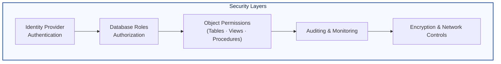
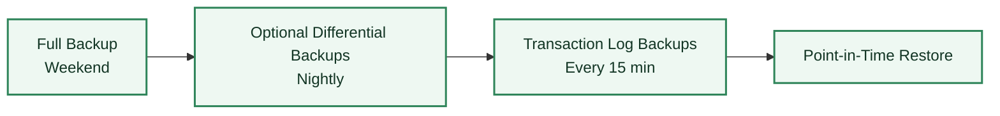

This chapter covers the foundational duties that form the core of a DBA's role. These are the non-negotiable tasks that ensure a database environment is stable, secure, and prepared for failure.

### **6.1. Choosing and Installing a DBMS**

Before a single line of code is written, a critical decision must be made: which Database Management System (DBMS) is right for the project? This choice has long-term consequences for cost, performance, and scalability.

#### **Comparing Popular RDBMS Systems**

| DBMS           | Key Characteristics & Strengths                                                                                                                                          | Best For                                                                                                                                         |
| :------------- | :----------------------------------------------------------------------------------------------------------------------------------------------------------------------- | :----------------------------------------------------------------------------------------------------------------------------------------------- |
| **PostgreSQL** | Highly extensible, standards-compliant, with advanced features like JSONB and robust indexing. Often called the "world's most advanced open source relational database." | Complex applications requiring data integrity, custom procedures, and geospatial data. A strong all-around choice.                               |
| **MySQL**      | The world's most popular open source database. Known for its ease of use, high performance for read-heavy workloads, and large community.                                | Web applications, content management systems (like WordPress), and read-intensive applications.                                                  |
| **SQL Server** | A commercial product from Microsoft. Excellent tooling, strong integration with the Windows ecosystem, and comprehensive enterprise features.                            | Enterprises heavily invested in Microsoft technologies. BI and data warehousing applications.                                                    |
| **Oracle DB**  | The long-standing leader in the commercial database market. Known for extreme performance, scalability, and reliability for massive, mission-critical systems.           | Large-scale enterprise applications, data warehousing, and systems where performance and support are paramount, and cost is a secondary concern. |

**Key Factors for Choosing:**
* **Cost:** Open-source (PostgreSQL, MySQL) vs. Commercial licensing (SQL Server, Oracle).
* **Features:** Does the application require specific features, like advanced JSON support (PostgreSQL) or deep BI integration (SQL Server)?
* **Scalability:** How will the database handle growth? Does it need simple replication or complex clustering?
* **Community & Support:** Is there a large community for help, or is paid enterprise support a requirement?

#### **Installation and Initial Configuration**

The installation process varies by DBMS and operating system, but some initial configuration steps are universal. After installation, a DBA immediately looks at the configuration file (e.g., `postgresql.conf` for PostgreSQL, `my.cnf` for MySQL).

**Example: Key Initial Configuration Steps (Conceptual)**
1.  **Memory Allocation:** A DBA's first task is often to adjust memory parameters. The default settings are usually very conservative. You might increase `shared_buffers` in PostgreSQL or `innodb_buffer_pool_size` in MySQL to dedicate more RAM to the database.
2.  **Network Settings:** Configure which IP addresses the database will listen on. For security, it's often restricted to `localhost` initially.
3.  **Logging:** Configure the logging level to capture errors, slow queries, and connection attempts. This is crucial for troubleshooting later.
4.  **Creating a Superuser:** Create a primary administrative user account with a strong, secure password and limit the use of the default superuser.

---

### **6.2. Database Security**

Database security is a multi-layered practice aimed at protecting the database from unauthorized access and malicious threats. The guiding principle is the **Principle of Least Privilege**: a user should only have the exact permissions required to do their job, and nothing more.

#### **Authentication vs. Authorization**
* **Authentication:** "Who are you?" This is the process of verifying a user's identity, typically with a username and password.
* **Authorization:** "What are you allowed to do?" This is the process of granting or denying a user permissions to access specific database objects.

#### **User and Role Management**
Instead of granting permissions to individual users one by one, it's best practice to create **roles** that represent job functions. You grant permissions to the role, and then assign users to that role.



**Example:** Let's create roles for an `analyst` and a `developer`.

```sql
-- Step 1: Create the roles
CREATE ROLE analyst;
CREATE ROLE developer;

-- Step 2: Grant permissions to the roles
-- Analysts can only read data from the Employees and Departments tables.
GRANT SELECT ON Employees TO analyst;
GRANT SELECT ON Departments TO analyst;

-- Developers can read and also modify data (INSERT, UPDATE, DELETE).
GRANT SELECT, INSERT, UPDATE, DELETE ON Employees TO developer;
GRANT SELECT, INSERT, UPDATE, DELETE ON Departments TO developer;

-- Step 3: Create users and assign them to roles
CREATE USER bob WITH PASSWORD 'a_very_strong_password';
CREATE USER alice WITH PASSWORD 'another_strong_password';

GRANT analyst TO bob;
GRANT developer TO alice;
```

  * **Result:** Bob can now only run `SELECT` queries on the two tables. Alice has full DML access. If you need to change permissions, you just modify the role, and it automatically applies to all users in that role.

#### **SQL Injection Prevention**

SQL Injection is a common attack where a malicious user inserts their own SQL code into an application's query.

**Example of Vulnerable Code (in a programming language like Python):**

```python
# VERY BAD - DO NOT DO THIS
user_input = "101; DROP TABLE Employees;" # Malicious input
db.execute(f"SELECT * FROM Orders WHERE OrderID = {user_input}")
```

The database would see two commands and try to delete your `Employees` table.

**Example of Safe Code (Using Parameterized Queries):**

```python
# GOOD - THIS IS SAFE
user_input = "101; DROP TABLE Employees;"
# The database treats the input as a single, literal value, not as executable code.
db.execute("SELECT * FROM Orders WHERE OrderID = ?", (user_input,))
```

#### **Data Encryption**

  * **Encryption in Transit:** Encrypting data as it travels over the network between the application and the database. This is typically achieved using SSL/TLS.
  * **Encryption at Rest:** Encrypting the physical data files on the disk. This protects data even if the physical server or hard drives are stolen. Modern databases and cloud providers offer Transparent Data Encryption (TDE) to handle this automatically.

-----

### **6.3. Backup and Recovery**

A backup is a copy of database data taken at a specific point in time. A DBA's most important job is to ensure that if the database is destroyed (due to hardware failure, corruption, or human error), it can be restored successfully. **A backup strategy that has not been tested is not a strategy—it's a prayer.**

#### **Types of Backups**

  * **Full Backup:** A complete copy of the entire database.
      * **Pro:** Simple to restore; everything is in one place.
      * **Con:** Can be very large and slow to create.
      * **Example (`pg_dump` for PostgreSQL):**
        ```bash
        pg_dump -U username -h hostname mydatabase > mydatabase_backup.sql
        ```
  * **Differential Backup:** A copy of all data that has changed *since the last full backup*.
      * **Pro:** Faster to create than a full backup.
      * **Con:** Restoration requires the last full backup plus the latest differential backup.
  * **Incremental / Log Backup:** A copy of the transaction logs (e.g., Write-Ahead Logs or WALs), which contain a record of every single change made to the database.
      * **Pro:** Very small and fast to create.
      * **Con:** Restoration can be complex, requiring the last full backup, potentially the last differential, and all log backups in sequence.

#### **Point-in-Time Recovery (PITR)**

By using a full backup combined with a continuous stream of transaction log backups, a DBA can restore a database to a very specific moment in time. This is critical for recovering right up to the moment before a disaster (like an accidental `DROP TABLE` command) occurred.



**Example Scenario:**

1.  **Sunday 1 AM:** A full backup is taken.
2.  **Monday - Wednesday:** Transaction log backups are taken every 15 minutes.
3.  **Wednesday 10:30 AM:** A developer accidentally deletes a critical table.
4.  **Recovery Process:** The DBA restores the full backup from Sunday, then applies all the transaction logs in order up to Wednesday at 10:29 AM. The database is restored to the state it was in one minute before the error.

#### **Disaster Recovery (DR)**

This is a broader plan for recovering from a catastrophic event, like a fire that destroys the entire data center. A DR plan might involve having backups stored off-site or maintaining a "hot site" (a replica database server in a different geographical location) that can take over immediately if the primary site fails.

-----

### **6.4. Monitoring and Tuning**

A DBA must constantly monitor the database's health to identify performance problems before they impact users.

**Common Bottlenecks:**

  * **CPU:** Are there inefficient queries that are consuming all the CPU cycles?
  * **Memory:** Is there enough RAM for the database to work efficiently in memory, or is it constantly having to read from slow disks?
  * **I/O (Disk):** Are the hard drives fast enough to keep up with the read/write demand? Are indexes being used effectively to minimize disk reads?
  * **Network:** Is the network connection between the application and the database a bottleneck?

**Monitoring Tools & Techniques:**

  * **Performance Dashboards:** Most databases have built-in or third-party tools (e.g., `pgAdmin` for PostgreSQL, Prometheus/Grafana) that provide real-time graphs of CPU usage, memory, connections, etc.
  * **Query Analysis:** Tools like `pg_stat_statements` in PostgreSQL can identify the top queries by execution time, helping a DBA focus their tuning efforts on the queries that have the biggest impact.
  * **Log Analysis:** The database error log is the first place to look when something goes wrong. It records errors, failed login attempts, and can be configured to log queries that take longer than a certain threshold (e.g., > 500ms). This helps proactively find and fix slow queries.
