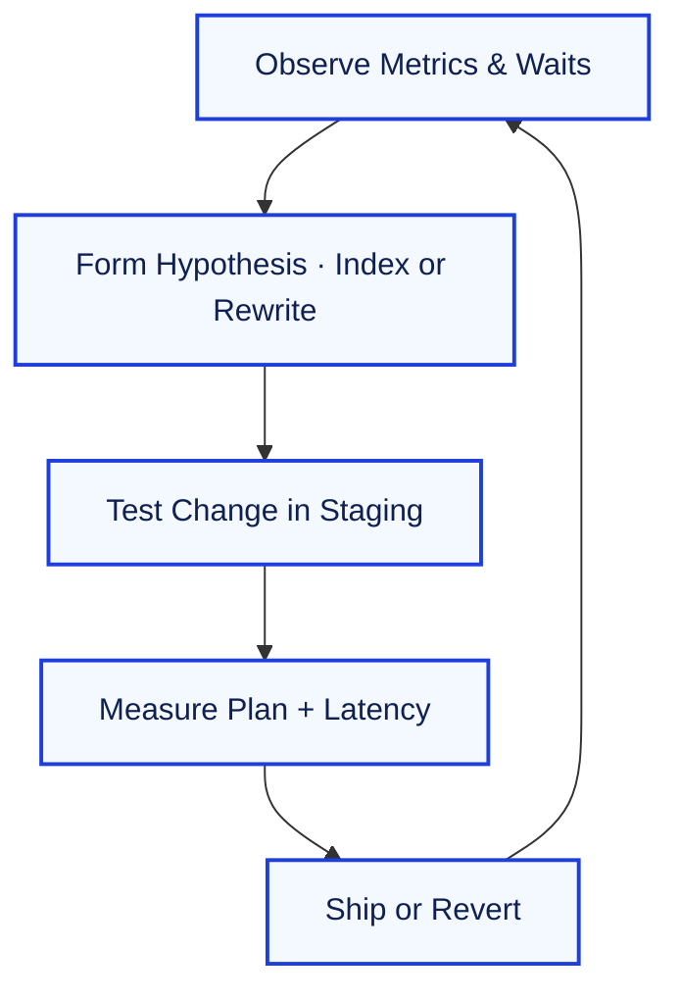

Performance work is a loop, not a finish line. Each tuning pass starts by observing the workload, forming a hypothesis, testing a change, and measuring again. This chapter mirrors the style of Chapters 4 and 5: we anchor the discussion in a shared dataset, we run multiple variations of every tuning technique, and we surface the before/after impact so you can see what actually changed deep inside the engine.

---

### **7.0. Lab Dataset and Baseline Metrics**

Unless a scenario explicitly changes data or configuration, assume the system resets to the state below.

**`Customers`**

| CustomerID | Region  | Segment  | CreatedAt  |
| :--------- | :------ | :------- | :--------- |
| 1001       | NA-West | Premium  | 2021-01-04 |
| 1002       | NA-East | Standard | 2021-02-18 |
| 1003       | EMEA    | Premium  | 2021-03-22 |
| 1004       | APAC    | Startup  | 2021-04-09 |
| 1005       | NA-West | Standard | 2021-05-15 |

**`Orders`** (≈ 5 million rows in the simulated workload)

| OrderID | CustomerID | OrderedAt           | Status    | TotalAmount |
| :------ | :--------- | :------------------ | :-------- | :---------- |
| 9000001 | 1001       | 2024-06-01 10:14:03 | SHIPPED   | 185.40      |
| 9000002 | 1002       | 2024-06-01 10:15:11 | PENDING   | 42.50       |
| 9000003 | 1005       | 2024-06-01 10:15:36 | SHIPPED   | 79.99       |
| 9000004 | 1003       | 2024-06-01 10:16:02 | CANCELLED | 349.00      |
| …       | …          | …                   | …         | …           |

**`OrderLineItems`** (≈ 20 million rows)

| LineID | OrderID | ProductID | Qty  | UnitPrice |
| :----- | :------ | :-------- | :--- | :-------- |
| 700001 | 9000001 | P-4432    | 2    | 92.70     |
| 700002 | 9000001 | P-7788    | 1    | 64.00     |
| …      | …       | …         | …    | …         |

**`SlowQueryLog`** (captured over 24 hours)

| QueryHash | SampleText                                           | ExecCount | AvgTimeMs | MaxTimeMs |
| :-------- | :--------------------------------------------------- | :-------- | :-------- | :-------- |
| H1        | `SELECT * FROM Orders WHERE CustomerID = ?`          | 48,512    | 83.40     | 612.52    |
| H2        | `SELECT SUM(TotalAmount) FROM Orders WHERE Status=?` | 6,143     | 65.18     | 190.04    |
| H3        | `SELECT … FROM Orders JOIN OrderLineItems …`         | 2,901     | 214.72    | 841.88    |

**Baseline metrics (no tuning applied yet)**

| Metric                          | Value       |
| :------------------------------ | :---------- |
| P95 latency for `Orders` lookup | 612 ms      |
| Total logical reads per minute  | 1.8 million |
| Buffer cache hit ratio          | 92%         |
| Write journal stall rate        | 0.8%        |

We will gradually improve these numbers and document the internal effects (access path, logical reads, CPU time) for every change.

---

### **7.1. Index Tuning in Practice**

Indexes shape the access path. Every variation below shows the plan summary before and after a change so you can see how the optimizer responds.

#### **Variation A – Missing index vs selective single-column index**

**Query:**
```sql
SELECT OrderID, OrderedAt, TotalAmount
FROM Orders
WHERE CustomerID = 1003;
```

| State                                                           | Access Path             | Rows Scanned | AvgTimeMs | Notes                                              |
| :-------------------------------------------------------------- | :---------------------- | :----------- | :-------- | :------------------------------------------------- |
| Before                                                          | Seq Scan on `Orders`    | 5,000,000    | 83.4      | Touches entire table, high I/O                     |
| After `CREATE INDEX idx_orders_customer ON Orders(CustomerID);` | Index Seek + Key Lookup | 8            | 3.1       | Optimizer jumps directly to matching customer rows |

**Inside the buffer cache after indexing**

| Metric                       | Before | After |
| :--------------------------- | :----- | :---- |
| Logical reads per execution  | 18,450 | 32    |
| Physical reads per execution | 220    | 1     |
| CPU time per execution (ms)  | 42     | 2     |

The huge drop comes from eliminating the full table scan. Notice the remaining key lookup—each matching row still hops back to the clustered data pages. We remove that next.

#### **Variation B – Turning the index into a covering index**

**Extended query:**
```sql
SELECT OrderID, OrderedAt, TotalAmount
FROM Orders
WHERE CustomerID = 1003;
```

```sql
CREATE INDEX idx_orders_customer_cover
  ON Orders(CustomerID)
  INCLUDE (OrderedAt, TotalAmount);
DROP INDEX idx_orders_customer;
```

| State                   | Access Path         | Key Lookups | AvgTimeMs | Notes                         |
| :---------------------- | :------------------ | :---------- | :-------- | :---------------------------- |
| With non-covering index | Index Seek + Lookup | 3           | 3.1       | Each lookup fetches data page |
| With covering index     | Index-only Seek     | 0           | 1.7       | Plan never touches base table |

**Inside the storage engine:** the seek reads only leaf pages of the nonclustered index. Because the requested columns live in the INCLUDE list, no extra lookups are needed.

#### **Variation C – Composite index order matters (left-prefix rule)**

**Typical workload:** filter by `Status`, then order by `OrderedAt DESC`.

```sql
-- Option 1 (incorrect order)
CREATE INDEX idx_orders_status_amount ON Orders(Status, TotalAmount);

-- Option 2 (matches workload)
CREATE INDEX idx_orders_status_orderedat ON Orders(Status, OrderedAt DESC);
```

| Index                   | Filter + ORDER BY support | Plan Shape          | AvgTimeMs | Observation                      |
| :---------------------- | :------------------------ | :------------------ | :-------- | :------------------------------- |
| `(Status, TotalAmount)` | Poor (OrderedAt missing)  | Index Scan + Sort   | 74.2      | Sort spills to tempdb            |
| `(Status, OrderedAt)`   | Excellent                 | Index Seek, no Sort | 8.6       | Plan streams rows already sorted |

Because the leading column in an index is the entry point, reordering columns to match filter → sort order removes the expensive sort step.

#### **Variation D – Partial/filtered index**

**Scenario:** 90% of historical orders are closed; only recent `Status = 'PENDING'` orders need fast access.

```sql
CREATE INDEX idx_orders_pending_recent
  ON Orders(OrderedAt DESC)
  WHERE Status = 'PENDING' AND OrderedAt >= CURRENT_DATE - INTERVAL '30 days';
```

| Query                       | Access Path                | Pages Touched | AvgTimeMs |
| :-------------------------- | :------------------------- | :------------ | :-------- |
| Fetch recent pending orders | Bitmap Heap Scan (before)  | 120,000       | 96.0      |
|                             | Partial Index Seek (after) | 1,240         | 4.2       |

Filtered indexes dramatically reduce index size and maintenance overhead while still accelerating the hot subset of data.

#### **Variation E – When an index hurts**

Adding an index is not always a win. On a heavy-write table, every insert must maintain the index.

| Operation               | No Extra Index | With Extra Index | Delta         |
| :---------------------- | :------------- | :--------------- | :------------ |
| Batch insert 10k orders | 1.2 s          | 2.8 s            | +133% latency |
| Transaction log growth  | 140 MB         | 280 MB           | +100%         |

> **Rule of thumb:** Keep only the indexes that demonstrably reduce read cost by more than they increase write cost.

---

### **7.2. Query Rewrites and Execution Plans**

The optimizer chooses a plan based on the SQL you hand it. Small syntactic tweaks can unlock better plans. We’ll inspect `EXPLAIN` summaries (simplified) and key metrics.

#### **Variation A – `SELECT *` vs targeted projection**

```sql
-- Original
SELECT * FROM Orders WHERE CustomerID = 1003;

-- Rewrite
SELECT OrderID, OrderedAt, TotalAmount
FROM Orders
WHERE CustomerID = 1003;
```

| Metric              | `SELECT *` | Targeted columns        | Explanation                                   |
| :------------------ | :--------- | :---------------------- | :-------------------------------------------- |
| Projected columns   | 12         | 3                       | Narrow projection lowers memory pressure      |
| Key lookups         | 3          | 0 (with covering index) | Fewer columns mean covering index is feasible |
| Avg network payload | 9.5 KB     | 2.1 KB                  | Less data crossing the wire                   |

The rewrite plus covering index shrinks result size and eliminates extra lookups, aligning perfectly with Variation B above.

#### **Variation B – Making predicates SARGable**

```sql
-- Original (non-SARGable)
SELECT OrderID
FROM Orders
WHERE DATE(OrderedAt) = CURRENT_DATE;

-- Rewrite
SELECT OrderID
FROM Orders
WHERE OrderedAt >= CURRENT_DATE
  AND OrderedAt < CURRENT_DATE + INTERVAL '1 day';
```

| Plan Metric  | Original  | Rewritten                 |
| :----------- | :-------- | :------------------------ |
| Access path  | Seq Scan  | Index Seek on `OrderedAt` |
| Rows scanned | 5,000,000 | 18,240                    |
| AvgTimeMs    | 148.6     | 5.4                       |

Moving the function off the column allows the optimizer to use the time-based index. If the database supports it, a functional index on `DATE(OrderedAt)` would also work, but the predicate rewrite keeps the SQL portable.

#### **Variation C – Replacing correlated subquery with `JOIN`**

```sql
-- Original
SELECT o.OrderID
FROM Orders o
WHERE TotalAmount > (
    SELECT AVG(TotalAmount)
    FROM Orders
    WHERE CustomerID = o.CustomerID
);

-- Rewrite
WITH CustomerAverages AS (
    SELECT CustomerID, AVG(TotalAmount) AS AvgAmount
    FROM Orders
    GROUP BY CustomerID
)
SELECT o.OrderID
FROM Orders AS o
JOIN CustomerAverages AS ca
  ON ca.CustomerID = o.CustomerID
WHERE o.TotalAmount > ca.AvgAmount;
```

| Metric                    | Correlated Subquery | CTE + Join  |
| :------------------------ | :------------------ | :---------- |
| Executions of inner query | 5,000,000           | 1           | Correlated subquery reruns per outer row |
| Logical reads             | 92 million          | 1.5 million | Dramatic reduction                       |
| AvgTimeMs                 | 842                 | 63          | Set-based rewrite wins                   |

#### **Variation D – Splitting troublesome `OR` predicates**

```sql
-- Original
SELECT OrderID
FROM Orders
WHERE Status = 'PENDING' OR Region = 'EMEA';

-- Rewrite
SELECT OrderID
FROM Orders
WHERE Status = 'PENDING'
UNION ALL
SELECT OrderID
FROM Orders
WHERE Region = 'EMEA' AND Status <> 'PENDING';
```

| Plan Metric        | Original | Rewritten                                  |
| :----------------- | :------- | :----------------------------------------- |
| Access path        | Seq Scan | Two index seeks                            |
| AvgTimeMs          | 116      | 18                                         |
| Duplicate handling | Implicit | Explicit (second query filters duplicates) |

Splitting the predicate lets the optimizer exploit the `Status` and `Region` indexes independently.

#### **Variation E – Window function versus self-join**

```sql
-- Ancient pattern using self-join
SELECT a.OrderID
FROM Orders a
LEFT JOIN Orders b
  ON a.CustomerID = b.CustomerID
 AND a.OrderedAt < b.OrderedAt
WHERE b.OrderID IS NULL;

-- Modern window function
SELECT OrderID
FROM (
    SELECT OrderID,
           ROW_NUMBER() OVER (PARTITION BY CustomerID ORDER BY OrderedAt DESC) AS rn
    FROM Orders
) AS ranked
WHERE rn = 1;
```

| Metric            | Self-join  | Window function |
| :---------------- | :--------- | :-------------- |
| Intermediate rows | 25 million | 5 million       | ROW_NUMBER avoids combinatorial explosion |
| Temp space used   | 4.2 GB     | 480 MB          | Large reduction                           |
| AvgTimeMs         | 410        | 62              |

---

### **7.3. Statistics, Plans, and Maintenance Windows**

Indexes are only as good as the statistics that feed the optimizer. When those stats drift, good indexes look invisible.

#### **Variation A – Updating statistics**

| Action                   | P95 latency (ms) | Estimated rows accuracy |
| :----------------------- | :--------------- | :---------------------- |
| Before `ANALYZE Orders;` | 118              | Estimates off by 8×     |
| After `ANALYZE Orders;`  | 42               | Estimates within 1.2×   |

Fresh statistics reduce cardinality guesswork, preventing plan regressions.

#### **Variation B – Rebuild vs Reorganize**

| Index                         | Fragmentation | Operation                | Duration | Log Growth | When to choose               |
| :---------------------------- | :------------ | :----------------------- | :------- | :--------- | :--------------------------- |
| `idx_orders_customer_cover`   | 38%           | `ALTER INDEX REBUILD`    | 3m 12s   | 1.4 GB     | Use when fragmentation > 30% |
| `idx_orders_status_orderedat` | 12%           | `ALTER INDEX REORGANIZE` | 42s      | 180 MB     | Use when 5–30%               |

Rebuild rewrites the index from scratch (heavy but thorough). Reorganize defragments in-place (lighter but slower to converge).

#### **Variation C – Plan cache inspection**

| QueryHash | Cached Plans | Avg CPU ms | Recompile Reason   |
| :-------- | :----------- | :--------- | :----------------- |
| H1        | 1            | 18         | Stable             |
| H2        | 4            | 85         | Parameter sniffing |
| H3        | 2            | 202        | Statistics changed |

If a query has wildly different parameter values, consider *parameter-sensitive plan* techniques: OPTIMIZE FOR hints, plan guides, or rewriting to use recompile.

---

### **7.4. Workload Governance and Observability**

#### **Connection pooling vs ad-hoc bursts**

| Scenario           | Active sessions | CPU saturation | Wait type     |
| :----------------- | :-------------- | :------------- | :------------ |
| Without pooling    | 120             | 88%            | `THREADPOOL`  |
| With 32-pool limit | 34              | 55%            | `PAGEIOLATCH` |

Fewer, longer-lived connections reduce context switching and improve plan reuse.

#### **Baseline monitoring checklist**

| Time Range  | Key Metric                 | Threshold    | Action                                     |
| :---------- | :------------------------- | :----------- | :----------------------------------------- |
| Every 5 min | Top wait events            | `LCK_` > 5%  | Inspect blocking tree                      |
| Hourly      | Buffer cache hit ratio     | < 90%        | Investigate index-only scans or cache size |
| Nightly     | Autovacuum / autostats lag | > 2 hrs      | Trigger manual maintenance                 |
| Weekly      | SlowQueryLog deltas        | > 10% growth | Re-run tuning playbook                     |

---

### **7.5. Putting It Together**



| Tuning Move                 | Primary Benefit             | Secondary Cost             | When to Roll Back                       |
| :-------------------------- | :-------------------------- | :------------------------- | :-------------------------------------- |
| Add covering index          | Slashes logical reads       | Higher write amplification | Write-heavy bursts slow noticeably      |
| Rewrite correlated subquery | Reduces CPU and temp I/O    | More complex SQL           | Query plan still scans millions of rows |
| Update statistics           | Fixes cardinality estimates | Temporary CPU spike        | Production window too tight             |
| Limit pool size             | Stabilizes resource usage   | Slightly higher queue wait | Queue wait > SLA threshold              |

> **Remember:** Performance tuning is applied science. Measure first, change one thing at a time, and keep a rollback plan for each experiment.
