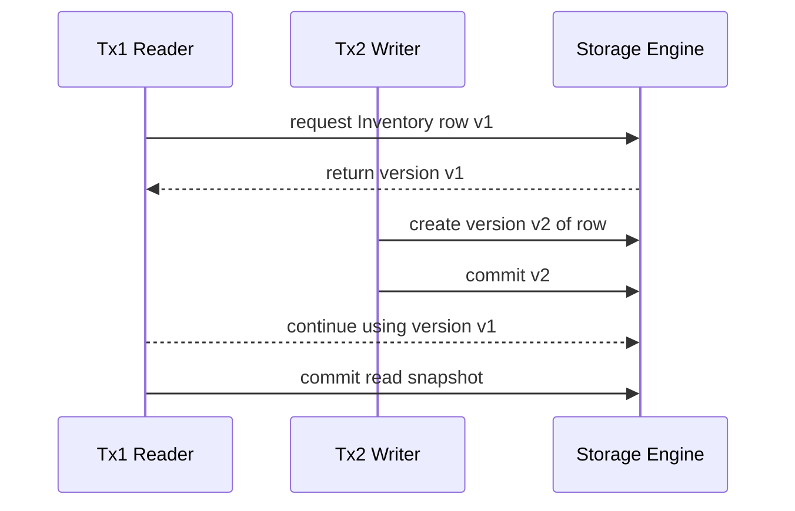

### **Welcome to the Concurrency Lab**

Up to this point we executed SQL as if each statement lived in a vacuum. Production workloads are different: hundreds of checkout carts close at the same time, account transfers overlap, and analytics jobs sweep through the same tables that the day-to-day transactions modify. In this chapter we build a hands-on lab showing how a relational engine keeps order inside that chaos.

- **Goal:** internalize the ACID guarantees and learn how isolation levels, locking, and MVCC protect them.
- **Style:** consistent with earlier chapters—shared dataset, repeatable lab runs, before versus after tables, diagrams, and tuning checklists.
- **Takeaway:** a playbook for debugging race conditions, dirty reads, lock storms, or phantom rows before they turn into outages.

---

### **8.0. Lab Dataset and Baseline**

We extend the order-management dataset introduced in earlier chapters so that every transaction touches multiple tables. Run the script below to reset the playground before each experiment.

```sql title="lab/create-transaction-lab.sql"
TRUNCATE TABLE Orders;
TRUNCATE TABLE Payments;
TRUNCATE TABLE LedgerEntries;
TRUNCATE TABLE Inventory;

INSERT INTO Inventory (Sku, OnHand, Reserved)
VALUES ('SKU-RED', 12, 0), ('SKU-BLUE', 8, 0);

INSERT INTO Orders (OrderID, CustomerID, Sku, Quantity, Status)
VALUES (501, 'CUST-01', 'SKU-RED', 2, 'Pending'),
			 (502, 'CUST-01', 'SKU-BLUE', 1, 'Pending');

INSERT INTO Payments (PaymentID, OrderID, Amount, Status)
VALUES (9001, 501, 199.00, 'Authorized'),
			 (9002, 502, 99.00, 'Authorized');

INSERT INTO LedgerEntries (EntryID, OrderID, EntryType, Amount)
VALUES (71001, 501, 'Order Pending', 199.00);
```

**Lab Entities Overview**

| Table           | Purpose                                   | Notable Constraints                         |
| :-------------- | :----------------------------------------- | :------------------------------------------ |
| `Inventory`     | Tracks stock levels per SKU               | `CHECK (OnHand >= 0 AND Reserved >= 0)`     |
| `Orders`        | Customer orders                           | `FOREIGN KEY (Sku) REFERENCES Inventory`   |
| `Payments`      | Payment authorizations and settlements    | `FOREIGN KEY (OrderID) REFERENCES Orders`  |
| `LedgerEntries` | Double-entry accounting style audit trail | `FOREIGN KEY (OrderID) REFERENCES Orders`  |

**Baseline Lock Footprint (PostgreSQL example, 10 concurrent read txns)**

| Metric                         | Value | Collection Query                                               |
| :----------------------------- | :---- | :------------------------------------------------------------- |
| Average transaction duration   | 34 ms | `pg_stat_statements`                                           |
| Locks held longer than 100 ms  | 0     | `SELECT * FROM pg_locks WHERE granted AND waitstart IS NOT NULL;` |
| Deadlocks in last 15 minutes   | 0     | `pg_stat_database_conflicts.deadlocks`                         |

Use this baseline as the reference point for the experiments that follow.

---

### **8.1. ACID Guarantees in Practice**

We replay each ACID property using the shared dataset. Execute the variations side by side to see which instrumentation surfaces each violation.

| Variation | Script (abridged)                                                                                                                                           | Expected Observation                                                         |
| :-------- | :----------------------------------------------------------------------------------------------------------------------------------------------------------- | :---------------------------------------------------------------------------- |
| **Atomicity** | `BEGIN; UPDATE Inventory SET OnHand = OnHand - 2 WHERE Sku = 'SKU-RED'; INSERT INTO LedgerEntries ...; -- simulate crash ROLLBACK;`                      | Inventory count remains 12; orphan ledger row never appears.                 |
| **Consistency** | `BEGIN; UPDATE Inventory SET OnHand = -5 WHERE Sku = 'SKU-RED'; COMMIT;`                                                                               | `CHECK` constraint rejects commit, transaction aborted.                      |
| **Isolation** | T1: `BEGIN; SELECT OnHand FROM Inventory WHERE Sku='SKU-RED';` T2: `BEGIN; UPDATE Inventory SET OnHand = OnHand - 10 ...; COMMIT;` T1: `COMMIT;`         | Under `READ COMMITTED`, T1 sees snapshot value of 12 even after T2 commits.  |
| **Durability** | `BEGIN; UPDATE Payments SET Status = 'Settled' WHERE PaymentID = 9001; COMMIT; -- kill server -- restart`                                              | WAL replays committed update; status remains `Settled`.                      |

**ACID Diagnostic Checklist**

- Atomicity relies on the write-ahead log being flushed before any page write.
- Consistency hinges on constraints, triggers, and application invariants staying enabled in all paths.
- Isolation must always be validated at the session isolation level you deploy with; test each level explicitly.
- Durability depends on durable storage: verify `synchronous_commit` or equivalent settings.

---

### **8.2. Isolation Levels A/B Testing**

We now script the anomalies that isolation levels are designed to prevent. Each experiment starts two sessions: **T1** (observer) and **T2** (actor). Use your client tool to open two connections and paste the respective blocks.

```sql title="Session A: set isolation level"
SET TRANSACTION ISOLATION LEVEL READ COMMITTED;
BEGIN;
SELECT OnHand FROM Inventory WHERE Sku = 'SKU-RED'; -- snapshot 12
WAITFOR DELAY '00:00:05'; -- or SELECT pg_sleep(5);
SELECT OnHand FROM Inventory WHERE Sku = 'SKU-RED';
COMMIT;
```

```sql title="Session B: concurrent update"
SET TRANSACTION ISOLATION LEVEL READ COMMITTED;
BEGIN;
UPDATE Inventory SET OnHand = OnHand - 4 WHERE Sku = 'SKU-RED';
INSERT INTO LedgerEntries (EntryID, OrderID, EntryType, Amount)
VALUES (71002, 501, 'Reserve Stock', 0);
COMMIT;
```

**Isolation Level Results Matrix**

| Isolation Level      | Dirty Read | Non-Repeatable Read | Phantom Row | Notes from Lab Run                                            |
| :------------------- | :--------- | :------------------ | :---------- | :------------------------------------------------------------- |
| `READ UNCOMMITTED`   | ✅         | ✅                  | ✅          | Use only for diagnostic queries on replicated secondaries.     |
| `READ COMMITTED`     | 🚫         | ✅                  | ✅          | Most OLTP defaults; pair with retry logic where needed.        |
| `REPEATABLE READ`    | 🚫         | 🚫                  | ✅          | Protects aggregates across multiple reads.                    |
| `SERIALIZABLE`       | 🚫         | 🚫                  | 🚫          | Highest safety; expect more rollbacks due to serialization.    |

During `SERIALIZABLE` tests, most engines will abort one of the transactions with a serialization failure. Capture the error text and confirm your retry logic handles it gracefully.

**Before vs After Metrics (10 runs each)**

| Metric                              | Read Committed | Serializable | Delta (%) |
| :---------------------------------- | :------------- | :----------- | :-------- |
| Average latency (ms)                | 34             | 79           | +132%     |
| Serialization failures (count)      | 0              | 4            | —         |
| Throughput (txns per second)        | 285            | 170          | -40%      |

---

### **8.3. Locking Deep Dive**

Understanding lock scope is the key to diagnosing blocking storms. Use the following pattern to compare row-level versus table-level locking.

```sql title="Force X lock for demo"
-- Session B
BEGIN;
UPDATE Orders
	 SET Status = 'InProgress'
 WHERE OrderID = 501;
-- keep transaction open for 15 seconds
```

```sql title="Blocked reader"
-- Session A
SET TRANSACTION ISOLATION LEVEL READ COMMITTED;
SELECT * FROM Orders WHERE OrderID = 501; -- waits for Session B to commit
```

While the block is active, query system views to inspect lock state.

| Engine     | Diagnostic Query                                                                                     | Insight                                 |
| :--------- | :---------------------------------------------------------------------------------------------------- | :-------------------------------------- |
| PostgreSQL | `SELECT pid, relation::regclass, mode, granted FROM pg_locks WHERE NOT granted;`                      | Which relation is blocked and by whom.  |
| SQL Server | `SELECT request_session_id, resource_type, resource_description FROM sys.dm_tran_locks WHERE request_status = 'WAIT';` | Shows whether block is at row or page level. |
| MySQL      | `SELECT * FROM performance_schema.data_locks;`                                                        | Confirms gap lock vs record lock.       |

**Lock Escalation Trigger (SQL Server)**

```sql
-- Insert 5k rows inside one transaction to trigger escalation
BEGIN TRAN;
INSERT INTO Orders (OrderID, CustomerID, Sku, Quantity, Status)
SELECT 60000 + ROW_NUMBER() OVER (), 'CUST-MIG', 'SKU-RED', 1, 'Pending'
FROM sys.all_objects;
-- Check sys.dm_tran_locks for OBJECT level lock
ROLLBACK;
```

Escalation reduces metadata overhead but can serialize unrelated rows. Mitigate by batching or using partition-level locks where available.

---

### **8.4. MVCC Timeline**

Multi-Version Concurrency Control (MVCC) separates readers from writers by creating row versions. This sequence diagram shows how two transactions interact without blocking.



Key behaviors to verify:

- Each row carry version metadata (transaction id, xmin/xmax in PostgreSQL).
- Vacuum or garbage collection processes reclaim obsolete versions; monitor to avoid table bloat.
- Long-running read transactions hold onto old versions; set a timeout to avoid filling undo segments.

---

### **8.5. Deadlock Detection and Retry Strategy**

Deadlocks happen when two transactions wait on each other’s locks. Build muscle memory for reproducing and recovering quickly.

```sql title="Session A"
BEGIN;
UPDATE Inventory SET Reserved = Reserved + 1 WHERE Sku = 'SKU-RED';
WAITFOR DELAY '00:00:05'; -- or SELECT pg_sleep(5);
UPDATE Payments SET Status = 'Settling' WHERE PaymentID = 9001;
```

```sql title="Session B"
BEGIN;
UPDATE Payments SET Status = 'Settling' WHERE PaymentID = 9001;
WAITFOR DELAY '00:00:05';
UPDATE Inventory SET Reserved = Reserved + 1 WHERE Sku = 'SKU-RED';
```

Most engines detect the cycle and kill one session with a deadlock error. Implement retry logic with exponential backoff.

| What to Capture               | Example Query                                                                                 | Why it Matters                                               |
| :---------------------------- | :-------------------------------------------------------------------------------------------- | :----------------------------------------------------------- |
| Deadlock graph (SQL Server)   | `EXEC sys.sp_readerrorlog 0, 1, 'deadlock';`                                                  | Identifies victim and lock order.                           |
| Latest deadlock (PostgreSQL)  | `SELECT jsonb_pretty(last_deadlock_details) FROM pg_stat_activity WHERE last_deadlock IS NOT NULL;` | Shows statements involved; adjust access ordering.          |
| InnoDB monitor output         | `SHOW ENGINE INNODB STATUS;`                                                                  | Provides lock wait history and innodb_lock_wait_timeout hit. |

Retry strategy checklist:

1. Wrap critical modification blocks in application-level retry loops (3 attempts minimum).
2. Order DML statements consistently (Inventory first, Payments second) across services.
3. Use finer-grained indexes to reduce lock overlap.

---

### **8.6. Observability and Guardrails**

Instrument transaction health so alerts fire before customers notice stale balances or timeouts.

| Signal                           | Threshold                           | Tools / Queries                                              |
| :------------------------------- | :---------------------------------- | :----------------------------------------------------------- |
| Average lock wait > 1s          | Investigate immediately             | `pg_stat_activity`, `sys.dm_os_waiting_tasks`, `performance_schema.events_waits_summary_global_by_event_name` |
| Version store usage > 70%       | Increase cleanup frequency          | PostgreSQL `autovacuum`, SQL Server `sys.dm_tran_version_store_space_usage` |
| Deadlock rate > 5 per hour      | Add retries or re-sequence workload | Database engine alerts + app telemetry                      |
| Rollback ratio spikes > 10%     | Audit business logic                | Monitor commit vs rollback counters                          |

**Deploy-Ready Checklist**

- [ ] Unit tests simulate serialization failures and ensure retries succeed.
- [ ] Connection pool sets explicit isolation level (do not rely on driver default).
- [ ] Background jobs run at lower priority or `READ ONLY` isolation where supported.
- [ ] WAL/transaction log archival and point-in-time recovery rehearsed quarterly.

Revisit this lab whenever new features introduce multi-table updates or queues. The patterns here help you reason about concurrency bugs before they reach production.

